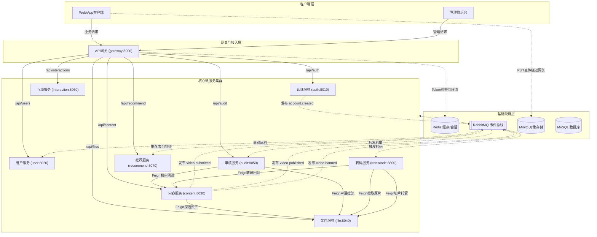

# Media Platform 架构设计与技术文档中心

欢迎查阅 Calles 媒体平台重构工程文档中心。本工程采用**“双层互锁（Two-Tier Interlocking）”**现代分布式微服务文档架构：
- **宏观层【服务调用主线 (Flows)】**：以真实业务生命周期与服务调用为主线，通过 **Mermaid 时序图与拓扑大图** 直观呈现跨服务协同全貌；
- **微观层【模块专精文档 (Modules)】**：各微服务按**“HTTP 接口 + MQ 消息 + 定时任务/补偿调度”三件套标准化骨架**深入剖析私有机制与表结构；
- **双向锚点穿透**：读者可由宏观主线顺着锚点深入模块查阅底层细节，亦可从模块专篇反向回溯全局主线。

---

## 1. 全站微服务调用全局拓扑大图

平台共划分为 **9 个独立服务模块**，依赖 **4 大核心基础设施（MySQL、Redis、RabbitMQ、MinIO）**：

---

## 2. 宏观层：端到端服务调用主线 (Flows)

以用户业务行为为引导，深入解析跨服务时序流转、协议参数与容灾边界：

| 主线文档 | 核心图表与主线内容 | 关键涉及服务 |
| :--- | :--- | :--- |
| [**主线 01：账号生命周期与鉴权透传**](flows/01-账号生命周期与鉴权透传.md) | 注册事务 ➔ Outbox ➔ MQ 异步资料建档；登录双 Token 签发；Redis 多设备会话池置换；网关 Token 拦截鉴权、SHA-256 缓存与下游受信 Header 透传时序图。 | `gateway` `auth` `user` `Redis` `RabbitMQ` |
| [**主线 02：大文件资产 V2 暂存直传与归档**](flows/02-大文件直传与存储归档.md) | 三种上传模式对比拓扑；客户端流式 PUT 直连 MinIO（零网关带宽消耗）；服务端 HEAD 校验、内部 Copy 转正与孤儿文件定时清理自愈时序图。 | `gateway` `file` `MinIO` |
| [**主线 03：视频提审、异步机审与分级门禁**](flows/03-视频创作提审与分级门禁.md) | **【全平台技术核心】** 创作者提审 ➔ Feign 同步探活 ➔ Outbox 派发 ➔ 审核与转码多路并发 ➔ 专有回调 ➔ `PublishGatekeeper` 分级门禁决策（基准流就绪即发布，4K 异步追加，违规熔断）全流程时序图。 | `content` `file` `audit` `transcode` `RabbitMQ` |
| [**主线 04：前台视频播放分发与网关防刷**](flows/04-前台视频播放分发与网关防刷.md) | 网关单 IP 令牌桶秒级限流（QPS<=30）；Base62 短码（`vid`）寻址防爬虫；多画质播放流切片汇聚与访问权限安全脱敏时序图。 | `gateway` `content` `Redis` |
| [**主线 05：平台合规治理与全站广播下线**](flows/05-平台合规治理与全站广播下线.md) | 管理端 RBAC 鉴权；状态原子跃迁；`content.video.banned` 领域事件广播驱动搜索引擎、推荐池与端侧长连接全网即时下线时序图。 | `gateway` `content` `audit` `RabbitMQ` |

---

## 3. 微观层：各微服务专精文档 (Modules)

每个微服务均严格配备**“HTTP 接口服务链路 + MQ 消息链路 + 定时任务与自愈补偿链路”三件套骨架**：

| 微服务模块 | 职责与架构重点 | 专属核心图表 |
| :--- | :--- | :--- |
| [**网关模块 (gateway)**](modules/gateway.md) | 统一路由转发、IP 令牌桶限流、Token 验证缓存、防伪造 Header 清洗与受信注入。 | 网关全局过滤器链执行决策流程图 |
| [**认证模块 (auth)**](modules/auth.md) | 账号密码管理、BCrypt 哈希、双 Token 签发、Redis 多端会话池、Outbox 发件箱调度。 | 双 Token 生命周期与会话池状态机图 |
| [**用户模块 (user)**](modules/user.md) | 用户档案初始化、`auth.account.created` 幂等消费建档、资料并发修改乐观锁（Revision）。 | 资料初始化防重消费与乐观锁版本控制图 |
| [**文件模块 (file)**](modules/file.md) | 普通上传、大文件 V2 暂存直传、内部微服务免密托管上传/拉流端点、孤儿文件清理定时器。 | 三种上传模式架构对比与对象状态机图 |
| [**内容模块 (content)**](modules/content.md) | 创作者工作台、双 ID 体系、Feign 强探活、分级就绪门禁决策器、僵死任务超时自愈调度器。 | 实体拓扑类图、全生命周期状态机、门禁决策树 |
| [**审核模块 (audit)**](modules/audit.md) | 提审事件消费、DFA 前缀树敏感词机审、阿里云内容安全 2.0 适配、综合仲裁引擎、回调指数退避重试。 | 多维机审流水线与最高风险综合仲裁流程图 |
| [**转码模块 (transcode)**](modules/transcode.md) | 提审驱动流媒体压制、系统级 FFmpeg 适配、硬件公平信号量限流、切片托管与门禁闭环。 | 转码工单聚合根类图、转码生命周期流转图 |
| [**互动模块 (interaction)**](modules/interaction.md) | [骨架预留] 点赞、收藏、评论社交互动；高并发热点 Redis 计数与定时批量回写规划。 | 互动读写分离与批量回写架构规划图 |
| [**推荐模块 (recommend)**](modules/recommend.md) | [骨架预留] 首页热门流、关联推荐；消费视频发布/封禁事件与多模态特征特征入库规划。 | 推荐召回、排序与特征录入拓扑图 |
| [**公共模块 (common)**](modules/common.md) | 统一 ApiResponse 响应外壳、EventEnvelope 事件信封、UserContext 身份上下文与 TraceId 追踪。 | 公共契约与 Filter 线程上下文模型 |

---

## 4. 接口契约与任务追踪

- [**HTTP API 接口全景契约**](api.md)：集中速查全平台对外、对内与管理端接口请求参数、响应模型、权限门禁与状态码规范；
- [**开发进度追踪清单**](TODO.md)：实时跟踪各微服务功能落地、测试用例覆盖与阶段演进状态；

---

## 5. 如何高效查阅本文档

1. **想了解业务全流程**：直接从 [宏观层服务调用主线](#2-宏观层端到端服务调用主线-flows) 开始阅读，通过时序图建立系统全局感；
2. **想深入某个特定环节**：在主线文档中点击对应节点的“模块细查”链接，直达微服务专篇的接口、MQ 或定时任务详细定义；
3. **想排查单服务运维/配置/表结构**：直接进入 [微观层微服务专精文档](#3-微观层各微服务专精文档-modules)，按三件套快速定位目标代码与 DDL。
