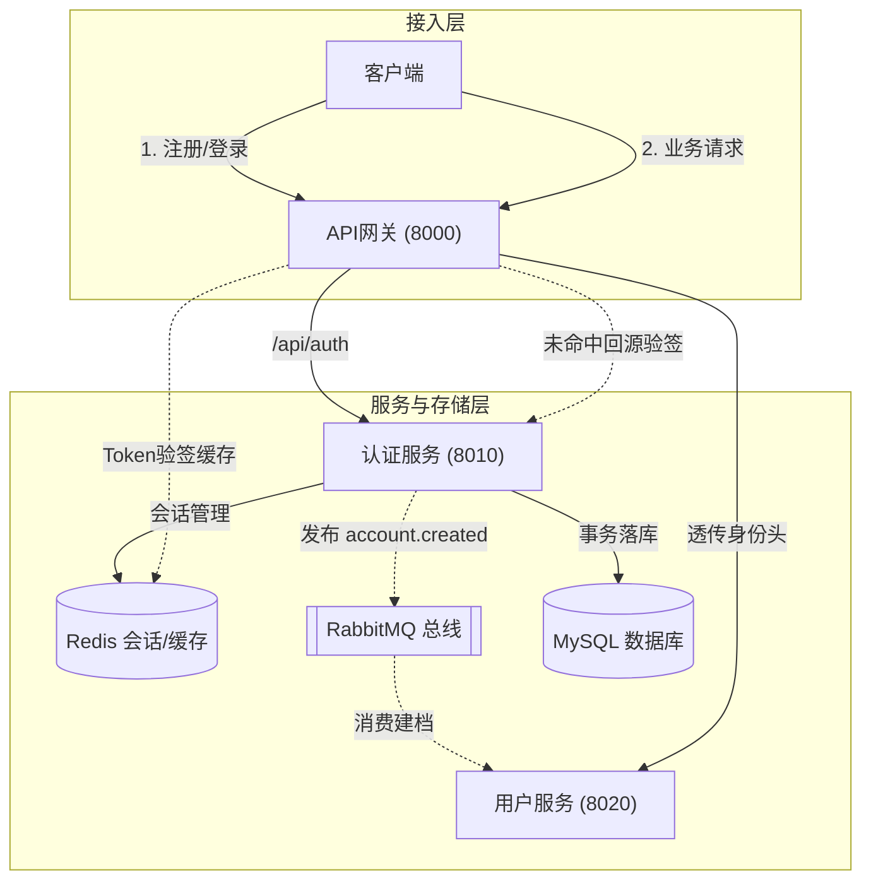
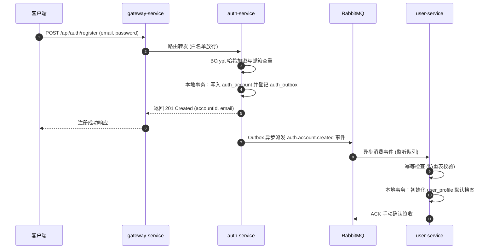
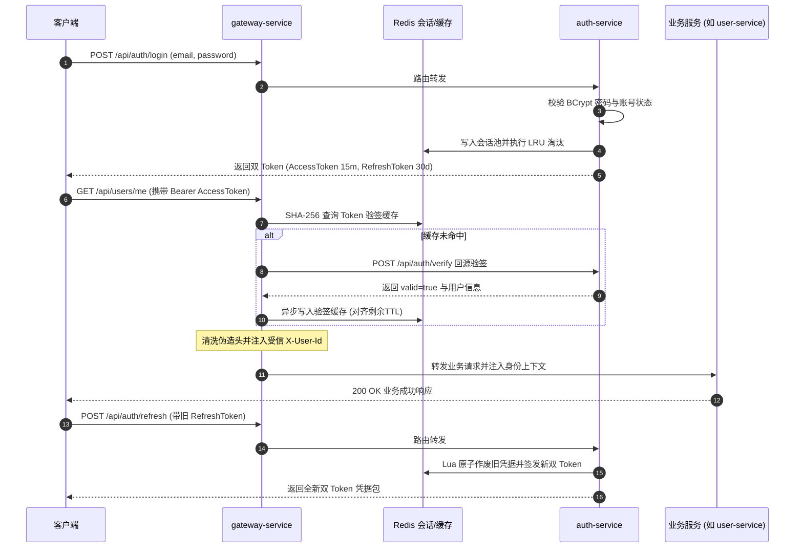

# 服务调用主线 01：账号生命周期、双 Token 维护与网关鉴权穿透

本文档梳理平台**账号注册、资料异步初始化、用户登录、双 Token 会话管理、网关身份鉴权拦截与下游受信透传**的端到端服务调用全流程。

---

## 1. 参与组件与调用拓扑

本链路涉及接入层、核心认证、用户中心及缓存与消息总线：



- **API 网关 (`gateway-service`)**：统一入口。执行静态白名单过滤、JWT 格式提取、Redis 验签缓存查验、向 `auth-service` 回源验签，并将已确认身份注入受信 Header（`X-User-Id`、`X-User-Role`）转发下游。
- **认证服务 (`auth-service`)**：账号实体所有者。负责密码 BCrypt 哈希、登录凭据签发、Redis 多设备会话池淘汰置换、事务发件箱（Outbox）事件派发与验签接口提供。
- **用户服务 (`user-service`)**：用户资料实体所有者。监听账号创建事件完成幂等建档，维护用户昵称、头像与个人简介。

---

## 2. 端到端交互时序图 (End-to-End Sequence)

### 2.1 账号注册与资料异步建档时序


### 2.2 登录认证、业务鉴权与凭据轮换时序


---

## 3. 执行全过程逐步深度剖析

### 3.1 账号注册与资料异步解耦 (Registration & Async Profile)
1. **统一入口路由与白名单机制**：
   - 客户端调用 `POST /api/auth/register`。网关配置将 `/api/auth/**` 转发至 `lb://auth-service`，该路径位于白名单内，跳过 Token 鉴权，但网关仍会强制清除任何客户端自带的特权头。
2. **账号防重与密码哈希加固**：
   - `auth-service` 规范化邮箱（去除首尾空白并统一转小写），比对数据库唯一索引 `uk_auth_email`。
   - 密码采用带有随机盐值的 BCrypt 哈希加密存储（密码长度至少 8 字符且不超过 72 字节），杜绝明文泄露与彩虹表破解风险。
3. **事务发件箱（Transactional Outbox）强一致性保障**：
   - 为避免“微服务分布式事务（2PC/Seata）的性能损耗”与“先发 MQ 后提交事务导致的脏读数据”，账号主体记录与待发送消息记录在 `auth_account` 与 `auth_outbox` 中通过**同一个本地数据库事务**提交：
     ```sql
     -- 同一本地事务内执行
     INSERT INTO auth_account (id, email, password_hash, role, status) VALUES (...);
     INSERT INTO auth_outbox (id, event_type, routing_key, payload, trace_id, status) VALUES (...);
     ```
4. **RabbitMQ 异步消费与幂等建档**：
   - 事务提交后，触发 Outbox 投递机制，向 `media.platform.events` 交换机广播路由键 `auth.account.created`；
   - `user-service` 的监听器接收到事件后，基于 `accountId` 作为主键插入 `user_profile`；
   - **防重保证**：通过独立的防重记录表 `user_event_consume` 和 `user_profile.id` 唯一主键约束实现强幂等。即便发生网络重传，已存在的用户记录绝不重复创建，处理完成后向 Broker 回送手动 ACK。

> 💡 **模块细查**：
> - 账号注册业务规则与表结构详见 [认证模块 · auth-service](../modules/auth.md#2-第一套件http-接口服务链路)。
> - 资料初始化消费者与幂等策略详见 [用户模块 · user-service](../modules/user.md#3-第二套件mq-消息链路事件发布与消费)。

---

### 3.2 登录认证与多端会话池 (Login & Session Pool)
1. **身份核验与状态审查**：
   - 客户端携带邮箱、密码以及可选的 `X-Device-Id` 请求 `POST /api/auth/login`。
   - 服务端首先核查账号状态：若账号被封禁（`status = 'DISABLED'`）则明确返回 `403 FORBIDDEN`；账号不存在或密码不匹配返回 `401 UNAUTHORIZED`。
2. **双 Token 体系设计原理**：
   - **AccessToken**：短期无状态 JWT，载荷包含 `sub`（用户ID）、`role`（角色）、`sid`（会话ID），有效期限较短（默认 900 秒 / 15 分钟），专供网关业务 API 鉴权，降低 Token 泄露造成的窗口期风险；
   - **RefreshToken**：长期高熵随机字符串（32 字节 Hex），有效期限较长（默认 30 天），仅保存在 Redis 会话池中，不用于调用业务 API，专职用于静默续期。
3. **设备会话置换与并发超限淘汰 (LRU)**：
   - `SessionService` 维护每个用户的活跃会话集合 `auth:user:sessions:{userId}`；
   - **同一设备覆盖**：若相同 `deviceId` 重复登录，立即作废该设备的旧会话并替换为新会话；
   - **多设备并发上限**：若用户在手机、平板、多台 PC 等多端登录超过最大并发上限（默认 5 个，配置 `auth.max-sessions-per-user`），系统按最后活跃时间戳自动淘汰最久未活跃（LRU）的会话，其对应的 RefreshToken 被彻底删除，强退最早登录的客户端。

---

### 3.3 网关透明鉴权与下游受信透传 (Gateway Auth & Header Injection)
1. **提取凭据与格式校验**：
   - 客户端请求业务接口，携带 `Authorization: Bearer <accessToken>` 请求头；
   - 网关全局拦截器 `AuthGlobalFilter` 检测路径：白名单放行，非白名单请求若缺失 Token 或格式异常直接拦截返回 HTTP `401 UNAUTHORIZED`。
2. **双层鉴权与 Redis 验证缓存**：
   - 网关对 Token 字符串计算 SHA-256 哈希作为 Key，查询 Redis 缓存 `auth:token:cache:<hash>`；
   - **缓存命中**：直接获取预存的主体元数据（`userId`、`role`、`sessionId`），将网关鉴权开销压降至亚毫秒级；
   - **缓存未命中**：网关发起内部 HTTP 调用 `POST /api/auth/verify` 向 `auth-service` 验签。验签通过后，将结果写入 Redis，其 TTL 与 Token 的剩余有效时间对齐（最高不超过 10 分钟）。
3. **安全清洗与上下文注入**：
   - **防特权头伪造**：下游业务微服务完全信任 Header 中的身份，因此网关在路由转发前**无条件剥除客户端提交的 `X-User-Id`、`X-User-Role`、`X-User-Type`、`X-Session-Id`**；
   - **受信注入**：网关将经由认证服务确认的主体信息重新注入上述 Header，下游微服务直接通过 `common-web` 的 `UserContext` 即可读取当前操作者身份，免去微服务各自解析 JWT 或查库的重复开销。

> 💡 **模块细查**：
> - 网关白名单配置、缓存 TTL 及熔断降级详见 [网关模块 · gateway-service](../modules/gateway.md#2-第一套件http-接口服务链路)。

---

### 3.4 一次性 RefreshToken 原子轮换 (Refresh Token Rotation)
1. **防止重放攻击 (Token Replay)**：
   - 客户端在 AccessToken 到期前调用 `POST /api/auth/refresh`。
   - `auth-service` 在 Redis 中通过原子操作将旧 `refreshToken` 标记为已消费并失效。同一张凭据绝不能被二次消费，若发生重放攻击，二次提交相同 RefreshToken 将直接触发安全预警并强退设备。
2. **退出与防复活机制**：
   - 用户调用 `POST /api/auth/logout` 时，服务端删除 Redis 中的会话池，并将当前 AccessToken 的唯一标识（JTI）拉黑至自然过期；
   - 凭据轮换操作必须严格核验会话在 Redis 中依旧处于有效激活态，防止网络延迟到达的刷新请求在用户注销后“复活”已退出的会话。

---

## 4. 异常边界与容灾补偿

| 故障场景 | 影响范围 | 系统应对与容灾机制 |
| :--- | :--- | :--- |
| **RabbitMQ 暂时不可达** | 注册后用户资料建档延迟 | 注册本地事务不受影响，Outbox 发件箱记录安全留存数据库；`AuthOutboxScanJob` 后台调度器在 MQ 恢复后每 3 秒自动轮询补发。 |
| **用户资料消费持续失败** | 资料档案未能初始化 | 消费重试达到最大上限（3 次）后，消息路由至死信队列 `user.account-created.dlq`，保留现场触发运维告警。 |
| **Redis 缓存波动** | 网关无法读取 Token 缓存 | 网关降级执行（Fail-open 回源）：穿透缓存直接回源调用 `auth-service`；若 Auth 服务亦超时（>3s），网关安全返回 `401`，保障系统安全边界不失守。 |
| **RefreshToken 被截获** | 潜在凭据盗用风险 | 采用单次轮换机制。一旦发现已消费的旧凭据被重复提交，系统判定会话受到威胁，立刻作废该会话全线凭据。 |
