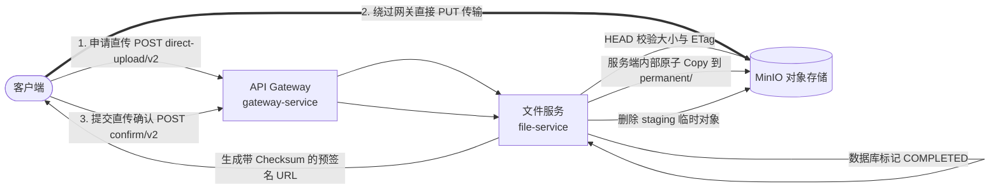
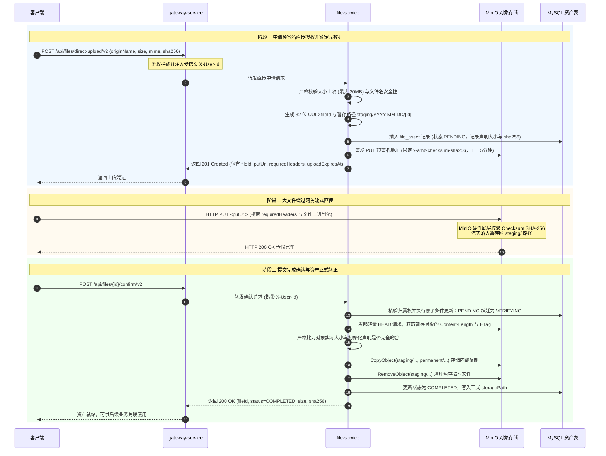
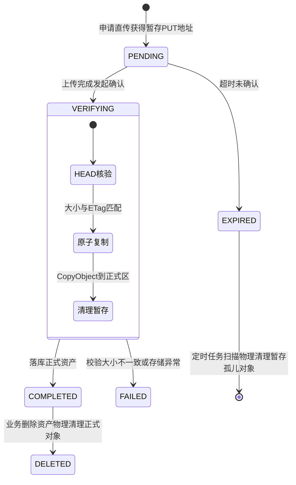

# 服务调用主线 02：大文件/媒体资产 V2 两阶段直传、存储隔离与确认归档

本文档梳理平台**视频与图片资产的两阶段客户端直传、MinIO 存储桶物理隔离、服务端完备性校验与正式转正归档**的端到端服务调用全流程。

---

## 1. 为什么必须采用两阶段直传架构 (Why Staged Direct Upload)

在传统中小型 Web 架构中，文件上传通常直接通过业务接口上传表单。但在微服务音视频平台中，直接上传或简易直传存在严重的工程隐患：



1. **网关带宽打满与 Netty 线程池耗尽**：
   - 视频文件体积通常在几十 MB 至数 GB。若音视频二进制流直接穿透网关，网关的 Netty Reactor 反应堆线程与堆内存缓冲区将被大流量长时间霸占，导致心跳包丢失、普通业务接口超时，甚至引发集群假死；
2. **缺乏原子性与存储孤儿对象泛滥**：
   - 若客户端上传到一半断网，或恶意上传垃圾文件后放弃提交，存储桶中将留下海量无人引用的“幽灵文件”，长期累积导致磁盘耗尽；
3. **恶意篡改与正式流被覆写的风险**：
   - 若直接签发正式目录（`permanent/`）的 PUT 授权，恶意攻击者可利用未过期的 URL 恶意覆写已上线正常作品的视频流。

本工程采用 **V2 暂存直传架构（Staging-to-Permanent Architecture）**：客户端只能取得暂存区（`staging/`）的写入权限，服务端完成元数据核验后在存储内部原子移动至正式区（`permanent/`）。

---

## 2. 端到端交互时序图 (End-to-End Sequence)



---

## 3. 执行全过程逐步深度剖析

### 3.1 预签名申请与安全锚定 (Initialization)
1. **客户端预计算摘要**：
   - 客户端在本地预先计算好文件的 SHA-256 哈希值，随文件名、文件大小（字节数）与 MIME 类型提交至 `POST /api/files/direct-upload/v2`。
2. **入库与过期倒计时**：
   - `file-service` 在 `file_asset` 表中插入初始记录，赋予状态 `PENDING`，并记录业务确认截止时间 `upload_expires_at`（默认 15 分钟）。
3. **预签名参数防篡改绑定**：
   - 服务调用 MinIO SDK 签发带有严格安全约束的短期 PUT URL（默认有效时间 5 分钟）；
   - 将客户端声明的 SHA-256 转换为 Base64 编码的 `x-amz-checksum-sha256` 头部，并纳入预签名签名签名串计算中；
   - **安全效果**：客户端在 PUT 时若篡改文件内容、改变 Content-Type 或字节数不符，MinIO 存储端会直接在传输层拒绝并返回 403/400，从源头杜绝内容篡改与重放。

> 💡 **模块细查**：
> - 直传初始化的参数约束与配置详见 [文件模块 · file-service](../modules/file.md#2-第一套件http-接口服务链路)。

---

### 3.2 客户端流式 PUT 直传 (Direct Transmission)
1. **零微服务内存占用**：
   - 客户端直接向 MinIO 端口发起 HTTP PUT 请求；
   - 整个音视频流传输过程**完全不穿透 API 网关，也不流经任何微服务 Java 进程**，彻底解放了集群的 CPU、堆内存与内网带宽。

---

### 3.3 完备性确认与原子转正归档 (Confirmation & Promotion)
1. **防并发中间状态机（`VERIFYING`）**：
   - 客户端直传完成后，调用 `POST /api/files/{id}/confirm/v2`；
   - 服务端首先通过带有所有权判断的原子 SQL，将状态从 `PENDING` 跃迁为 `VERIFYING`：
     ```sql
     UPDATE file_asset 
     SET upload_status = 'VERIFYING', updated_at = NOW() 
     WHERE id = #{fileId} AND user_id = #{userId} AND upload_status = 'PENDING';
     ```
   - 此操作防止客户端重复并发调用确认接口导致的重复处理竞争。
2. **HEAD 元数据对齐**：
   - 服务端向 MinIO 发送轻量级 HEAD 请求，仅读取对象的元数据（`Content-Length`、`ETag`）；
   - 严格核验存储端的实际字节数是否与阶段一客户端声明的值完全吻合；若大小不符，判定为非法截断或伪造，直接废弃。
3. **存储端内部原子转正**：
   - 服务端向 MinIO 发出 `CopyObject` 指令，要求对象存储内部将对象从 `staging/2026-09-17/{id}` 复制到正式隔离区 `permanent/2026-09-17/{id}`；
   - 复制完成后立刻调用 `RemoveObject` 删掉暂存区临时对象。
4. **终态达成**：
   - 更新数据库状态为 `COMPLETED`，正式对外发布该资产，此时创作者才可在 `content-service` 等业务中作为合法文件资产进行绑定。

---

## 4. 存储对象生命周期状态机



---

## 5. 异常自愈与孤儿文件清理补偿

| 异常类型 | 潜在风险 | 自动化自愈机制 |
| :--- | :--- | :--- |
| **客户端申请后未上传** | 数据库留存僵死 `PENDING` 记录 | 记录自带 `upload_expires_at`（默认 15 分钟）。到期后该记录失效，客户端无法再调用确认接口。 |
| **已传至 MinIO 但未确认** | 暂存区存在未引用的垃圾大文件 | 文件服务后台挂载定时扫描任务 `FileCleanupScheduler`，定期扫描数据库中超过期限仍处于 `PENDING` 的记录，向 MinIO 批量下发 `staging/` 对象的物理清理指令。 |
| **HEAD 检查大小不符** | 客户端上传残缺或截断文件 | 确认逻辑直接抛出 `400 BAD_REQUEST`，将记录标为 `FAILED`，并触发暂存对象清理，杜绝破损视频入库。 |
| **复制成功但数据库异常** | 产生了正式文件但数据库未标记 | 后台自愈任务定期核对 `VERIFYING` 超过一定阈值的挂起任务，自动重试最终对齐状态。 |
