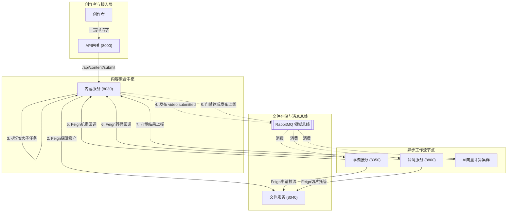
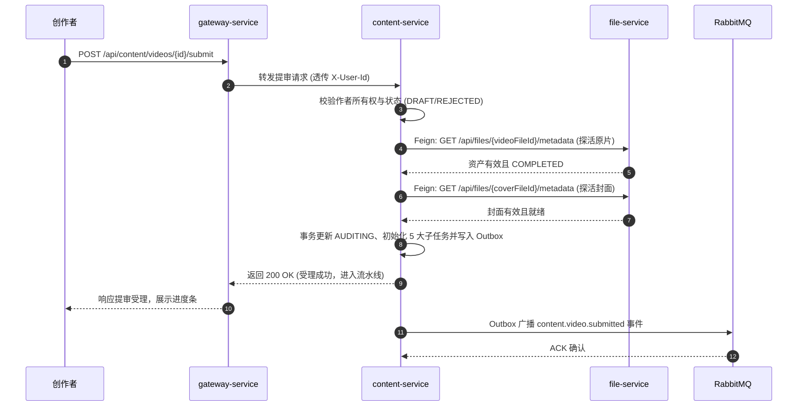
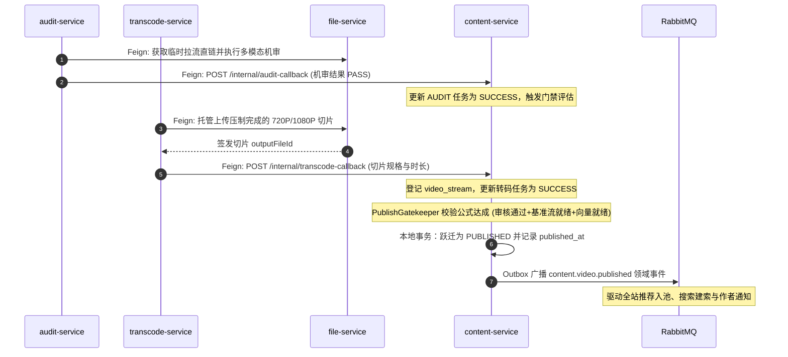
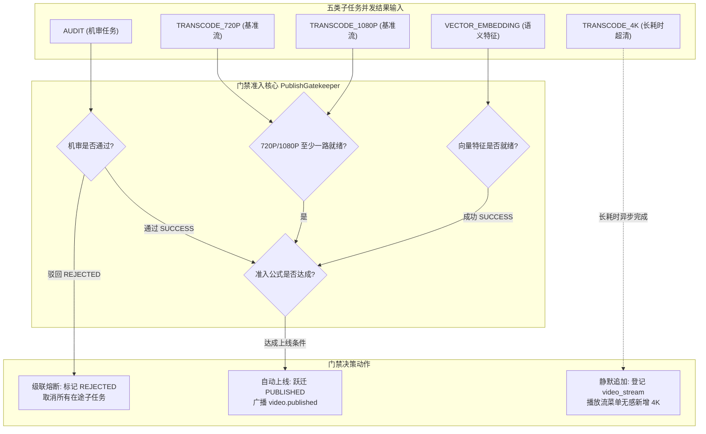
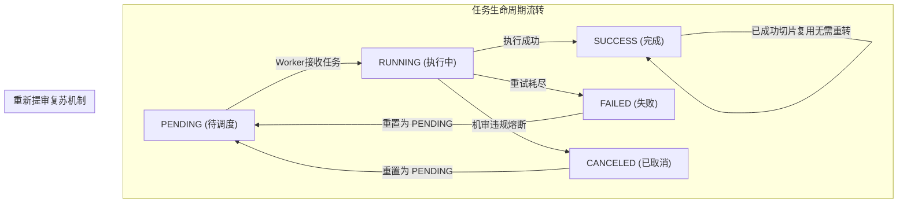

# 服务调用主线 03：视频创作、提审探活、异步机审与分级门禁流水线

本文档是媒体平台的**核心业务支柱与技术皇冠**。深入梳理创作者视频创建、Feign 同步文件探活、RabbitMQ 异步流水线任务分解（内容安全机审、多规格切片转码、多模态语义向量）、工业级**分级就绪门禁（`PublishGatekeeper`）**裁决、级联熔断以及超时自愈补偿的端到端服务调用全流程。

---

## 1. 跨服务协同架构全景

视频发布并非简单的单体保存，而是由**内容服务中心协调、跨微服务分工并行、门禁最终裁决**的分布式流水线：

---

## 2. 端到端执行时序图 (End-to-End Sequence)

### 2.1 提审受理、Feign 资产强探活与事件派发

### 2.2 异步工作流回调、分级门禁裁决与正式上线

---

## 3. 核心技术机制深度剖析

### 3.1 提审前 OpenFeign 强探活机制
在分布式音视频架构中，最忌讳“脏引用与空壳提审”——即用户传入了未经确认的 `PENDING` 文件 ID 或伪造的 ID，导致系统调动大量 GPU/CPU 算力去转码一个根本不存在的文件。

- **探活客户端**：[`FileServiceClient.getFileMetadata(fileId)`](../../service/content-service/src/main/java/com/calles/platform/content/application/client/FileServiceClient.java)
- **校验硬指标**：
  1. 主视频文件与封面图必须在 `file_asset` 表中存在；
  2. 文件的逻辑可用状态必须为 `status = 'ACTIVE'`；
  3. 文件的上传确认状态必须为 `upload_status = 'COMPLETED'`；
  4. 若任一检查不满足，`content-service` 在提审阶段立即抛出 `400 BAD_REQUEST` 并附带明确中文提示，彻底杜绝下游空转。

---

### 3.2 分级就绪门禁决策器 (`PublishGatekeeper`)
传统音视频网站在“全部分辨率（包含 4K、AV1 等重度规格）压制完成前”禁止上线，导致创作者发布延迟极大。`content-service` 引入工业级**分级就绪门禁**：

#### 1. 门禁准入公式 (数学逻辑)
$$\text{GateReady} = (\text{Task}_{\text{AUDIT}} = \text{SUCCESS}) \land (\text{Task}_{\text{720P}} = \text{SUCCESS} \lor \text{Task}_{\text{1080P}} = \text{SUCCESS}) \land (\text{Task}_{\text{VECTOR}} = \text{SUCCESS})$$

- **快速发布**：只要审核通过、至少一条基准清晰度流（720P 或 1080P）就绪且向量计算完毕，视频**立刻自动流转为 `PUBLISHED`**；
- **4K 异步追加**：4K 转码耗时长达数十分钟，其任务完成时仅静默插入一条 `video_stream` 切片，前台画质切换菜单无缝增加 4K 选项，完全不阻塞视频的提前上线；
- **违规即时熔断**：一旦 `audit-service` 判定违规（驳回），门禁立即将视频标为 `REJECTED`，并调用原子 SQL 将处于 `PENDING` 或 `RUNNING` 的其余转码任务统一置为 `CANCELED`，防止空耗转码算力与磁盘空间。

---

### 3.3 重新提审与流水线复苏机制 (`Pipeline Resuscitation`)

当视频被审核驳回或转码异常后，创作者修改标题、简介或更换文件可再次提审。系统具备智能的**流水线复苏能力**：

- 在 [`VideoTaskCoordinator.resetPipelineTasksForResubmit(...)`](../../service/content-service/src/main/java/com/calles/platform/content/application/task/VideoTaskCoordinator.java) 中：
  - 已完成的 `SUCCESS` 切片保留，不重复转码；
  - 处于 `FAILED` 或 `CANCELED` 的子任务被原子重置为 `PENDING`，重试计数清零，错误信息重置；
  - 视频状态由 `REJECTED` 重新跃迁为 `AUDITING`，发件箱重新向 RabbitMQ 广播提审事件。

---

### 3.4 僵死任务巡检与超时自愈调度器 (`VideoTaskTimeoutScheduler`)

在分布式 Worker 集群中，进程崩溃、网络断开或宿主机 OOM 可能导致子任务永久停留在 `RUNNING` 状态：
- **定时调度**：后台调度器每分钟扫描处于 `RUNNING` 状态且持续时长超过阈值（默认 15 分钟，通过 `content.task.timeout-minutes` 配置）的僵死任务；
- **自愈补偿策略**：
  - 若 `retryCount < maxRetries`（默认 3 次）：将任务重置为 `PENDING`，自增 `retryCount` 重新进入派发排队；
  - 若已达最大重试上限：标记任务为 `FAILED`；若失败的是阻断性 `AUDIT` 任务，联动门禁驳回视频并终止流水线，防止作品处于永久挂死状态。

> 💡 **模块细查**：
> - 完整门禁决策与用例代码详见 [内容模块 · content-service](../modules/content.md)。
> - 审核多维规则与仲裁引擎详见 [审核模块 · audit-service](../modules/audit.md)。
> - 物理转码与硬件限流机制详见 [转码模块 · transcode-service](../modules/transcode.md)。
