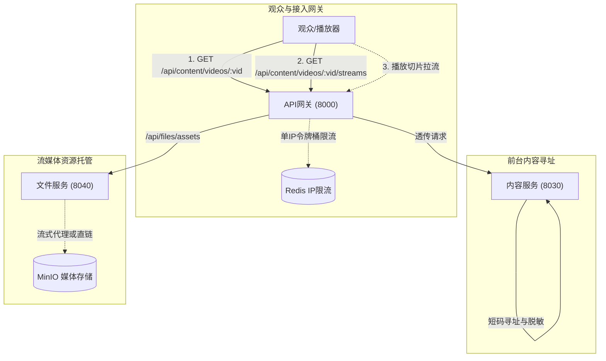
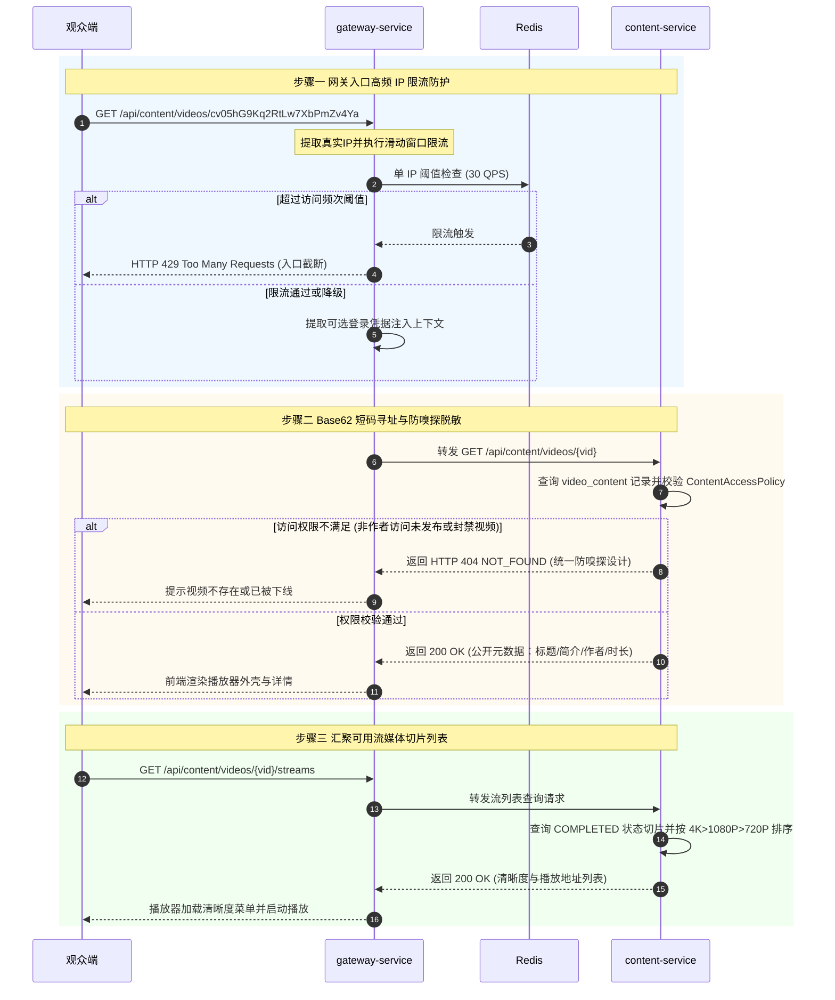

# 服务调用主线 04：前台视频播放分发、短码寻址与网关防刷

本文档梳理普通观众与已登录用户在门户前台**浏览视频详情、寻址业务公开短码（`vid`）、网关入口高频 IP 防刷限流、可见性脱敏判定以及多清晰度播放流切片聚合**的端到端服务调用全流程。

---

## 1. 参与组件与调用拓扑

---

## 2. 端到端执行时序图 (End-to-End Sequence)

---

## 3. 核心机制深度剖析

### 3.1 双 ID 体系与 Base62 防爬短码 (`vid`)
为兼顾数据库性能与前台公开安全，内容服务设计了**双 ID 体系**：
- **物理主键 `id`**：32 位小写 UUID，专供聚合根内部持久化、外键关联、索引优化，**严禁暴露于外部 URL**；
- **公开业务短码 `vid`**：固定前缀 `cv` + 22 位高熵 Base62 随机字符串（全长 24 位，由 `Base62VidGenerator` 生成）：
  - **防全站遍历爬取**：彻底告别自增 ID（如 1001, 1002）带来的爬虫顺序抓取漏洞；
  - **URL 紧凑与美观**：相比 UUID，Base62 更加紧凑，便于用户在社交媒体、剪贴板中分享。

### 3.2 访问权限与“防嗅探”安全脱敏 (`ContentAccessPolicy`)
在公网环境中，攻击者常通过随机请求 ID 来嗅探平台未发布的内部视频或被封禁的敏感视频。
- **防嗅探设计**：当未登录访客尝试访问未公开、已下架、私密或封禁的视频时，系统**统一返回 `404 NOT_FOUND`，而不是 `403 FORBIDDEN`**；
- **业务收益**：对外抹平“该视频究竟是不存在，还是被违规封禁”的差异，彻底杜绝黑客利用接口状态码刺探平台封禁规则与违规内容。

### 3.3 网关 IP 令牌桶防刷限流 (`AssetRateLimiterGlobalFilter`)
针对静态资源与音视频切片拉取（路径匹配 `/api/files/assets/**`），网关入口挂载了高优先级限流过滤器（Order = -150）：
- 基于客户端真实 IP（解析 `X-Forwarded-For`、`X-Real-IP`），在 Redis 中进行原子滑动窗口计数；
- 默认单 IP 每秒限制最多 30 次请求，超阈值直接在网关入口截断并返回 HTTP `429 Too Many Requests`；
- **优雅降级（Fail-open）**：当 Redis 出现网络波动或不可达时，限流器自动放行，保障正常用户的观影体验不受中间件单点抖动影响。

> 💡 **模块细查**：
> - 网关限流配置与源码详见 [网关模块 · gateway-service](../modules/gateway.md#2-第一套件http-接口服务链路)。
> - 读模型查询用例与策略实现见 [内容模块 · content-service](../modules/content.md#2-第一套件http-接口服务链路)。
