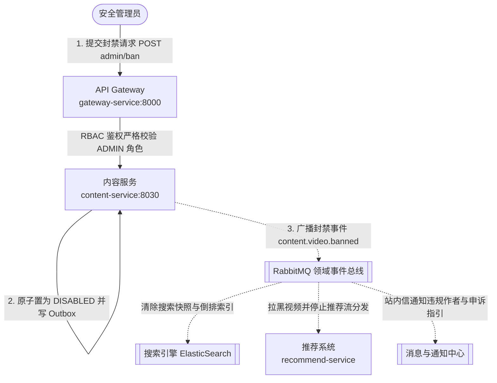
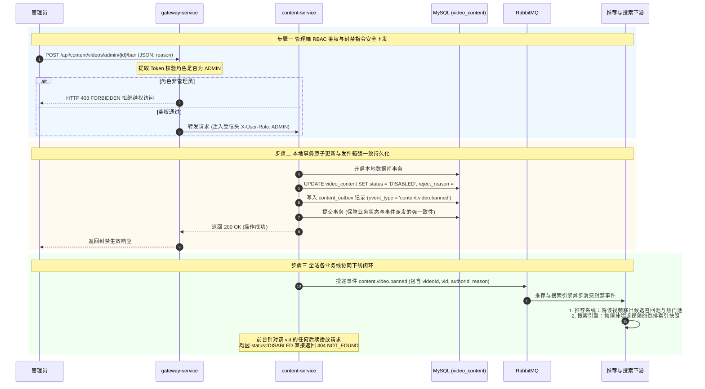

# 服务调用主线 05：平台合规治理、违规封禁与全站事件广播下线

本文档梳理运营与安全管理员在管理端后台**检索可疑作品、执行违规封禁（Ban）与解封（Unban）、状态原子跃迁以及通过领域事件广播驱动全站搜索、推荐与前台即时下线**的端到端服务调用全流程。

---

## 1. 参与组件与调用拓扑

---

## 2. 端到端执行时序图 (End-to-End Sequence)

---

## 3. 核心机制深度剖析

### 3.1 状态分层解耦体系
平台的视频实体具备两套独立的状态维度，互不干扰：
1. **统一可用状态 `CommonStatus`**（平台级）：
   - `ACTIVE`：正常可用；
   - `DISABLED`：违规封禁/冻结。
2. **创作流转状态 `PublishStatus`**（业务生命周期）：
   - `DRAFT` / `AUDITING` / `PUBLISHED` / `REJECTED` / `OFFLINE`。

**封禁的工程优势**：管理员封禁仅将 `status` 翻转为 `DISABLED`，**保留了原有的 `publish_status`（如 PUBLISHED）**：
- **前台立即生效**：前台公众接口在可见性核验时发现 `status = DISABLED`，立即可见性阻断（安全脱敏为 404）；
- **低成本解封恢复（Unban）**：如果未来管理员经申诉核实后执行“解封”，只需将 `status` 重新置回 `ACTIVE`，视频**无需重新经历漫长的高耗能转码与机审流水线**即可直接恢复播放，极大降低了纠偏成本。

### 3.2 治理相关事件总线清单

| 事件类型 (`event_type`) | 触发时机 | 载荷核心字段 | 下游响应动作 |
| :--- | :--- | :--- | :--- |
| `content.video.banned` | 管理员封禁视频 | `videoId`, `vid`, `authorId`, `reason` | 推荐池拉黑、搜索引擎下架、创作者站内违规警告通知。 |
| `content.video.unbanned` | 管理员解封恢复视频 | `videoId`, `vid`, `authorId` | 重新激活搜索索引、恢复推荐分发通道。 |
| `content.video.offlined` | 创作者主动下架视频 | `videoId`, `vid`, `authorId` | 搜索与推荐池下线，前台隐藏。 |

> 💡 **模块细查**：
> - 管理端接口契约与权限校验见 [内容模块 · content-service](../modules/content.md#2-第一套件http-接口服务链路)。
> - 审核证据沉淀与工单详情见 [审核模块 · audit-service](../modules/audit.md#2-第一套件http-接口服务链路)。
