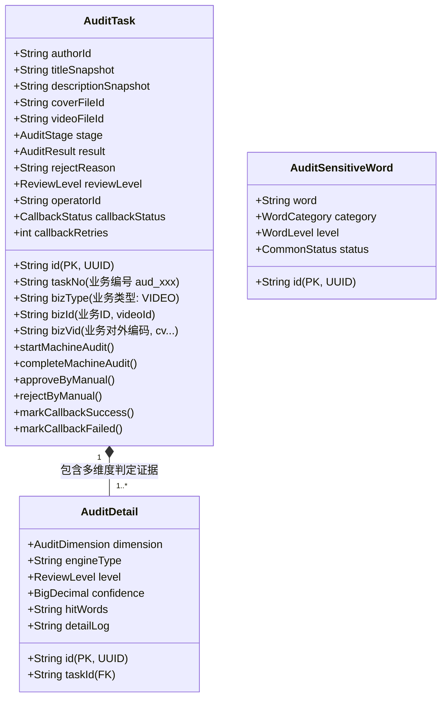
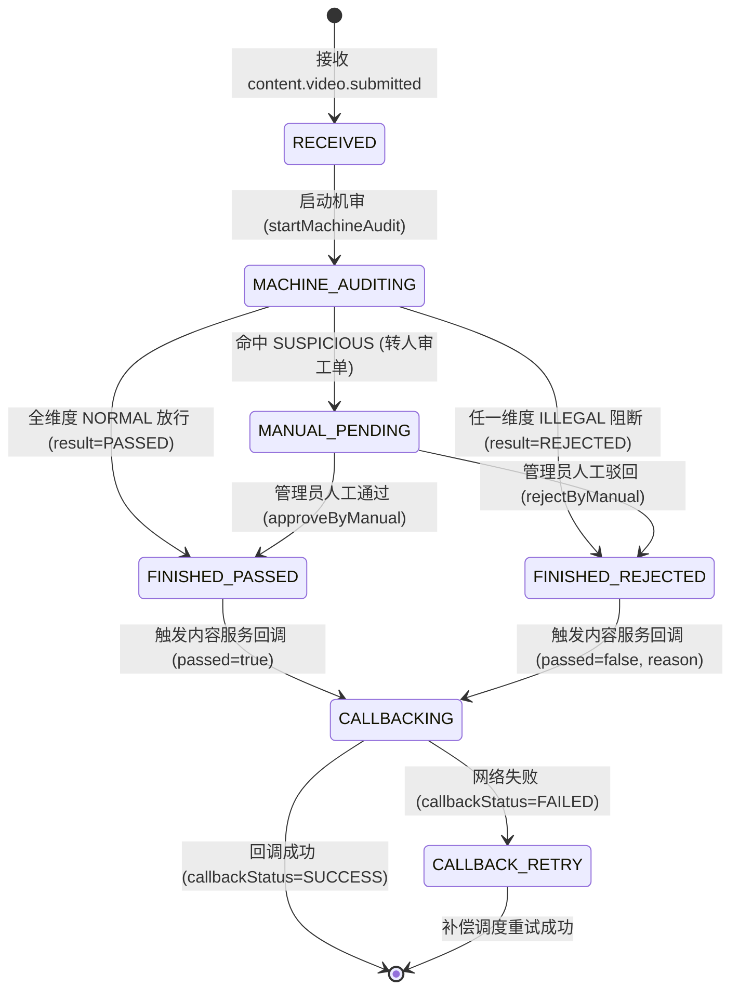

# 审核模块 · audit-service 架构设计与实现文档

审核模块（`audit-service`）是平台内容安全、合规风控与法律防线业务支柱。它负责接收来自内容服务（`content-service`）的提审事件，对视频图文元数据（标题、简介）、多媒体封面图片以及音视频资产执行分级安全合规机审，生成完备的多维度审查证据与日志，并通过专用内部微服务回调机制驱动内容服务的分级门禁流转。

---

## 1. 模块定位与架构边界

### 1.1 业务职责边界
- **提审事件异步受理**：通过 RabbitMQ 消费来自 `content-service` 的 `content.video.submitted` 提审事件，解析视频主键、公开编码、作者信息及关联文件资产凭证；
- **分级自动化机审流水线**：
  - **文本元数据审查**：基于确定有限状态自动机（DFA）前缀树算法，对标题、简介等文本进行毫秒级敏感词过滤与分级研判；
  - **多媒体封面审查**：基于规则校验与可插拔适配器（支持本地规则桩演练与第三方云内容安全 SDK 适配层）校验封面图合规性；
  - **视频流资产合规性**：对主视频文件进行基础规则合法性探测；
- **聚合仲裁决策**：采用最高风险等级优先策略（`ILLEGAL` > `SUSPICIOUS` > `NORMAL`）聚合各维度明细，判定是直接通过、违规驳回还是转入人工复审；
- **高韧性下游回调与状态对齐**：通过 OpenFeign 调用内容服务专属内部回调端点 `POST /api/content/videos/internal/audit-callback`，驱动内容状态流转；内置指数退避定时重试调度器（`AuditCallbackRetryScheduler`），避免瞬时网络抖动导致任务卡死。

### 1.2 防腐与不应承担的工作
- **不直接修改视频业务表**：视频的状态维护由 `content-service` 完全拥有，本服务仅提供判定结论与驳回原因；
- **不直接托管二进制文件**：音视频与图片物理存储由 `file-service` 负责，本服务仅依赖文件资产 ID 进行元数据判定或受控临时拉流；
- **不直接管理账号身份**：依赖网关校验 JWT 并透传 `X-User-Id` 与 `X-User-Role`。

---

## 2. 领域模型与核心状态机

### 2.1 聚合根与实体拓扑

### 2.2 状态流转状态机

---

## 3. 数据库表结构

表统一存放在 MySQL 实例中，使用前缀 `audit_` 隔离表所有权，主键为 32 位 UUID，时间保留毫秒精度 `DATETIME(3)`。

- **审核主任务表 (`audit_task`)**：独立 DDL 脚本位于 [`service/audit-service/db/schema/audit-task.sql`](../../service/audit-service/db/schema/audit-task.sql)；
- **审核判定明细表 (`audit_detail`)**：独立 DDL 脚本位于 [`service/audit-service/db/schema/audit-detail.sql`](../../service/audit-service/db/schema/audit-detail.sql)；
- **敏感词库字典表 (`audit_sensitive_word`)**：独立 DDL 脚本位于 [`service/audit-service/db/schema/audit-sensitive-word.sql`](../../service/audit-service/db/schema/audit-sensitive-word.sql)；
- **全局建表汇总**：已合并至根目录 [`db/init/schema.sql`](../../db/init/schema.sql)。

---

## 4. 可插拔审核引擎与通信契约

### 4.1 审核引擎群与策略编排
- **引擎抽象契约与值对象**（`domain/engine/`）：
  - `TextAuditEngine`、`ImageAuditEngine`、`VideoAuditEngine`、`EngineAuditResult`
- **引擎基础设施具体实现**（`infrastructure/engine/`）：
  - **`DfaTextAuditEngine`**：基于确定有限状态机（DFA）敏感词前缀树扫描，时间复杂度为 $O(N)$；支持大小写与噪声干扰字符过滤；支持数据库热重载与本地内置默认兜底词库；
  - **`DefaultRuleImageAuditEngine`**：封面多媒体合规规则引擎，支持测试桩模拟演练与第三方云内容安全接口插拔适配；
  - **`DefaultVideoAuditEngine`**：视频资产基础规格与合规性审查；
- **领域决策仲裁服务**（`domain/service/`）：
  - **`AuditDecisionAggregator`**：综合仲裁器，基于安全最高优先级汇总判定与驳回理由；
- **业务专属执行器路由分派体系**（`application/executor/`）：
  - 基于策略模式与路由组件（`AuditExecutorRouter`）解耦通用流程与业务类型特化逻辑，包含 `AuditExecutor`、`VideoAuditExecutor`、`AuditContext` 与 `AuditExecutionResult`。

### 4.2 跨服务通信与回调契约
1. **提审事件消费**：
   - 监听 RabbitMQ Exchange `media.platform.events`，Queue `audit-service.content-video-submitted.v1`，Routing Key `content.video.submitted`；
   - 具备死信队列 `audit-service.content-video-submitted.v1.dlq` 保证异常消息可追溯。
2. **Feign 判定回调**：
   - 客户端：[`ContentServiceClient.java`](../../service/audit-service/src/main/java/com/calles/platform/audit/application/client/ContentServiceClient.java)；
   - 目标端点：`POST /api/content/videos/internal/audit-callback`；
   - 载荷参数：`videoId`、`passed`、`rejectReason`。

### 4.3 HTTP 接口清单

| 方法 | URI 路径 | 权限控制 | 说明 |
| :--- | :--- | :--- | :--- |
| `POST` | `/api/audit/internal/submit` | 内部网络 / 调试 | 模拟发起视频审核流水线 |
| `GET` | `/api/audit/tasks/{id}` | 内部网络 / 统一查阅 | 查看审核任务状态及多维度证据明细 |
| `GET` | `/api/audit/admin/tasks` | 管理员 / 审核员 | 运营后台复合条件分页检索工单列表 |
| `GET` | `/api/audit/admin/tasks/{id}` | 管理员 / 审核员 | 运营后台查看工单全景信息与多维度证据 |
| `POST` | `/api/audit/admin/tasks/{id}/review` | 管理员 / 审核员 | 人工审核放行/驳回裁决并联动下游内容服务 |

---

## 5. 源码核心入口索引

- **引导入口**：[`AuditApplication.java`](../../service/audit-service/src/main/java/com/calles/platform/audit/AuditApplication.java)（开启 OpenFeign 与 定时调度 `@EnableScheduling`）；
- **DTO 契约传输层**：
  - 入参契约：[`AuditRequests.java`](../../service/audit-service/src/main/java/com/calles/platform/audit/interfaces/http/dto/AuditRequests.java)
  - 出参契约：[`AuditResponses.java`](../../service/audit-service/src/main/java/com/calles/platform/audit/interfaces/http/dto/AuditResponses.java)
- **统一异常与处理器**：
  - 业务异常：[`AuditException.java`](../../service/audit-service/src/main/java/com/calles/platform/audit/exception/AuditException.java)
  - 全局异常切面：[`AuditExceptionHandler.java`](../../service/audit-service/src/main/java/com/calles/platform/audit/interfaces/http/advice/AuditExceptionHandler.java)
- **领域模型与服务**：
  - 任务聚合根：[`AuditTask.java`](../../service/audit-service/src/main/java/com/calles/platform/audit/domain/model/AuditTask.java)
  - 明细实体：[`AuditDetail.java`](../../service/audit-service/src/main/java/com/calles/platform/audit/domain/model/AuditDetail.java)
  - 敏感词实体：[`AuditSensitiveWord.java`](../../service/audit-service/src/main/java/com/calles/platform/audit/domain/model/AuditSensitiveWord.java)
  - 状态与维度枚举：[`domain/model/enums/`](../../service/audit-service/src/main/java/com/calles/platform/audit/domain/model/enums/)（包含 `AuditStage`、`AuditResult`、`ReviewLevel`、`AuditDimension`、`CallbackStatus`、`CommonStatus`、`WordCategory`、`WordLevel`）
  - 仲裁决策领域服务：[`AuditDecisionAggregator.java`](../../service/audit-service/src/main/java/com/calles/platform/audit/domain/service/AuditDecisionAggregator.java)
- **审查引擎契约与实现**：
  - 领域契约接口：[`TextAuditEngine.java`](../../service/audit-service/src/main/java/com/calles/platform/audit/domain/engine/TextAuditEngine.java)、[`ImageAuditEngine.java`](../../service/audit-service/src/main/java/com/calles/platform/audit/domain/engine/ImageAuditEngine.java)、[`VideoAuditEngine.java`](../../service/audit-service/src/main/java/com/calles/platform/audit/domain/engine/VideoAuditEngine.java)
  - 判定结果值对象模型：[`EngineAuditResult.java`](../../service/audit-service/src/main/java/com/calles/platform/audit/domain/engine/model/EngineAuditResult.java)
  - DFA 文本引擎实现：[`DfaTextAuditEngine.java`](../../service/audit-service/src/main/java/com/calles/platform/audit/infrastructure/engine/DfaTextAuditEngine.java)
  - 封面规则引擎实现：[`DefaultRuleImageAuditEngine.java`](../../service/audit-service/src/main/java/com/calles/platform/audit/infrastructure/engine/DefaultRuleImageAuditEngine.java)
  - 视频规则引擎实现：[`DefaultVideoAuditEngine.java`](../../service/audit-service/src/main/java/com/calles/platform/audit/infrastructure/engine/DefaultVideoAuditEngine.java)
- **应用协调、执行与调度**：
  - 通用工作流协调器：[`AuditTaskCoordinator.java`](../../service/audit-service/src/main/java/com/calles/platform/audit/application/coordinator/AuditTaskCoordinator.java)
  - 业务执行器体系：
    - 策略契约与路由：[`AuditExecutor.java`](../../service/audit-service/src/main/java/com/calles/platform/audit/application/executor/AuditExecutor.java)、[`AuditExecutorRouter.java`](../../service/audit-service/src/main/java/com/calles/platform/audit/application/executor/AuditExecutorRouter.java)
    - 执行上下文与结果模型：[`AuditContext.java`](../../service/audit-service/src/main/java/com/calles/platform/audit/application/executor/model/AuditContext.java)、[`AuditExecutionResult.java`](../../service/audit-service/src/main/java/com/calles/platform/audit/application/executor/model/AuditExecutionResult.java)
    - 业务执行实现：[`VideoAuditExecutor.java`](../../service/audit-service/src/main/java/com/calles/platform/audit/application/executor/impl/VideoAuditExecutor.java)
  - 人审应用服务：[`AuditManualReviewApplicationService.java`](../../service/audit-service/src/main/java/com/calles/platform/audit/application/service/AuditManualReviewApplicationService.java)
  - 回调服务：[`AuditCallbackService.java`](../../service/audit-service/src/main/java/com/calles/platform/audit/application/service/AuditCallbackService.java)
  - 容灾补偿定时器：[`AuditCallbackRetryScheduler.java`](../../service/audit-service/src/main/java/com/calles/platform/audit/application/scheduler/AuditCallbackRetryScheduler.java)
- **消息与控制器**：
  - 提审消息强类型模型：[`VideoSubmittedMessage.java`](../../service/audit-service/src/main/java/com/calles/platform/audit/interfaces/messaging/event/VideoSubmittedMessage.java) 与 [`VideoSubmittedPayload.java`](../../service/audit-service/src/main/java/com/calles/platform/audit/interfaces/messaging/event/VideoSubmittedPayload.java)
  - 提审消息消费者：[`VideoSubmittedConsumer.java`](../../service/audit-service/src/main/java/com/calles/platform/audit/interfaces/messaging/consumer/VideoSubmittedConsumer.java)
  - 内部端点控制器：[`InternalAuditController.java`](../../service/audit-service/src/main/java/com/calles/platform/audit/interfaces/http/controller/InternalAuditController.java)
  - 管理端端点控制器：[`AdminAuditController.java`](../../service/audit-service/src/main/java/com/calles/platform/audit/interfaces/http/controller/AdminAuditController.java)

---

## 6. 验证方式与测试覆盖

模块内置 **43 项单元与集成测试用例**（11 个测试类），测试套件涵盖：
1. **`DfaTextAuditEngineTest`**（5 项）：验证正常文本放行、严重违禁词拦截、疑似词识别、干扰符过滤及空串边界；
2. **`AuditDecisionAggregatorTest`**（3 项）：验证全正常仲裁、包含违规最高优先级判定、疑似转人审仲裁；
3. **`VideoAuditExecutorTest`**（3 项）：验证视频专属执行器多维度机审编排与判定输出；
4. **`AuditTaskTest`**（5 项）：验证聚合根全生命周期状态流转、人工审批/驳回跃迁及非法跃迁异常；
5. **`AuditCallbackServiceTest`**（3 项）：验证 Feign 远程回调成功更新状态、网络超时异常标记失败重试及未完结状态拦截；
6. **`AuditTaskCoordinatorTest`**（4 项）：验证全流程协调流水线、合规通过自动回调、违规拦截自动打回、疑似可疑转待人审及提审幂等保护；
7. **`AuditCallbackRetrySchedulerTest`**（1 项）：验证定时补偿器扫描并重试失败任务；
8. **`VideoSubmittedConsumerTest`**（4 项）：验证标准信封嵌套结构、扁平直传载荷、未知扩展字段兼容及缺失 ID 守卫校验；
9. **`InternalAuditControllerTest`**（3 项）：验证 MockMvc HTTP 模拟提交与任务明细查询（防腐 DTO 结构）；
10. **`AdminAuditControllerTest`**（5 项）：验证管理端分页检索工单、全景详情、人工通过/驳回、非法参数校验拦截；
11. **`AuditManualReviewApplicationServiceTest`**（7 项）：验证人审应用服务全景组装、分页查询、审批流转、驳回原因校验及状态机保护。

**全量回归测试指令**：
- 审核模块测试：`./mvnw -f service/audit-service/pom.xml test`（43 项用例 100% 通过）
- 内容模块协同回归：`./mvnw -f service/content-service/pom.xml test`（109 项用例 100% 通过）
