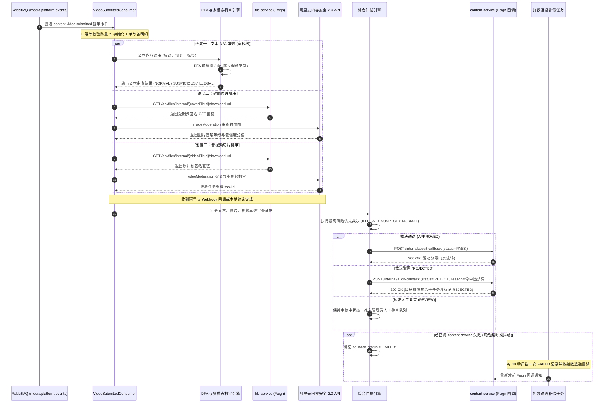
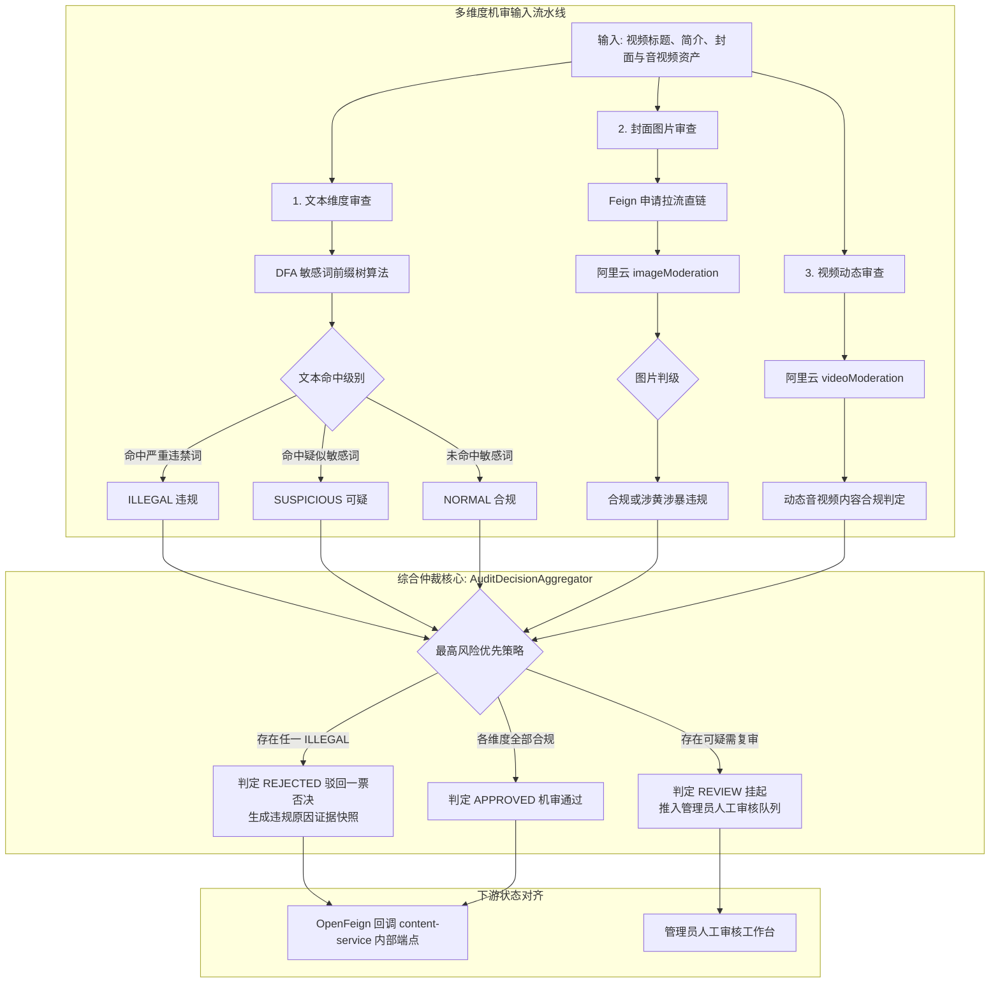

# 审核模块 · audit-service 架构设计与实现文档

审核模块（`audit-service`）是平台内容安全、合规风控与法律责任的守护中枢（运行端口：8050）。负责异步消费来自内容服务（`content-service`）的提审领域事件，对视频文本元数据（标题、简介、标签）、封面静态图以及音视频多媒体资产执行多维度自动化机审，生成可追溯的合规证据链，并通过专有内部回调驱动内容服务的分级门禁流转与驳回熔断。

---

## 1. 模块定位与架构边界

### 1.1 核心业务职责
- **提审事件异步接入与防重**：
  - 监听 RabbitMQ `content.video.submitted` 路由键，异步拉取提审事件；
  - 基于业务类型（`biz_type = 'VIDEO'`）与业务实体 ID（`biz_id = #{videoId}`）构建幂等性防线，防止网络重放导致重复建单。
- **三维多模态自动化机审流水线**：
  - **文本维度审查（毫秒级）**：基于**确定有限状态自动机（DFA）前缀树算法**，对标题、简介与标签执行高性能敏感词匹配，支持跳过无意义混淆符号（如标点、空格、特殊 Unicode），输出 `NORMAL`、`SUSPICIOUS` 或 `ILLEGAL`；
  - **封面图片审查**：可插拔适配器架构（本地规则测试桩 + 阿里云内容安全 2.0 增强版 `imageModeration`），调用 `file-service` 换取短期预签名 GET 直链拉流，识别涉黄、涉暴、涉政、违禁元素；
  - **音视频动态审查**：支持本地规则桩与阿里云 `videoModeration` 双轨结果接收（开发环境本地轮询降级 + 生产环境 Webhook 回调带 SHA-256 防篡改签名验签）。
- **综合仲裁引擎（`AuditDecisionAggregator`）**：
  - 遵循**最高风险优先原则（`ILLEGAL` > `SUSPICIOUS` > `NORMAL`）**聚合三维证据；
  - 只要任意一维触发 `ILLEGAL`，整单立即一票否决为 `REJECTED`；
  - 若存在 `SUSPICIOUS` 且无 `ILLEGAL`，转入 `REVIEW` 状态推入人工审核工作台；
  - 所有维度均合规，判定为 `APPROVED`。
- **高韧性状态回调与指数退避重试**：
  - 裁决完成后通过 OpenFeign 同步回调 `content-service` 的内部专享端点 `POST /api/content/videos/internal/audit-callback`；
  - 内置指数退避定时重试调度器（`AuditCallbackRetryScheduler`），网络抖动时自动按 2s、4s、8s、16s、32s 梯次重试，消除跨微服务断层死锁。

### 1.2 防腐与禁止承担的工作
- **严禁直接修改视频业务主表**：视频生命周期状态由 `content-service` 独立拥有，审核服务绝不跨库 update `video_content`；
- **严禁直接托管多媒体物理文件**：文件存储由 `file-service` 统一负责，审核服务仅依赖文件 ID 动态获取时效拉流直链；
- **不承接用户鉴权**：除管理员人工复审端点校验 `ADMIN` 角色外，核心机审流水线完全由内部事件驱动。

### 1.3 参与的全局业务主线导航
- 核心协同 [主线 03：视频创作、提审探活、异步机审与分级门禁流水线](../flows/03-video-publish-and-pipeline.md)
- 核心支撑 [主线 05：平台合规治理、违规封禁与全站事件广播下线](../flows/05-platform-governance-flow.md)

---

## 2. 端到端多模态机审与仲裁时序图



---

## 3. 多维度审查与综合仲裁决策图



---

## 4. 第一套件：HTTP 接口服务链路

审核服务对外端点均挂载于 `/api/audit/**` 下：

| HTTP 方法 | URI 路径 | 鉴权要求 | 核心处理流与调用链 | 关键响应状态 |
| :--- | :--- | :--- | :--- | :--- |
| `POST` | `/api/audit/callback/aliyun` | 匿名验签 | 接收阿里云机审 Webhook 回调 ➔ SHA-256 签名校验防篡改 ➔ 关联工单明细 ➔ 推进机审终态 | `200` 成功接收 |
| `POST` | `/api/audit/admin/tasks/page` | `requireAdmin` | 管理员分页检索审核工单（支持按业务类型、工单阶段、审核结果组合多维过滤） | `200` 成功返回分页列表 |
| `GET` | `/api/audit/admin/tasks/{id}` | `requireAdmin` | 查询单个工单完整证据链（文本命中片段、图片涉嫌标签、机审分值快照） | `200` 成功返回详情<br/>`404` 工单不存在 |
| `POST` | `/api/audit/admin/tasks/{id}/approve` | `requireAdmin` | 人工审核通过 ➔ 记录操作人 ID ➔ 翻转工单状态 ➔ 触发 Feign 回调通知内容服务放行 | `200` 成功 |
| `POST` | `/api/audit/admin/tasks/{id}/reject` | `requireAdmin` | 人工审核驳回 ➔ 录入人工驳回原因说明 ➔ 触发 Feign 回调通知内容服务熔断下线 | `200` 成功 |

### 4.1 微服务间内部 RPC 交互说明

- **拉流凭证依赖（调用 `file-service`）**：
  - 端点：`GET /api/files/internal/{id}/download-url`
  - 说明：审核服务从不直接在本地缓存或下载几十 MB 的原视频，而是动态向文件服务换取限时 30 分钟的临时下载预签名 URL，直接下发给阿里云机审引擎拉流。
- **裁决结果回调（调用 `content-service`）**：
  - 端点：`POST /api/content/videos/internal/audit-callback`
  - 报文契约：
    ```json
    {
      "videoId": "cv05hG9Kq2RtLw7XbPmZv4Ya",
      "auditTaskId": "tsk_89a012345678abcdef0123456789",
      "result": "PASS", // 或 REJECT
      "rejectReason": null, // 驳回时附带违规证据摘要
      "evidenceSnapshot": "{\"textHit\":[],\"imgScore\":0.02,\"videoScore\":0.01}",
      "completedAt": 1773728000000
    }
    ```

---

## 5. 第二套件：MQ 消息链路

### 5.1 消费的领域事件：`content.video.submitted`

- **监听配置**：
  - Queue：`audit-service.video-submitted.v1`
  - Exchange：`media.platform.events`
  - RoutingKey：`content.video.submitted`
- **消费全流程与并发防重**：
  1. 解析提审事件载荷，提取 `videoId`、`title`、`description`、`videoFileId`、`coverFileId` 等；
  2. 校验是否存在针对该 `videoId` 且状态处于 `PENDING` 或 `AUDITING` 的存活工单；
  3. 插入 `audit_task` 主表，初始化各明细表 `audit_detail`；
  4. 采用 Spring `@Async` 异步线程池多路并发派发机审子流水线。

---

## 6. 第三套件：定时任务与异步补偿调度链路

### 6.1 回调指数退避重试调度器 (`AuditCallbackRetryScheduler`)
- **执行频率**：默认每 10 秒扫描一次；
- **自愈机制**：
  1. 检索数据库 `audit_task` 中 `callback_status = 'FAILED'` 且 `callback_retries < 5` 的工单；
  2. 采用**指数退避公式**：$\text{Delay} = 2^{\text{retryCount}} \text{ 秒}$，只有当前时间大于下次允许重试时间才触发；
  3. 重新向 `content-service` 发起 Feign 回调，调用成功后立即更新 `callback_status = 'SUCCESS'`；
  4. 若重试达到 5 次上限仍失败，工单被标记为死信告警状态，由运维人员人工干预，确保不会发生跨服务静默丢单。

---

## 7. 数据库表结构全景 (Schema)

### 7.1 审核工单主表 (`audit_task`)
```sql
CREATE TABLE IF NOT EXISTS `audit_task` (
    `id` CHAR(32) NOT NULL COMMENT '工单全局唯一ID',
    `biz_type` VARCHAR(32) NOT NULL DEFAULT 'VIDEO' COMMENT '业务类型: VIDEO, USER_PROFILE, COMMENT',
    `biz_id` CHAR(32) NOT NULL COMMENT '业务实体主键 (如 video_content.id)',
    `author_id` CHAR(32) NOT NULL COMMENT '内容创作者ID',
    `title_snapshot` VARCHAR(255) NOT NULL COMMENT '送审时标题快照',
    `status` VARCHAR(32) NOT NULL DEFAULT 'PENDING' COMMENT '工单状态: PENDING, MACHINE_AUDITING, MANUAL_REVIEW, APPROVED, REJECTED',
    `final_result` VARCHAR(16) NULL COMMENT '最终仲裁结论: PASS, REJECT',
    `reject_reason` VARCHAR(512) NULL COMMENT '驳回原因快照',
    `callback_status` VARCHAR(16) NOT NULL DEFAULT 'PENDING' COMMENT '回调状态: PENDING, SUCCESS, FAILED',
    `callback_retries` INT NOT NULL DEFAULT 0 COMMENT '回调重试次数',
    `created_at` DATETIME(3) NOT NULL DEFAULT CURRENT_TIMESTAMP(3),
    `updated_at` DATETIME(3) NOT NULL DEFAULT CURRENT_TIMESTAMP(3) ON UPDATE CURRENT_TIMESTAMP(3),
    PRIMARY KEY (`id`),
    KEY `idx_biz` (`biz_type`, `biz_id`),
    KEY `idx_callback_retry` (`callback_status`, `callback_retries`)
) ENGINE=InnoDB DEFAULT CHARSET=utf8mb4 COMMENT='审核任务主表';
```

---

## 8. 核心源码入口索引

- **服务启动类**：[`AuditApplication.java`](../../service/audit-service/src/main/java/com/calles/platform/audit/AuditApplication.java)
- **任务编排与仲裁**：
  - 协调器：[`AuditTaskCoordinator.java`](../../service/audit-service/src/main/java/com/calles/platform/audit/application/coordinator/AuditTaskCoordinator.java)
  - 综合仲裁引擎：[`AuditDecisionAggregator.java`](../../service/audit-service/src/main/java/com/calles/platform/audit/domain/service/AuditDecisionAggregator.java)
- **算法与外部引擎适配**：
  - DFA 敏感词引擎：[`DfaTextAuditEngine.java`](../../service/audit-service/src/main/java/com/calles/platform/audit/infrastructure/engine/text/DfaTextAuditEngine.java)
  - 阿里云适配器：`AliyunContentSecurityModerator.java`
- **自愈与重试调度**：
  - 指数退避调度器：[`AuditCallbackRetryScheduler.java`](../../service/audit-service/src/main/java/com/calles/platform/audit/application/scheduler/AuditCallbackRetryScheduler.java)
- **全量测试覆盖**：
  - 55 项单元与集成测试：`AuditDecisionAggregatorTest.java`、`DfaTextAuditEngineTest.java`
