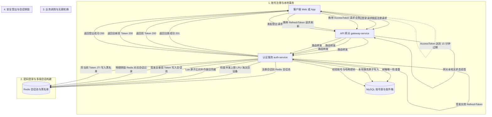
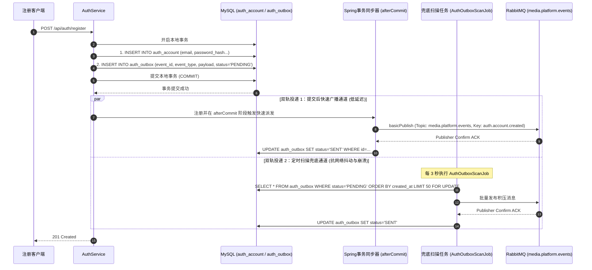

# 认证模块 · auth-service 架构设计与实现文档

认证模块（`auth-service`）是平台账号体系、认证授权与身份安全的中枢（运行端口：8010）。本模块负责全平台用户的账号密码生命周期管理、带盐哈希加密存储、签发有状态/无状态双 Token（短效 AccessToken + 长效 RefreshToken）、基于 Redis 构建单用户多端并发会话池（防刷与超限 LRU 淘汰）、一次性原子令牌轮换（Token Rotation），并通过本地事务发件箱（Transactional Outbox）向 RabbitMQ 可靠发布账号领域事件。

---

## 1. 模块定位与架构边界

### 1.1 核心业务职责
- **账号注册与密码防护**：
  - 规范化校验邮箱格式与唯一性；
  - 采用行业标准带盐 BCrypt 算法计算密码哈希（工作因子 Cost=10），严禁任何明文或弱加密密码入库；
  - 赋予新注册账号基础角色 `USER`，初始化账号状态为 `ACTIVE`。
- **双 Token 签发与多端会话中枢**：
  - 签发 15 分钟短效无状态 JWT（AccessToken），承载 `userId`、`role`、`status`、`jti` 等凭据声明；
  - 签发 30 天高熵随机字符串（RefreshToken），在 Redis 会话池中维系用户设备会话；
  - 支持单账号多端并发登录（默认最大 5 台设备），超出并发阈值按 LRU（最久未活跃）策略优雅剔除旧设备。
- **凭据原子轮换（Token Rotation）防重放**：
  - 每次使用 RefreshToken 换取新令牌时，必须原子作废旧 RefreshToken 并派发全新双 Token；
  - 若已消费的旧凭据被二次提交，立即识别为凭据被窃，触发该会话乃至该账号全端强制下线安全机制。
- **网关鉴权回源验证**：
  - 提供内部 RPC / HTTP 端点 `/api/auth/verify`，供 API 网关在特定严苛场景或离线验签降级时进行凭据校验。
- **事务性领域事件广播**：
  - 依托本地事务发件箱（`auth_outbox`）保障“账号落库”与“事件记录”强一致；
  - 依托提交后快速通知 + 定时扫描双轨调度器将 `auth.account.created` 投递至 RabbitMQ，驱动下游 `user-service` 初始化用户资料。

### 1.2 防腐与禁止承担的工作
- **严禁管理用户个人资料**：用户的昵称、头像、个人简介、性别、生日等属于 `user-service` 领域范围，认证服务绝不建立或修改 `user_profile` 表；
- **严禁代理业务请求鉴权**：除内部验签回源外，所有普通业务 API 鉴权由 API 网关在边缘节点统一完成，业务微服务直接从 HTTP Header 读取网关注入的明文上下文，严禁业务服务直连认证服务做每次鉴权。

### 1.3 参与的全局业务主线导航
- 核心牵头 [主线 01：账号生命周期、双 Token 维护与网关鉴权穿透](../flows/01-auth-and-identity-flow.md)

---

## 2. 双 Token 与多端并发会话生命周期架构图



---

## 3. 核心机制与架构设计权衡

### 3.1 为什么采用“短效 AccessToken + 长效 RefreshToken”双 Token 机制？
- **无状态高吞吐与安全性兼得**：
  - **短效 AccessToken（15 分钟）**：使用 HMAC-SHA256 签发无状态 JWT。网关只需持有公钥/共享密钥即可本地毫秒级验签与提取用户信息，无需每次请求穿透 Redis 或数据库；
  - **长效 RefreshToken（30 天）**：纯随机高熵字符串，仅保存在用户端受保护存储（如 HTTP-Only Cookie 或本地安全存储）并在 Redis 中维护关联索引。即使用户 AccessToken 在公共网络或客户端被嗅探，由于有效期仅 15 分钟，攻击窗口极短；
  - **快速主动拉黑**：当用户改密、封号或登出时，通过拉黑 JTI 或销毁 RefreshToken，最长 15 分钟后该用户全端失效。

### 3.2 Redis 多端并发会话池（Session Pool）与 LRU 淘汰
为了防止同一账号被无限多设备登录或恶意刷号，认证服务在 Redis 中维护结构化的用户会话池：
- **存储结构**：
  - 会话索引（ZSET）：`auth:user:sessions:{userId}`，Score 为设备最近活跃时间戳（Unix Epoch Millis），Member 为 `sessionId`；
  - 会话详情（HASH）：`auth:session:{sessionId}`，存储 `refreshTokenHash`、`deviceId`、`clientIp`、`userAgent`、`createdAt`、`lastActiveAt`；
- **并发控制策略**：
  - 登录时获取当前 ZSET 的基数（Cardinality）；
  - 若 `count >= max-sessions`（系统默认配置为 5），取出 Score 最小（最久未活跃）的 `sessionId`；
  - 物理删除旧会话 HASH 并移出会话池 ZSET，实现优雅的 **LRU 超限自动踢出**，同时向旧设备连接（如有 WebSocket 通道）发送设备下线通知。

### 3.3 一次性原子凭据轮换（Token Rotation）与防重放 Lua
在执行 `/api/auth/refresh` 接口时，为防范并发网络竞态和黑客重放攻击，认证服务采用 Redis Lua 脚本保证**读取、核对与作废**的原子执行：
```lua
-- KEYS[1]: auth:session:{sessionId}
-- ARGV[1]: expectedRefreshTokenHash
-- ARGV[2]: newRefreshTokenHash
-- ARGV[3]: updateTimestamp

local currentHash = redis.call('HGET', KEYS[1], 'refreshTokenHash')
if not currentHash then
    return -1 -- 会话不存在或已过期
end

if currentHash ~= ARGV[1] then
    return -2 -- 凭据不匹配，疑似重放攻击或已被消费
end

redis.call('HSET', KEYS[1], 'refreshTokenHash', ARGV[2], 'lastActiveAt', ARGV[3])
return 1 -- 成功原子轮换
```
- 若返回 `-2`，说明该 RefreshToken 已被先前请求轮换过，属于**凭据窃取重放异常**，系统立即将该 `sessionId` 彻底抹除并告警。

---

## 4. 第一套件：HTTP 接口服务链路

认证服务对外接口均挂载于统一前缀 `/api/auth/**` 下：

| HTTP 方法 | URI 路径 | 鉴权要求 | 核心处理链路与内部调用 | 典型响应状态码 |
| :--- | :--- | :--- | :--- | :--- |
| `POST` | `/api/auth/register` | 匿名开放 | `AuthController` ➔ `AuthService.register(...)` ➔ 规范化 Email ➔ 查重 ➔ BCrypt 计算哈希 ➔ 事务插入 `auth_account` 与 `auth_outbox` ➔ 触发事件广播 | `201` 注册成功<br/>`409` 邮箱冲突<br/>`400` 邮箱密码格式不符 |
| `POST` | `/api/auth/login` | 匿名开放 | `AuthController` ➔ `AuthService.login(...)` ➔ 校验账号存在与状态 ➔ BCrypt 验密 ➔ `SessionService.createSession(...)` ➔ Redis 会话池维护与 LRU 淘汰 ➔ 签发双 Token | `200` 登录成功<br/>`401` 密码错误<br/>`403` 账号已封禁 |
| `POST` | `/api/auth/refresh` | 匿名开放 | `AuthController` ➔ `AuthService.refresh(...)` ➔ 提取 RefreshToken ➔ Lua 脚本原子作废旧凭据 ➔ 验证账号未封禁 ➔ 签发全新双 Token 并落库 | `200` 刷新成功<br/>`401` 凭据已失效/已轮换<br/>`403` 账号被封禁 |
| `POST` | `/api/auth/logout` | `requireUser` | `AuthController` ➔ `AuthService.logout(...)` ➔ 读取网关透传 `X-User-Id` 与 Token JTI ➔ 销毁 Redis 会话 ➔ JTI 写入 Redis 黑名单（TTL 15m） | `200` 退出成功<br/>`401` 未登录 |
| `GET` | `/api/auth/me` | `requireUser` | `AuthController` ➔ `AuthService.getCurrentUser(...)` ➔ 查库校验账号最新状态 ➔ 返回账号唯一 ID、邮箱、角色与状态 | `200` 获取成功<br/>`401` 凭据过期 |
| `POST` | `/api/auth/verify` | 内部回源专用 | `AuthController` ➔ `TokenService.verifyToken(...)` ➔ 校验 JWT 签名、有效期与 JTI 黑名单 ➔ 返回上下文载荷 | `200` (返回 valid, userId, role) |
| `GET` | `/api/auth/ping` | 匿名开放 | 快速探活与集群健康检查 | `200` 探活成功 |

### 4.1 接口报文样例与契约规范

#### 1. 用户登录响应载荷 (`POST /api/auth/login`)
```json
{
  "code": 0,
  "message": "success",
  "data": {
    "accessToken": "eyJhbGciOiJIUzI1NiIsInR5cCI6IkpXVCJ9...",
    "refreshToken": "rf_7a8b9c0d1e2f3a4b5c6d7e8f90123456",
    "tokenType": "Bearer",
    "expiresIn": 900,
    "refreshTokenExpiresIn": 2592000,
    "user": {
      "id": "a0123456789abcdef0123456789abcde",
      "email": "creator@calles.com",
      "role": "USER",
      "status": "ACTIVE"
    }
  }
}
```

#### 2. 网关回源验签载荷 (`POST /api/auth/verify`)
```json
// 请求体
{
  "token": "eyJhbGciOiJIUzI1NiIsInR5cCI6IkpXVCJ9..."
}

// 响应体
{
  "valid": true,
  "userId": "a0123456789abcdef0123456789abcde",
  "email": "creator@calles.com",
  "role": "USER",
  "jti": "jti_9876543210abcdef9876543210abcdef",
  "expiresAt": 1773728900
}
```

---

## 5. 第二套件：MQ 消息链路（事件发布与消费）

### 5.1 发布的领域事件：`auth.account.created`

为确保身份账号创建后下游服务（如 `user-service` 创建用户资料）能够可靠响应，同时绝不将跨网络 MQ 调用绑定在数据库本地事务中，认证服务采用**事务发件箱模式（Transactional Outbox）**。



#### 领域事件契约规范
- **Exchange**：`media.platform.events`（Topic 类型，持久化）
- **RoutingKey**：`auth.account.created`
- **消息结构 (V1 标准契约)**：
  ```json
  {
    "eventId": "evt_c7a8b9e012345678abcdef0123456789",
    "eventType": "auth.account.created",
    "version": "1.0",
    "timestamp": 1773728000000,
    "traceId": "9b12a83f98274ac09d7e345b1287e0fa",
    "payload": {
      "accountId": "a0123456789abcdef0123456789abcde",
      "email": "creator@calles.com",
      "role": "USER",
      "status": "ACTIVE",
      "registeredAt": 1773728000000
    }
  }
  ```

### 5.2 消费的领域事件
- **架构定义**：`auth-service` 处于全站用户身份的最上游，**不消费任何下层业务事件**。其所有操作均为外部主动触发或自闭环。

---

## 6. 第三套件：定时任务与异步补偿调度链路

认证服务通过专有任务类保障高可用与可靠投递，避免因网络抖动或服务重启造成数据不一致：

### 6.1 发件箱扫描补偿任务 (`AuthOutboxScanJob`)
- **执行频率**：通过配置项 `auth.outbox.scan-interval-ms` 驱动（默认每 3000ms 执行一次）；
- **执行逻辑**：
  1. 检索 `auth_outbox` 表中 `status = 'PENDING'` 且处于未锁定状态的事件，按批次（默认 50 条）拉取；
  2. 借助行级锁或乐观锁防多实例并发，批量推送到 RabbitMQ；
  3. 收到 Broker ACK 后将状态置为 `SENT`，记录 `sent_at`；
  4. 若投递失败或网络异常，自增 `retry_count`（当 `retry_count >= 5` 时将状态置为 `FAILED`，触发告警钉钉/邮件通知管理员介入人工排查）。

### 6.2 发件箱积压监控指标任务 (`AuthOutboxBacklogMetricsJob`)
- **执行频率**：默认每 30 秒执行一次；
- **核心职能**：
  - 统计当前发件箱积压总量（`status = 'PENDING'`）；
  - 统计积压超过 5 分钟的在途停滞消息量；
  - 将指标通过 Micrometer 注册至 Prometheus（如 `auth_outbox_backlog_total`、`auth_outbox_failed_total`），实现基于 Grafana 的可视化大盘与告警。

### 6.3 历史普通账号资料补齐任务 (`ProfileBackfillJob`)
- **定位与机制**：专为系统初期或从旧单体系统割接迁移时设计的受控补齐工具（默认配置 `auth.profile-backfill.enabled=false`）；
- **补齐策略**：定向扫描已有 `auth_account` 中未收到资料初始化 ACK 的老账号，增量向发件箱补发 `auth.account.created` 领域事件，实现向下游平滑补齐。

---

## 7. 数据库表结构全景 (Schema)

### 7.1 账号主表 (`auth_account`)
```sql
CREATE TABLE IF NOT EXISTS `auth_account` (
    `id` CHAR(32) NOT NULL COMMENT '账号全局唯一ID (UUID/雪花)',
    `email` VARCHAR(128) NOT NULL COMMENT '登录邮箱 (唯一索引)',
    `password_hash` VARCHAR(255) NOT NULL COMMENT 'BCrypt 加密密码哈希',
    `role` VARCHAR(32) NOT NULL DEFAULT 'USER' COMMENT '角色: USER, ADMIN',
    `status` VARCHAR(32) NOT NULL DEFAULT 'ACTIVE' COMMENT '状态: ACTIVE, DISABLED, DELETED',
    `created_at` DATETIME(3) NOT NULL DEFAULT CURRENT_TIMESTAMP(3) COMMENT '注册时间',
    `updated_at` DATETIME(3) NOT NULL DEFAULT CURRENT_TIMESTAMP(3) ON UPDATE CURRENT_TIMESTAMP(3) COMMENT '最后更新时间',
    PRIMARY KEY (`id`),
    UNIQUE KEY `uk_email` (`email`),
    KEY `idx_status` (`status`)
) ENGINE=InnoDB DEFAULT CHARSET=utf8mb4 COMMENT='认证服务-账号信息主表';
```

### 7.2 事务性发件箱表 (`auth_outbox`)
```sql
CREATE TABLE IF NOT EXISTS `auth_outbox` (
    `id` CHAR(32) NOT NULL COMMENT '发件箱事件唯一ID',
    `aggregate_type` VARCHAR(64) NOT NULL DEFAULT 'ACCOUNT' COMMENT '聚合根类型',
    `aggregate_id` CHAR(32) NOT NULL COMMENT '聚合根唯一ID (对应 auth_account.id)',
    `event_type` VARCHAR(64) NOT NULL COMMENT '事件类型标识 (auth.account.created)',
    `payload` LONGTEXT NOT NULL COMMENT '事件契约序列化 JSON 载荷',
    `status` VARCHAR(16) NOT NULL DEFAULT 'PENDING' COMMENT '状态: PENDING, SENT, FAILED',
    `retry_count` INT NOT NULL DEFAULT 0 COMMENT '重试投递次数',
    `error_message` VARCHAR(512) NULL COMMENT '投递失败异常信息',
    `created_at` DATETIME(3) NOT NULL DEFAULT CURRENT_TIMESTAMP(3) COMMENT '事件生成时间',
    `sent_at` DATETIME(3) NULL COMMENT '成功投递时间',
    PRIMARY KEY (`id`),
    KEY `idx_status_retry` (`status`, `retry_count`, `created_at`)
) ENGINE=InnoDB DEFAULT CHARSET=utf8mb4 COMMENT='认证服务-事务发件箱';
```

---

## 8. 核心源码入口索引

- **服务入口启动类**：[`AuthApplication.java`](../../service/auth-service/src/main/java/com/calles/platform/auth/AuthApplication.java)
- **HTTP 控制器层**：[`AuthController.java`](../../service/auth-service/src/main/java/com/calles/platform/auth/interfaces/http/AuthController.java)
- **核心用例编排**：
  - 账号与凭据服务：[`AuthService.java`](../../service/auth-service/src/main/java/com/calles/platform/auth/application/AuthService.java)
  - 会话池管理：[`SessionService.java`](../../service/auth-service/src/main/java/com/calles/platform/auth/infrastructure/security/SessionService.java)
  - JWT 令牌引擎：[`TokenService.java`](../../service/auth-service/src/main/java/com/calles/platform/auth/infrastructure/security/TokenService.java)
- **发件箱与消息派发**：
  - 事务发件箱分发器：[`AuthOutboxDispatcher.java`](../../service/auth-service/src/main/java/com/calles/platform/auth/infrastructure/outbox/AuthOutboxDispatcher.java)
  - 定时补偿扫描调度：[`AuthOutboxScanJob.java`](../../service/auth-service/src/main/java/com/calles/platform/auth/infrastructure/scheduling/AuthOutboxScanJob.java)
- **自动化测试规范**：
  - 登录注册用例：`AuthControllerTest.java`、`AuthServiceTest.java`
  - 凭据轮换与并发会话单测：`SessionServiceConcurrentTest.java`
