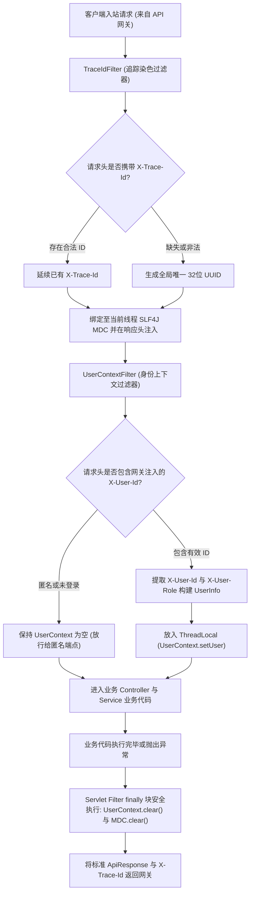

# 公共模块 · common-core 与 common-web 架构与使用文档

公共模块群作为全平台的底层契约与横切基础设施，分为无业务依赖的纯基础契约库 `common-core` 与服务于 Servlet 微服务的 Web 上下文组件库 `common-web`。公共模块严格秉承无业务侵入原则，不持久化业务数据，不操作账号凭据，仅提供跨服务统一响应规范、领域事件通用外壳以及线程级追踪与安全身份上下文。

---

## 1. 模块定位与分层职责

### 1.1 核心职责与边界划分
- **`common-core`（纯纯契约与无依赖工具库）**：
  - **统一接口响应外壳 (`ApiResponse<T>`)**：规范 HTTP 业务响应结构（`code`、`message`、`data`、`timestamp`），提供标准化成功与错误构建工厂；
  - **版本化事件外壳 (`EventEnvelope<T>`)**：承载 RabbitMQ 领域事件的通用信封，规范 `eventId`、`eventType`、`version`、`timestamp`、`traceId` 与泛型 `payload`；
  - **基础异常契约**：定义基础业务异常基类与常用错误码枚举。
- **`common-web`（Servlet 容器横切切面与过滤器）**：
  - **全链路追踪染色 (`TraceIdFilter`)**：提取或生成 `X-Trace-Id`，绑定至 SLF4J MDC，响应头回显并向下游透传；
  - **受信身份上下文 (`UserContextFilter` 与 `UserContext`)**：从网关透传的受信 Header（`X-User-Id`、`X-User-Role`）中提取身份信息，绑定至 `ThreadLocal` 上下文，在 `finally` 块彻底安全清理；
  - **统一异常处理切面 (`GlobalExceptionHandler`)**：拦截业务异常与参数校验错误，统一转换为符合规范的 `ApiResponse`。

### 1.2 防腐与严格禁止事项
- **严禁沉淀共享业务逻辑**：严禁在 `common-core` 或 `common-web` 中编写订单、视频、积分、关注等具体业务代码；
- **严禁共享持久化领域实体**：各微服务通过 `EventEnvelope` 传输独立版本的 DTO/JSON，严禁通过公共模块共享 JPA/MyBatis 实体。

---

## 2. 请求上下文与追踪拦截执行时序图



---

## 3. 核心公共契约规范

### 3.1 统一接口响应外壳 (`ApiResponse<T>`)
所有业务微服务的对外 Controller 统一通过 `ApiResponse` 封装返回数据：
```json
{
  "code": 0,
  "message": "success",
  "data": {
    "videoId": "cv05hG9Kq2RtLw7XbPmZv4Ya",
    "title": "分布式微服务架构演进实践"
  },
  "timestamp": 1773728000000
}
```
- **业务状态码规范**：
  - `code = 0`：操作成功；
  - `code > 0`：具体业务错误码（如 `40001` 参数错误、`40401` 资源不存在、`40901` 版本冲突）；
- **注意要点**：业务外壳 `code` 不应与 HTTP 响应状态码混淆，文件服务上传成功时 HTTP 状态为 `201 Created`，返回的 JSON 外壳包含具体资产实体。

### 3.2 领域事件通用信封 (`EventEnvelope<T>`)
所有投递至 RabbitMQ 交换机 `media.platform.events` 的领域事件必须打包于 `EventEnvelope` 内：
```json
{
  "eventId": "evt_9b12a83f98274ac09d7e345b1287e0fa",
  "eventType": "content.video.published",
  "version": "1.0",
  "timestamp": 1773728000000,
  "producer": "content-service",
  "aggregateId": "cv05hG9Kq2RtLw7XbPmZv4Ya",
  "traceId": "9b12a83f98274ac09d7e345b1287e0fa",
  "payload": {
    "videoId": "cv05hG9Kq2RtLw7XbPmZv4Ya",
    "authorId": "u_1001",
    "title": "分布式微服务架构演进实践",
    "duration": 360
  }
}
```
- **解耦优势**：各消费者服务按支持的 `version` 解析载荷，容忍未知扩展字段，杜绝因服务间实体定义细微差异导致的反序列化崩溃。

---

## 4. 线程上下文与资源生命周期安全

### 4.1 `UserContext` 上下文读取与访问
在引入 `common-web` 的业务微服务中，Controller 或 Service 内部可直接获取当前登录身份：
```java
// 获取当前登录用户 ID (未登录则返回 null)
String currentUserId = UserContext.getUserId();

// 校验并获取必须登录的用户身份 (未登录直接抛出 UnauthorizedException)
UserInfo currentUser = UserContext.requireUser();

// 检查是否具备管理员权限
boolean isAdmin = UserContext.isAdmin();
```

### 4.2 为什么必须在 `finally` 中执行清理？
Servlet 容器（如 Tomcat / Undertow）基于**线程池（Thread Pool）**工作，工作线程在处理完一次 HTTP 请求后不会销毁，而是被放回线程池供下一个并发请求复用。若不强制在 `finally` 块中执行 `UserContext.clear()` 和 `MDC.clear()`，后续到达该线程的匿名请求将**脏读**上一用户的特权身份或错误继承历史 `traceId`，导致灾难性越权漏洞。

---

## 5. 核心源码入口索引

- **`common-core` 核心类**：
  - 统一响应外壳：[`ApiResponse.java`](../../common/common-core/src/main/java/com/calles/platform/common/core/ApiResponse.java)
  - 领域事件信封：[`EventEnvelope.java`](../../common/common-core/src/main/java/com/calles/platform/common/core/event/EventEnvelope.java)
- **`common-web` 核心类**：
  - 全链路追踪过滤器：[`TraceIdFilter.java`](../../common/common-web/src/main/java/com/calles/platform/common/web/filter/TraceIdFilter.java)
  - 身份上下文过滤器：[`UserContextFilter.java`](../../common/common-web/src/main/java/com/calles/platform/common/web/filter/UserContextFilter.java)
  - 身份安全持有器：[`UserContext.java`](../../common/common-web/src/main/java/com/calles/platform/common/web/context/UserContext.java)
  - 自动装配配置类：[`CommonWebAutoConfiguration.java`](../../common/common-web/src/main/java/com/calles/platform/common/web/config/CommonWebAutoConfiguration.java)
