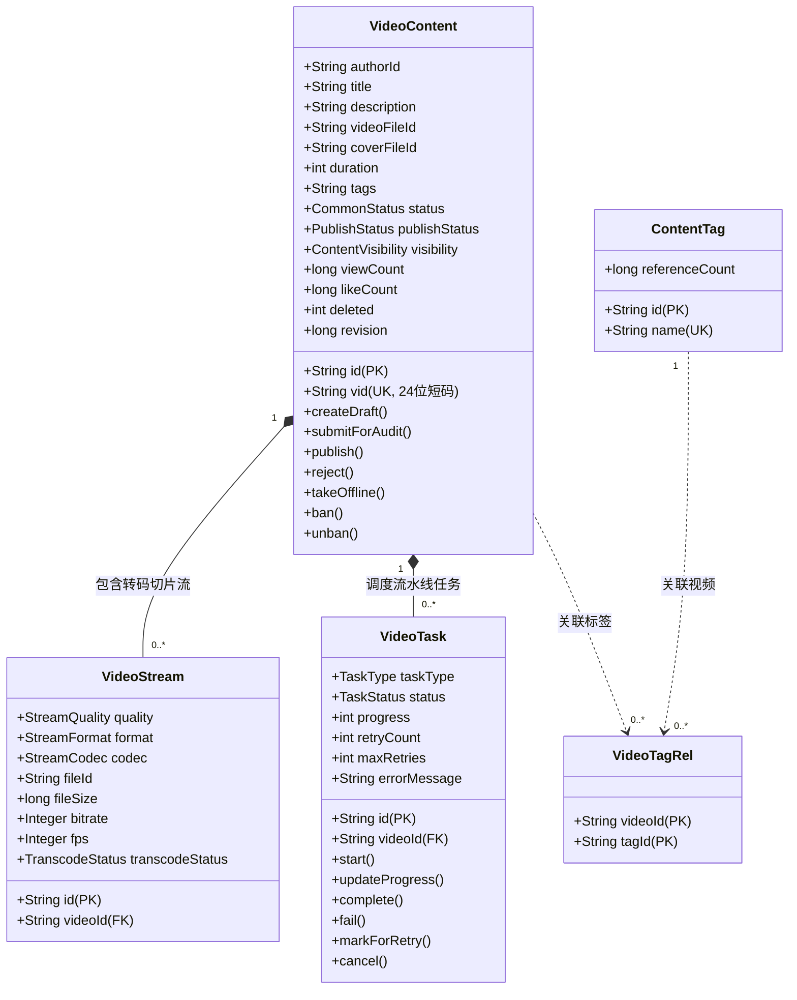
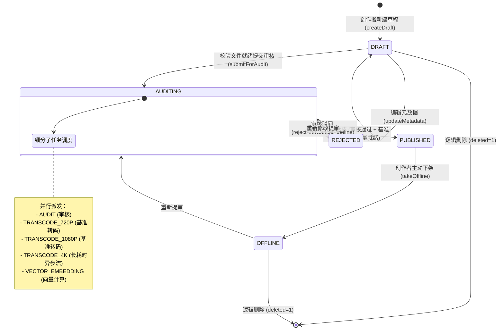

# 内容模块 · content-service 架构设计与实现文档

内容模块（`content-service`）是媒体平台的核心业务支柱之一，承担视频创作者工作台、音视频图文元数据管理、标签索引、多清晰度切片媒体资产登记、分级就绪异步任务流水线协调（审核、转码、向量提取）、前台多码率播放流分发以及管理端风控治理的核心职责。

---

## 1. 模块定位与架构边界

### 1.1 业务职责边界
- **创作者工作台**：管理视频生命周期，支持草稿创建、图文元数据修订（标题、简介、封面、标签）、文件资产关联校验、提审发布、主动下架与逻辑删除；
- **异步任务流水线与门禁协调**：视频提审后将耗时任务分解为细粒度子任务（内容机审/人审、多画质切片转码、多模态语义向量提取），实施**分级就绪门禁（Staged Ready Gatekeeper）**与超时自愈巡检；
- **媒体切片资产归档**：登记转码后各画质规格（`360P`、`720P`、`1080P`、`1080P_60`、`4K`、`RAW`）与封装格式（`MP4`、`HLS`、`DASH`）的切片资产；
- **轻量标签字典体系**：维护全站全局标签字典、视频标签多对多关联及热度引用计数的增量同步；
- **前台多清晰度播放分发**：根据业务公开短码 `vid` 汇聚公开图文详情及有效播放流列表，基于访问策略执行多层可见性与权限过滤；
- **平台风控与违规治理**：提供管理员批量检索、封禁下线（`DISABLED`）与解封恢复（`ACTIVE`）能力。

### 1.2 防腐与不应承担的工作
- **不直接存储二进制文件**：音视频与图片等二进制字节流由对象存储与 `file-service` 独立承担，本服务仅通过资产 ID（`file_id`）与逻辑校验进行解耦关联；
- **不直接执行音视频转码与 AI 深度学习计算**：FFmpeg 编解码切片与向量模型推理部署于专用 Worker 计算集群，本服务通过异步事件（Outbox）驱动并接收回调；
- **不直接管理账号密码与认证 Token**：由 `auth-service` 负责认证，API 网关统一验证并透传 `X-User-Id` 与 `X-User-Role`，本服务仅基于 `UserContext` 实施业务级所有权判定。

---

## 2. 领域模型与核心状态机

### 2.1 双 ID 设计体系
为兼顾底层数据库查询性能与前台业务展示友好性，内容模型采用双 ID 体系：
1. **内部主键 `id`**：32 位小写十六进制 UUID（无短横线），作为聚合根与外键关联的稳定物理主键；
2. **公开短码 `vid`**：固定 **`cv` + 22 位高熵 Base62 字符**（全长 24 位），由 `Base62VidGenerator` 经过 128 位安全随机数/UUID 压缩生成。具备**离散无序、防恶意遍历爬取、URL 友好且全局唯一**的特性。

### 2.2 聚合根与实体拓扑



### 2.3 状态分层模型与状态转移状态机
遵循平台实体设计规范，状态分为平台级可用状态与内容创作流转生命周期两层：

1. **统一可用状态 `CommonStatus`**（与 `user-service` 等全平台微服务语义对齐）：
   - `ACTIVE`：正常可用；
   - `DISABLED`：违规封禁/冻结（前台脱敏为不可见，仅作者本人与管理员可见）。
2. **发布流转生命周期 `PublishStatus`**：
   - `DRAFT`：草稿箱编辑中；
   - `AUDITING`：审核与转码流水线处理中；
   - `PUBLISHED`：正式公开发布上线；
   - `REJECTED`：审核驳回（需记录打回原因）；
   - `OFFLINE`：创作者主动下架。



---

## 3. 视频发布流水线与分级就绪门禁策略

### 3.1 分级就绪门禁决策器 (`PublishGatekeeper`)
传统视频网站在全部分辨率（尤其是 4K、AV1 等高耗时规格）转码完成前阻断上线，导致创作者发布延迟极大。`content-service` 引入工业级**分级就绪门禁机制**：

```
提审 (AUDITING)
   │
   ├── [子任务 1] AUDIT ───> SUCCESS ──┐
   ├── [子任务 2] TRANSCODE_720P ──────┤
   │      OR                           ├─> 【PublishGatekeeper】 ──> 自动流转 PUBLISHED (正式发布)
   │   [子任务 3] TRANSCODE_1080P ─────┤    (并发写入 Outbox content.video.published)
   ├── [子任务 5] VECTOR_EMBEDDING ───> SUCCESS ──┘
   │
   └── [子任务 4] TRANSCODE_4K (长耗时可选流) ───────────> 异步后续完成，静默注册流资产 (不阻断发布)
```

- **门禁准入公式**：

  $$\text{GatekeeperReady} = (\text{Task}_{\text{AUDIT}} = \text{SUCCESS}) \land (\text{Task}_{\text{720P}} = \text{SUCCESS} \lor \text{Task}_{\text{1080P}} = \text{SUCCESS}) \land (\text{Task}_{\text{VECTOR}} = \text{SUCCESS})$$

- **快速发布与异步追加**：只要审核通过、至少一条基准清晰度就绪且向量计算完成，视频立即上线。4K 转码可在数十分钟后完成后异步注册，不影响前台用户立即观看与搜索检索；

- **审核失败熔断**：若 `AUDIT` 判定失败，协调器立即将视频流转为 `REJECTED`，并自动将所有排队中或进行中的其余子任务置为 `CANCELED`，防止空耗转码计算与 GPU 资源。

### 3.2 超时巡检与重试补偿器 (`VideoTaskTimeoutScheduler`)
- **巡检机制**：定时扫描处于 `RUNNING` 状态且持续时长超过阈值（默认 15 分钟，通过 `content.task.timeout-minutes` 配置）的僵死任务；
- **自愈补偿**：
  - 若 `retryCount < maxRetries`（默认 3 次）：将任务重置为 `PENDING`，自增 `retryCount` 并重新进入调度排队；
  - 若已达最大重试上限：标记任务为 `FAILED`；若失败的是阻断性 `AUDIT` 任务，联动门禁驳回视频并终止流水线。

---

## 4. 数据库表结构设计全览

全库表统一采用 InnoDB 引擎、`utf8mb4` 字符集，主键统一为 `CHAR(32)` UUID，时间带毫秒精度 `DATETIME(3)`。

### 4.1 视频聚合根表 (`video_content`)
```sql
CREATE TABLE IF NOT EXISTS `video_content` (
    `id` CHAR(32) NOT NULL COMMENT '视频内部全局唯一ID (UUID)',
    `vid` VARCHAR(32) NOT NULL COMMENT '业务对外公开编码 (如 cv05hG9Kq2RtLw7XbPmZv4Ya)',
    `author_id` CHAR(32) NOT NULL COMMENT '作者账号ID (逻辑关联 auth_account.id)',
    `title` VARCHAR(128) NOT NULL COMMENT '视频标题',
    `description` VARCHAR(2000) NULL COMMENT '视频简介描述',
    `video_file_id` CHAR(32) NOT NULL COMMENT '主视频文件ID (引用 file_asset.id)',
    `cover_file_id` CHAR(32) NOT NULL COMMENT '封面图片文件ID (引用 file_asset.id)',
    `duration` INT NOT NULL DEFAULT 0 COMMENT '视频时长 (秒)',
    `tags` VARCHAR(255) NULL COMMENT '轻量标签快照 (英文逗号分隔)',
    `status` VARCHAR(16) NOT NULL DEFAULT 'ACTIVE' COMMENT '平台可用状态: ACTIVE=正常, DISABLED=违规封禁/冻结',
    `publish_status` VARCHAR(24) NOT NULL DEFAULT 'DRAFT' COMMENT '发布生命周期: DRAFT, AUDITING, PUBLISHED, REJECTED, OFFLINE',
    `reject_reason` VARCHAR(255) NULL COMMENT '审核拒绝或下架原因',
    `visibility` VARCHAR(16) NOT NULL DEFAULT 'PUBLIC' COMMENT '可见范围: PUBLIC, PRIVATE, UNLISTED',
    `view_count` BIGINT NOT NULL DEFAULT 0 COMMENT '播放量快照',
    `like_count` BIGINT NOT NULL DEFAULT 0 COMMENT '点赞数快照',
    `comment_count` BIGINT NOT NULL DEFAULT 0 COMMENT '评论数快照',
    `star_count` BIGINT NOT NULL DEFAULT 0 COMMENT '收藏数快照',
    `share_count` BIGINT NOT NULL DEFAULT 0 COMMENT '分享数快照',
    `published_at` DATETIME(3) NULL COMMENT '首次公开发布时间',
    `deleted` TINYINT NOT NULL DEFAULT 0 COMMENT '0=未删除，1=逻辑删除',
    `revision` BIGINT NOT NULL DEFAULT 0 COMMENT '并发修改版本乐观锁',
    `created_at` DATETIME(3) NOT NULL DEFAULT CURRENT_TIMESTAMP(3),
    `updated_at` DATETIME(3) NOT NULL DEFAULT CURRENT_TIMESTAMP(3) ON UPDATE CURRENT_TIMESTAMP(3),
    PRIMARY KEY (`id`),
    UNIQUE KEY `uk_video_vid` (`vid`),
    KEY `idx_video_author` (`author_id`, `status`, `publish_status`, `created_at`),
    KEY `idx_video_publish` (`status`, `publish_status`, `visibility`, `published_at`),
    CONSTRAINT `ck_video_content_status` CHECK (`status` IN ('ACTIVE', 'DISABLED')),
    CONSTRAINT `ck_video_content_publish_status` CHECK (`publish_status` IN ('DRAFT', 'AUDITING', 'PUBLISHED', 'REJECTED', 'OFFLINE')),
    CONSTRAINT `ck_video_content_visibility` CHECK (`visibility` IN ('PUBLIC', 'PRIVATE', 'UNLISTED')),
    CONSTRAINT `ck_video_content_deleted` CHECK (`deleted` IN (0, 1))
) ENGINE=InnoDB DEFAULT CHARSET=utf8mb4 COMMENT='视频内容聚合根表';
```

### 4.2 视频转码派生流表 (`video_stream`)
```sql
CREATE TABLE IF NOT EXISTS `video_stream` (
    `id` CHAR(32) NOT NULL COMMENT '流文件主键ID (UUID)',
    `video_id` CHAR(32) NOT NULL COMMENT '所属视频内部ID (关联 video_content.id)',
    `quality` VARCHAR(16) NOT NULL COMMENT '画质规格: 360P, 480P, 720P, 1080P, 1080P_60, 4K, RAW',
    `format` VARCHAR(16) NOT NULL DEFAULT 'MP4' COMMENT '流媒体封装格式: MP4, HLS, DASH',
    `codec` VARCHAR(16) NOT NULL DEFAULT 'H264' COMMENT '视频编码: H264, H265, AV1',
    `file_id` CHAR(32) NOT NULL COMMENT '转码后文件在 file_asset 中的ID',
    `file_size` BIGINT NOT NULL DEFAULT 0 COMMENT '流文件字节大小',
    `bitrate` INT NULL COMMENT '视频码率 (kbps)',
    `fps` INT NULL COMMENT '帧率',
    `transcode_status` VARCHAR(16) NOT NULL DEFAULT 'COMPLETED' COMMENT '转码状态: PENDING, PROCESSING, COMPLETED, FAILED',
    `created_at` DATETIME(3) NOT NULL DEFAULT CURRENT_TIMESTAMP(3),
    PRIMARY KEY (`id`),
    UNIQUE KEY `uk_stream_spec` (`video_id`, `quality`, `format`),
    KEY `idx_stream_file` (`file_id`),
    CONSTRAINT `ck_video_stream_quality` CHECK (`quality` IN ('360P', '480P', '720P', '1080P', '1080P_60', '4K', 'RAW')),
    CONSTRAINT `ck_video_stream_format` CHECK (`format` IN ('MP4', 'HLS', 'DASH')),
    CONSTRAINT `ck_video_stream_codec` CHECK (`codec` IN ('H264', 'H265', 'AV1')),
    CONSTRAINT `ck_video_stream_transcode_status` CHECK (`transcode_status` IN ('PENDING', 'PROCESSING', 'COMPLETED', 'FAILED'))
) ENGINE=InnoDB DEFAULT CHARSET=utf8mb4 COMMENT='视频转码派生流规格表';
```

### 4.3 视频异步流水线子任务表 (`video_task`)
```sql
CREATE TABLE IF NOT EXISTS `video_task` (
    `id` CHAR(32) NOT NULL COMMENT '任务主键ID (UUID)',
    `video_id` CHAR(32) NOT NULL COMMENT '所属视频内部ID (关联 video_content.id)',
    `task_type` VARCHAR(32) NOT NULL COMMENT '任务类型: AUDIT, TRANSCODE_720P, TRANSCODE_1080P, TRANSCODE_4K, VECTOR_EMBEDDING',
    `status` VARCHAR(24) NOT NULL DEFAULT 'PENDING' COMMENT '任务状态: PENDING, RUNNING, SUCCESS, FAILED, CANCELED',
    `progress` INT NOT NULL DEFAULT 0 COMMENT '执行进度百分比 (0-100)',
    `retry_count` INT NOT NULL DEFAULT 0 COMMENT '已重试次数',
    `max_retries` INT NOT NULL DEFAULT 3 COMMENT '最大重试上限',
    `error_message` VARCHAR(500) NULL COMMENT '失败错误信息',
    `started_at` DATETIME(3) NULL COMMENT '任务开始执行时间',
    `completed_at` DATETIME(3) NULL COMMENT '任务完成或终止时间',
    `created_at` DATETIME(3) NOT NULL DEFAULT CURRENT_TIMESTAMP(3),
    `updated_at` DATETIME(3) NOT NULL DEFAULT CURRENT_TIMESTAMP(3) ON UPDATE CURRENT_TIMESTAMP(3),
    PRIMARY KEY (`id`),
    UNIQUE KEY `uk_video_task_type` (`video_id`, `task_type`),
    KEY `idx_task_status_started` (`status`, `started_at`),
    KEY `idx_task_video` (`video_id`),
    CONSTRAINT `ck_video_task_type` CHECK (`task_type` IN ('AUDIT', 'TRANSCODE_720P', 'TRANSCODE_1080P', 'TRANSCODE_4K', 'VECTOR_EMBEDDING')),
    CONSTRAINT `ck_video_task_status` CHECK (`status` IN ('PENDING', 'RUNNING', 'SUCCESS', 'FAILED', 'CANCELED')),
    CONSTRAINT `ck_video_task_progress` CHECK (`progress` >= 0 AND `progress` <= 100)
) ENGINE=InnoDB DEFAULT CHARSET=utf8mb4 COMMENT='视频处理异步任务与流水线调度表';
```

### 4.4 标签与关联表 (`content_tag`, `video_tag_rel`)
```sql
CREATE TABLE IF NOT EXISTS `content_tag` (
    `id` CHAR(32) NOT NULL,
    `name` VARCHAR(32) NOT NULL,
    `reference_count` BIGINT NOT NULL DEFAULT 0,
    `created_at` DATETIME(3) NOT NULL DEFAULT CURRENT_TIMESTAMP(3),
    `updated_at` DATETIME(3) NOT NULL DEFAULT CURRENT_TIMESTAMP(3) ON UPDATE CURRENT_TIMESTAMP(3),
    PRIMARY KEY (`id`),
    UNIQUE KEY `uk_tag_name` (`name`),
    KEY `idx_tag_ref_count` (`reference_count` DESC)
) ENGINE=InnoDB DEFAULT CHARSET=utf8mb4 COMMENT='内容分类轻量标签表';

CREATE TABLE IF NOT EXISTS `video_tag_rel` (
    `video_id` CHAR(32) NOT NULL,
    `tag_id` CHAR(32) NOT NULL,
    `created_at` DATETIME(3) NOT NULL DEFAULT CURRENT_TIMESTAMP(3),
    PRIMARY KEY (`video_id`, `tag_id`),
    KEY `idx_rel_tag` (`tag_id`)
) ENGINE=InnoDB DEFAULT CHARSET=utf8mb4 COMMENT='视频与标签多对多关联映射表';
```

### 4.5 事务性发件箱表 (`content_outbox`)
遵循统一事件总线契约，在本地数据库事务中保障聚合根状态与事件投递的原子性（强一致）。

---

## 5. HTTP API 接口契约清单

所有对外端点均挂载于网关统一路由前缀 `/api/content/**` 下。

| 接口分类 | HTTP 方法 | URI 路径 | 鉴权门禁 | 用途说明 |
| :--- | :--- | :--- | :--- | :--- |
| **创作者端** | `POST` | `/api/content/videos/draft` | `requireUser` | 创建草稿，返回业务短码 `vid` |
| | `PUT` | `/api/content/videos/{id}` | 作者或管理员 | 更新标题、简介、封面图与标签 |
| | `POST` | `/api/content/videos/{id}/submit` | 作者或管理员 | 校验文件资产就绪后提交审核，派发任务 |
| | `POST` | `/api/content/videos/{id}/offline` | 作者或管理员 | 创作者主动下架视频 |
| | `DELETE` | `/api/content/videos/{id}` | 作者或管理员 | 逻辑删除视频，回收标签热度 |
| | `GET` | `/api/content/videos/me` | `requireUser` | 创作者工作台分页作品列表 |
| | `GET` | `/api/content/videos/{id}/tasks` | 作者或管理员 | 观测发布流水线各子任务进度与就绪状态 |
| **前台展示端** | `GET` | `/api/content/videos/{vid}` | 公开 / 鉴权脱敏 | 查询视频图文完整详情（私密/封禁自动拦截） |
| | `GET` | `/api/content/videos/{vid}/streams` | 公开 / 鉴权脱敏 | 查询该视频所有转码完成的可用播放流列表 |
| | `GET` | `/api/content/tags/hot` | 公开 | 查询全站引用量前 N 名的热门标签列表 |
| **管理治理端** | `POST` | `/api/content/videos/admin/list` | `requireAdmin` | 管理端多维组合过滤与分页检索 |
| | `POST` | `/api/content/videos/admin/{id}/ban` | `requireAdmin` | 违规封禁视频 (`DISABLED`) |
| | `POST` | `/api/content/videos/admin/{id}/unban` | `requireAdmin` | 解封恢复视频 (`ACTIVE`) |
| **内部微服务** | `POST` | `/api/content/videos/internal/audit-callback` | 内部受信网络 | 接收审核服务异步判定结果（自动联动 AUDIT 任务与门禁决策） |
| | `POST` | `/api/content/videos/internal/transcode-callback` | 内部受信网络 | 接收流媒体转码规格切片登记回调（自动登记流资产并联动转码任务） |
| | `POST` | `/api/content/videos/internal/task-callback` | 内部受信网络 | 通用工作节点（Worker）执行进度（0-100%）与无实体任务完成汇报（如向量计算） |

> **一次交互原则（Single-Interaction Principle）**：
> 外部执行模块（审核服务、转码集群）完成任务后，**仅需调用一次其专属的业务回调接口**。接口内部会自动将业务事实持久化，并直接联动 `VideoTaskCoordinator` 驱动子任务状态流转并顺带触发发布门禁评估，绝不需要额外调用 `/task-callback`。通用的 `/task-callback` 仅供无独立业务表的任务（如 `VECTOR_EMBEDDING`）和中间进度条刷新使用。

---

## 6. 跨服务交互与事务发件箱事件

### 6.1 Feign 远程文件探活
- **客户端**：[`FileServiceClient`](../../service/content-service/src/main/java/com/calles/platform/content/application/client/FileServiceClient.java)
- **校验点**：创作者提审（`submitForAudit`）时，强制调用 `file-service` 的 `GET /api/files/{id}/metadata`，校验视频与封面文件必须处于 `status = 'ACTIVE'` 且 `confirmStatus = 'CONFIRMED'`。若仍在上传中或已被清理，则阻断提审抛出 `400 BAD_REQUEST`。

### 6.2 事务性发件箱 (Transactional Outbox) 事件清单

| 事件类型 (`event_type`) | 触发时机 | 载荷核心字段 | 下游消费目标 |
| :--- | :--- | :--- | :--- |
| `content.video.submitted` | 创作者提交审核成功 | `videoId`, `vid`, `authorId`, `videoFileId`, `coverFileId` | `audit-service` 启动内容机审；转码 Worker 启动基准切片；AI 模型拉取源文件提取语义向量 |
| `content.video.published` | 达成门禁自动发布上线 | `videoId`, `vid`, `authorId`, `videoFileId`, `coverFileId`, `publishedAt` | `recommend-service` 计算推荐特征；搜索引擎构建搜索索引；用户消息中心 |
| `content.video.rejected` | 审核未通过打回 | `videoId`, `vid`, `reason` | 创作者通知中心发送站内信与驳回原因 |
| `content.video.offlined` | 创作者下架视频 | `videoId`, `vid`, `reason` | 搜索引擎与推荐流立即下线对应索引快照 |
| `content.video.banned` | 管理员违规封禁 | `videoId`, `vid`, `reason` | 推荐、搜索与客户端长连接主动拉黑下线 |
| `content.video.unbanned` | 管理员解封恢复 | `videoId`, `vid` | 重新激活搜索索引与推荐流通路 |

> **分布式链路追踪规范 (`traceId`)**：
> 发件箱记录构建统一通过 [`ContentOutboxRecord.of(...)`](../../service/content-service/src/main/java/com/calles/platform/content/infrastructure/outbox/ContentOutboxRecord.java) 工厂方法生成。优先从 SLF4J MDC 提取由网关和 `TraceIdFilter` 传递的全局追踪标识 `traceId`；在无请求上下文的调度或重试线程中，自动回退使用当前事件的 `eventId` 兜底，保证分布式链路溯源永不断链。

---

## 7. 源码入口导航与核心类索引

- **启动与上下文**：
  - [启动类](../../service/content-service/src/main/java/com/calles/platform/content/ContentApplication.java)（启用 OpenFeign 与 定时调度 `@EnableScheduling`）
- **领域模型层 (Domain Layer)**：
  - 视频聚合根：[`VideoContent.java`](../../service/content-service/src/main/java/com/calles/platform/content/domain/model/video/VideoContent.java)
  - 任务模型：[`VideoTask.java`](../../service/content-service/src/main/java/com/calles/platform/content/domain/model/task/VideoTask.java)、[`TaskType.java`](../../service/content-service/src/main/java/com/calles/platform/content/domain/model/task/TaskType.java)、[`TaskStatus.java`](../../service/content-service/src/main/java/com/calles/platform/content/domain/model/task/TaskStatus.java)
  - 转码流实体：[`VideoStream.java`](../../service/content-service/src/main/java/com/calles/platform/content/domain/model/stream/VideoStream.java)
  - 标签实体：[`ContentTag.java`](../../service/content-service/src/main/java/com/calles/platform/content/domain/model/tag/ContentTag.java)
  - 仓储端口：[`VideoContentRepository.java`](../../service/content-service/src/main/java/com/calles/platform/content/domain/repository/VideoContentRepository.java)、[`VideoTaskRepository.java`](../../service/content-service/src/main/java/com/calles/platform/content/domain/repository/VideoTaskRepository.java)、[`VideoStreamRepository.java`](../../service/content-service/src/main/java/com/calles/platform/content/domain/repository/VideoStreamRepository.java)、[`ContentTagRepository.java`](../../service/content-service/src/main/java/com/calles/platform/content/domain/repository/ContentTagRepository.java)
- **应用服务层 (Application Layer)**：
  - 门禁决策器：[`PublishGatekeeper.java`](../../service/content-service/src/main/java/com/calles/platform/content/application/task/PublishGatekeeper.java)
  - 流水线协调器：[`VideoTaskCoordinator.java`](../../service/content-service/src/main/java/com/calles/platform/content/application/task/VideoTaskCoordinator.java)
  - 超时补偿调度器：[`VideoTaskTimeoutScheduler.java`](../../service/content-service/src/main/java/com/calles/platform/content/application/task/VideoTaskTimeoutScheduler.java)
  - 视频发布用例：[`VideoPublishApplicationService.java`](../../service/content-service/src/main/java/com/calles/platform/content/application/video/VideoPublishApplicationService.java)
  - 视频读模型查询：[`VideoQueryApplicationService.java`](../../service/content-service/src/main/java/com/calles/platform/content/application/video/VideoQueryApplicationService.java)
  - 权限访问策略：[`ContentAccessPolicy.java`](../../service/content-service/src/main/java/com/calles/platform/content/application/security/ContentAccessPolicy.java)
  - Base62 短码发号器：[`Base62VidGenerator.java`](../../service/content-service/src/main/java/com/calles/platform/content/application/util/Base62VidGenerator.java)
- **接口层 (Interfaces Layer)**：
  - 创作者端控制器：[`CreatorVideoController.java`](../../service/content-service/src/main/java/com/calles/platform/content/interfaces/http/video/CreatorVideoController.java)
  - 前台受众端控制器：[`PortalVideoController.java`](../../service/content-service/src/main/java/com/calles/platform/content/interfaces/http/video/PortalVideoController.java)
  - 管理治理端控制器：[`AdminVideoController.java`](../../service/content-service/src/main/java/com/calles/platform/content/interfaces/http/video/AdminVideoController.java)
  - 内部回调控制器：[`InternalVideoController.java`](../../service/content-service/src/main/java/com/calles/platform/content/interfaces/http/video/InternalVideoController.java)
  - 标签热度控制器：[`TagController.java`](../../service/content-service/src/main/java/com/calles/platform/content/interfaces/http/tag/TagController.java)
  - 统一异常处理：[`ContentExceptionHandler.java`](../../service/content-service/src/main/java/com/calles/platform/content/interfaces/http/ContentExceptionHandler.java)
- **数据库 Schema 定义**：
  - 全局集成定义：[`db/init/schema.sql`](../../db/init/schema.sql)
  - 独立 DDL 脚本：[`video-content.sql`](../../service/content-service/db/schema/video-content.sql)、[`video-stream.sql`](../../service/content-service/db/schema/video-stream.sql)、[`video-task.sql`](../../service/content-service/db/schema/video-task.sql)、[`content-tag.sql`](../../service/content-service/db/schema/content-tag.sql)、[`video-tag-rel.sql`](../../service/content-service/db/schema/video-tag-rel.sql)、[`content-outbox.sql`](../../service/content-service/db/schema/content-outbox.sql)

---

## 8. 验证方式与测试覆盖

模块内置全面的单元测试与防腐校验，共计 **112 项测试用例**，测试套件涵盖：
1. **`VideoContentTest`**：聚合根状态跃迁合法性校验（草稿提审、发布、驳回原因校验、乐观锁版本）；
2. **`Base62VidGeneratorTest`**：24 位前缀 `cv` 高熵短码生成、无字符碰撞与并发安全性；
3. **`VideoTaskTest`**：子任务创建、执行中进度限制（0–100）、成功/失败终止态、可重试边界及重新提审时的复苏重置 (`resetToPending`)；
4. **`PublishGatekeeperTest`**：审核、基准清晰度流与语义向量三者与关系的门禁就绪决策；4K 异步非阻塞发布；审核未通过时的全流水线级联熔断取消；
5. **`VideoTaskCoordinatorTest`**：提审批量初始化 5 类任务网格、工作节点进度更新、重新提审时失败与取消子任务复苏 (`resetPipelineTasksForResubmit`) 及就绪自动发布触发；
6. **`VideoTaskTimeoutSchedulerTest`**：超时未汇报任务的自动识别、自增重试及超限置失败兜底；
7. **`VideoPublishApplicationServiceTest`**：草稿新建、元数据维护、Feign 文件探活阻断、提审发布、Outbox 标题与简介快照原子写入及重新提审协同流水线复苏；
8. **`VideoQueryApplicationServiceTest`**：详情读取权限门禁（他人私密/草稿拦截脱敏为 404）、多画质流切片组装；
9. **`CreatorVideoControllerTest` / `InternalVideoControllerTest` / `PortalVideoControllerTest` / `AdminVideoControllerTest`**：MockMvc 端到端 HTTP 接口参数绑定、统一响应结构与任务进度端点透出；
10. **仓储与持久化映射测试**：`VideoContentRepositoryImplTest`、`VideoStreamRepositoryImplTest`、`VideoTaskRepositoryImplTest`、`ContentTagRepositoryImplTest`、`VideoTagRelRepositoryImplTest`。

**全量回归指令**：
- 模块测试：`./mvnw -f service/content-service/pom.xml test`（112 项用例 100% 通过）
- 审核模块协同回归：`./mvnw -f service/audit-service/pom.xml test`（55 项用例 100% 通过）
