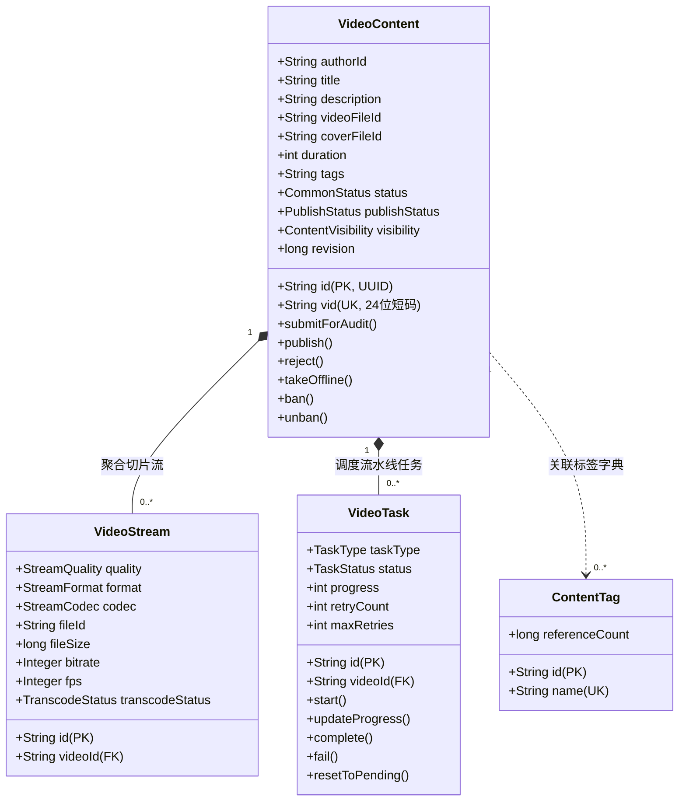
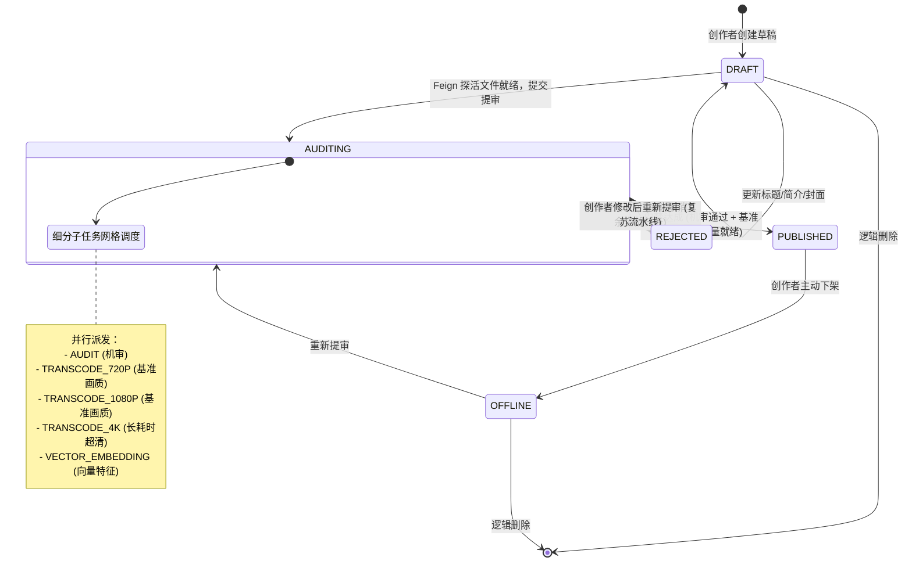
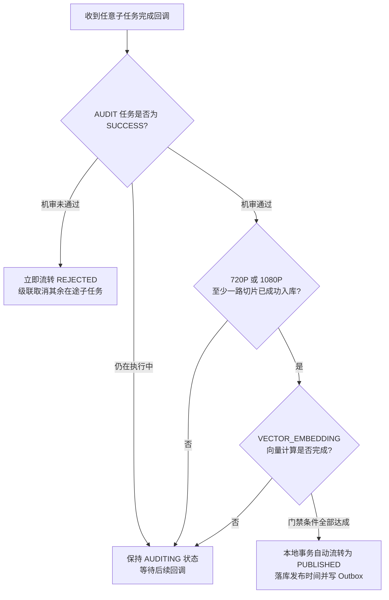

# 内容模块 · content-service 架构设计与实现文档

内容模块（`content-service`）是平台视频创作、流媒体资产调度与播放分发的核心业务支柱（默认端口 8030）。负责创作者工作台（草稿、元数据、提审、下架）、OpenFeign 文件强探活、异步任务网格分解、工业级**分级就绪门禁（`PublishGatekeeper`）**裁决、前台多画质播放流汇聚、标签字典索引以及管理端合规封禁治理。

---

## 1. 模块定位与架构边界

### 1.1 业务职责边界
- **创作者工作台**：管理视频全生命周期，支持草稿创建、图文元数据编辑（标题、简介、封面、标签）、Feign 文件资产探活、提审发布、主动下架与逻辑删除；
- **异步任务流水线与门禁协调**：视频提审后将耗时任务分解为 5 类子任务（机审 `AUDIT`、基准转码 `TRANSCODE_720P` / `1080P`、长耗时转码 `TRANSCODE_4K`、语义向量 `VECTOR_EMBEDDING`），通过分级就绪门禁实现“快速上线、异步追加”；
- **流媒体切片资产登记**：提供内部受信端点，接收转码服务切片产物（画质、码率、帧率、封装格式）登记至 `video_stream` 表；
- **轻量标签字典体系**：维护全站标签字典与视频多对多关联映射，支持标签热度引用计数增量同步；
- **前台多码率播放流分发**：基于公开短码 `vid` 汇聚公开详情与有效播放流列表，基于访问策略执行多层可见性与权限脱敏过滤；
- **平台风控与治理**：提供管理员多维分页筛选、违规封禁（`DISABLED`）与解封恢复（`ACTIVE`）。

### 1.2 防腐与不应承担的工作
- **不直接存储二进制文件**：音视频与图片物理存储由 `file-service` 负责，本服务仅持有 `file_id` 进行逻辑校验与关联；
- **不直接执行音视频转码与 AI 深度学习推理**：FFmpeg 压制与向量模型部署于专用集群，本服务通过 Transactional Outbox 事件驱动并通过专有内部回调对齐状态；
- **不管理账号密码与 Token**：依赖网关统一校验 JWT 并透传 `X-User-Id` 与 `X-User-Role`。

### 1.3 参与的全局业务主线导航
- 核心牵头 [主线 03：视频创作、提审探活、异步机审与分级门禁流水线](../flows/03-video-publish-and-pipeline.md)
- 核心牵头 [主线 04：前台视频播放分发、短码寻址与网关防刷](../flows/04-video-playback-and-portal.md)
- 核心牵头 [主线 05：平台合规治理、违规封禁与全站事件广播下线](../flows/05-platform-governance-flow.md)

---

## 2. 领域模型与核心状态机

### 2.1 双 ID 体系与实体关系拓扑
- **内部主键 `id`**：32 位 UUID，物理主键与外键关联；
- **业务短码 `vid`**：`cv` + 22 位高熵 Base62 字符（如 `cv05hG9Kq2RtLw7XbPmZv4Ya`），离散无序防遍历爬虫。

### 2.2 视频聚合根全生命周期状态流转图

---

## 3. 第一套件：HTTP 接口服务链路

对外及内部端点均挂载于 `/api/content/**` 下：

| 接口分类 | HTTP 方法 | URI 路径 | 鉴权门禁 | 核心处理流与调用链 | 关键响应状态 |
| :--- | :--- | :--- | :--- | :--- | :--- |
| **创作者端** | `POST` | `/api/content/videos/draft` | `requireUser` | `CreatorVideoController` ➔ 创建草稿，签发 Base62 短码 `vid` | `200` 返回短码 |
| | `PUT` | `/api/content/videos/{id}` | 作者本人 | 更新草稿标题、简介、封面图与标签绑定 | `200` 成功 |
| | `POST` | `/api/content/videos/{id}/submit` | 作者本人 | **Feign 强探活** 校验视频与封面就绪 ➔ 初始化任务网格 ➔ 事务写 Outbox ➔ 状态更至 `AUDITING` | `200` 受理成功 `400` 文件未就绪 |
| | `POST` | `/api/content/videos/{id}/offline`| 作者本人 | 创作者主动下架视频 ➔ 写入 `content.video.offlined` Outbox 事件 | `200` 成功 |
| | `DELETE`| `/api/content/videos/{id}` | 作者本人 | 逻辑删除视频 ➔ 扣减关联标签热度计数 | `200` 成功 |
| | `GET` | `/api/content/videos/me` | `requireUser` | 分页查询本人创作中心作品列表（包含各发布状态） | `200` 成功 |
| | `GET` | `/api/content/videos/{id}/tasks` | 作者本人 | 观测当前视频各子任务执行进度（0-100%）与就绪状态 | `200` 成功 |
| **前台受众端** | `GET` | `/api/content/videos/{vid}` | 公开/脱敏 | 依据短码 `vid` 查询公开图文详情；私密/封禁视频安全脱敏为 `404` | `200` 成功 `404` 隐藏 |
| | `GET` | `/api/content/videos/{vid}/streams`| 公开/脱敏 | 查询已完成的所有播放流切片（按 4K > 1080P > 720P 排序） | `200` 成功 |
| | `GET` | `/api/content/tags/hot` | 公开 | 查询全站热度最高的前 N 个标签 | `200` 成功 |
| **管理治理端** | `POST` | `/api/content/videos/admin/list` | `requireAdmin`| 管理端多维组合条件筛选与分页检索作品 | `200` 成功 |
| | `POST` | `/api/content/videos/admin/{id}/ban`| `requireAdmin`| 封禁视频（`status=DISABLED`）➔ 事务写入 `content.video.banned` 事件 | `200` 成功 |
| | `POST` | `/api/content/videos/admin/{id}/unban`| `requireAdmin`| 解封恢复视频（`status=ACTIVE`）➔ 事务写入 `content.video.unbanned` 事件 | `200` 成功 |
| **内部微服务** | `POST` | `/api/content/videos/internal/audit-callback` | 内部受信网络 | 接收审核服务判定结果 ➔ 联动更新 `AUDIT` 任务 ➔ 触发门禁决策 | `200` 成功 |
| | `POST` | `/api/content/videos/internal/transcode-callback` | 内部受信网络 | 接收转码服务切片数据 ➔ 持久化 `video_stream` ➔ 联动转码任务 ➔ 触发门禁 | `200` 成功 |
| | `POST` | `/api/content/videos/internal/task-callback` | 内部受信网络 | 通用 Worker 执行进度（0-100%）汇报与无独立业务表的任务（如向量）完成回调 | `200` 成功 |

---

## 4. 第二套件：MQ 消息链路（事件发布与消费）

### 4.1 发布的领域事件总线（Transactional Outbox）

所有事件统一在业务事务中写入 `content_outbox` 表，并自动由 MDC 提取 `traceId` 保持全链路追踪一致：

| 事件类型 (`event_type`) | 触发时机 | 载荷核心字段 | 下游消费目标与业务动作 |
| :--- | :--- | :--- | :--- |
| `content.video.submitted` | 提审探活通过入库 | `videoId`, `vid`, `authorId`, `videoFileId`, `coverFileId` | `audit-service` 启动机审；`transcode-service` 启动切片转码；AI Worker 启动向量计算 |
| `content.video.published` | 分级门禁达成自动上线 | `videoId`, `vid`, `authorId`, `videoFileId`, `publishedAt` | 搜索引擎构建索引；推荐系统计算特征；站内信通知作者 |
| `content.video.rejected` | 机审未通过违规驳回 | `videoId`, `vid`, `reason` | 创作者通知中心发送站内驳回说明 |
| `content.video.offlined` | 创作者主动下架 | `videoId`, `vid`, `authorId` | 搜索引擎与推荐流立即下线索引 |
| `content.video.banned` | 管理员违规封禁 | `videoId`, `vid`, `authorId`, `reason` | 推荐与搜索立即拉黑下线，长连接通知端侧截流 |
| `content.video.unbanned` | 管理员解封恢复 | `videoId`, `vid`, `authorId` | 重新激活搜索与推荐通道 |

---

## 5. 第三套件：定时任务与异步补偿调度链路

### 5.1 超时任务巡检与自愈补偿调度器 (`VideoTaskTimeoutScheduler`)
- **执行频率**：默认每 1 分钟执行一次（依赖 `@Scheduled(fixedDelayString = "${content.task.timeout-check-interval-ms:60000}")`）；
- **扫描逻辑与自愈规则**：
  1. 检索 `video_task` 表中 `status = 'RUNNING'` 且持续时长超过阈值（默认 15 分钟，配置 `content.task.timeout-minutes`）的僵死任务；
  2. **可恢复任务**：若 `retry_count < max_retries`（默认 3 次），将任务重置回 `PENDING`，自增 `retry_count`，清空异常信息，允许 Worker 重新拉取执行；
  3. **阻断性超时熔断**：若重试次数已达上限，标记任务为 `FAILED`。若该任务属于关键阻断任务（`AUDIT`），联动门禁判定发布失败，将视频置为 `REJECTED` 并级联取消其余子任务，防止创作者发布流程永久挂死。

---

## 6. 分级就绪门禁决策核心 (`PublishGatekeeper`)

门禁决策器作为独立领域服务，在**任何子任务状态更新（机审回调、切片登记回调、向量回调）时就地触发评估**：

---

## 7. 数据库表结构全景 (Schema)

全表统一 InnoDB、`utf8mb4`、毫秒时间精度 `DATETIME(3)`：
- 聚合根表：[`video_content`](../../service/content-service/db/schema/video-content.sql)（主键 `id`，唯一键 `vid`，包含乐观锁 `revision`）
- 流规格表：[`video_stream`](../../service/content-service/db/schema/video-stream.sql)（唯一键 `video_id, quality, format`）
- 子任务表：[`video_task`](../../service/content-service/db/schema/video-task.sql)（唯一键 `video_id, task_type`）
- 标签与映射表：[`content_tag`](../../service/content-service/db/schema/content-tag.sql)、[`video_tag_rel`](../../service/content-service/db/schema/video-tag-rel.sql)
- 事务发件箱表：[`content_outbox`](../../service/content-service/db/schema/content-outbox.sql)

---

## 8. 核心源码入口索引与单元测试

- **启动类**：[`ContentApplication.java`](../../service/content-service/src/main/java/com/calles/platform/content/ContentApplication.java)
- **门禁与协调**：[`PublishGatekeeper.java`](../../service/content-service/src/main/java/com/calles/platform/content/application/task/PublishGatekeeper.java)、[`VideoTaskCoordinator.java`](../../service/content-service/src/main/java/com/calles/platform/content/application/task/VideoTaskCoordinator.java)、[`VideoTaskTimeoutScheduler.java`](../../service/content-service/src/main/java/com/calles/platform/content/application/task/VideoTaskTimeoutScheduler.java)
- **应用用例**：[`VideoPublishApplicationService.java`](../../service/content-service/src/main/java/com/calles/platform/content/application/video/VideoPublishApplicationService.java)、[`VideoQueryApplicationService.java`](../../service/content-service/src/main/java/com/calles/platform/content/application/video/VideoQueryApplicationService.java)
- **Feign 客户端**：[`FileServiceClient.java`](../../service/content-service/src/main/java/com/calles/platform/content/application/client/FileServiceClient.java)
- **回归测试验证**：`./mvnw -f service/content-service/pom.xml test`（112 项单元测试 100% 覆盖通过）
