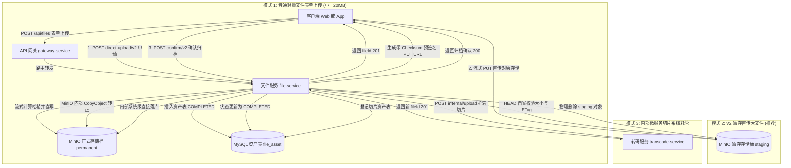
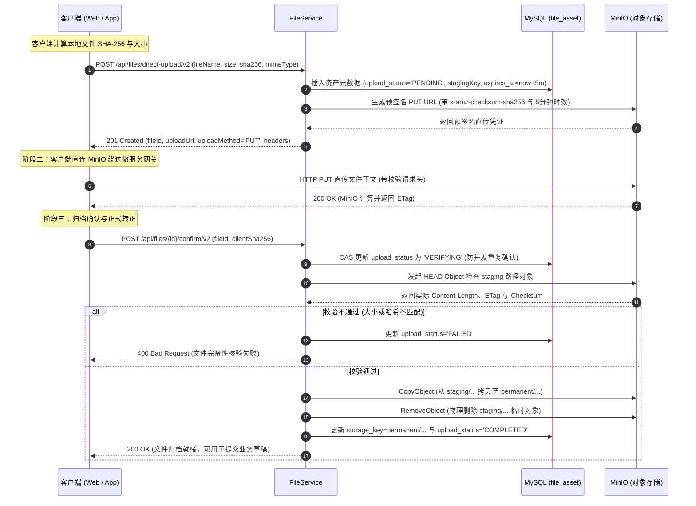
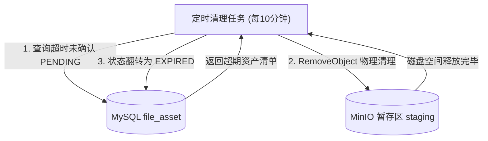

# 文件模块 · file-service 架构设计与实现文档

文件模块（`file-service`）是平台底层多媒体资产管理与对象存储（阿里云 OSS）中继协调的核心微服务。负责多模式文件接入（普通表单上传、海量音视频 V1/V2 暂存直传、内部微服务切片自动托管）、存储物理隔离与原子归档（`staging/` ➔ `permanent/`）、防盗链时效流媒体代理（HMAC 签名与 HTTP 304 协商缓存）以及僵死孤儿文件后台自愈清理。

---

## 1. 模块定位与架构边界

### 1.1 核心业务职责
- **大文件两阶段暂存直传中枢**：
  - 彻底规避传统应用服务器代理大文件二进制流导致的网关带宽打满、GC 停顿与 OOM 隐患；
  - 授权阶段：校验文件 MIME、扩展名与大小，签发仅限直写阿里云 OSS 暂存目录 `staging/` 的短期预签名 PUT 通行证（有效期 15 分钟）；
  - 确认归档阶段：核验客户端上传状态，向 OSS 发起 HEAD 对象元数据自省，校验 Content-Length 与 ETag，校验无误后在 OSS 内部触发毫秒级 `CopyObject`（带 ETag 条件）移动至正式目录 `permanent/`，并物理删除暂存对象，资产状态置为 `COMPLETED`。
- **存储物理目录严格隔离**：
  - **暂存区（`staging/{yyyy}/{MM}/{dd}/{fileId}`）**：任何未经过确认归档的文件物理隔离在此，对业务系统完全不可见；
  - **正式区（`permanent/{yyyy}/{MM}/{dd}/{fileId}`）**：只有确认合法的大文件与普通上传文件才允许落入该目录，业务服务仅关联正式区资产。
- **专有内部微服务托管通道**：
  - 转码服务（`transcode-service`）压制出的分分辨率切片（720P、1080P、HLS 切片文件）属于系统衍生资产；
  - 提供 `/api/files/internal/upload` 受信端点，允许转码节点免用户会话直接托管切片文件，并为其登记独立 `fileId`。
- **防盗链安全代理与流媒体加速**：
  - 私有存储桶不对公网开放匿名读权限；
  - 通过 `/api/files/assets/{id}` 端点提供防盗链代理，支持基于 HMAC-SHA256 的时效防盗链令牌（`sign` + `expires`）；
  - 支持 `ETag` 与 `If-None-Match` 的 HTTP 304 协商缓存，大文件（>20MB）实施熔断保护，杜绝恶意刷流打爆应用服务带宽。
- **存储自愈清理调度**：
  - 通过后台调度器定时扫描超时未确认的直传记录，调用 OSS 物理删除已上传的废弃分片与垃圾对象，将数据库状态置为 `EXPIRED`。

### 1.2 防腐与禁止承担的工作
- **严禁代理大文件音视频正文直传**：客户端音视频正文必须直接 PUT 到 MinIO 存储桶，严禁经由网关或本服务进行内存转发；
- **严禁管理上层业务实体元数据**：本服务仅维护物理文件元数据（大小、哈希、MIME、存储键），不感知视频标题、标签、简介或创作者粉丝关系；
- **严禁对外暴露内部接口**：`/api/files/internal/**` 必须在 API 网关层实施严格阻断，仅限微服务间通过 RPC / 内网直接调用。

### 1.3 参与的全局业务主线导航
- 核心牵头 [主线 02：大文件/媒体资产 V2 两阶段直传、存储隔离与确认归档](../flows/02-file-storage-direct-upload-flow.md)
- 支撑服务 [主线 03：视频创作、提审探活、异步机审与分级门禁流水线](../flows/03-video-publish-and-pipeline-flow.md)（转码切片自动托管与提审强探活）
- 支撑服务 [主线 04：前台视频播放分发、短码寻址与网关防刷](../flows/04-video-playback-and-portal-flow.md)（防盗链代理拉流）

---

## 2. 三种上传模式全景对比图



---

## 3. V2 两阶段直传核心执行时序



---

## 4. 第一套件：HTTP 接口服务链路

所有对外与内部接口统一挂载于 `/api/files/**` 下：

| HTTP 方法 | URI 路径 | 鉴权要求 | 核心处理流与调用链 | 关键响应状态 |
| :--- | :--- | :--- | :--- | :--- |
| `POST` | `/api/files` | `requireUser` | 普通小文件表单上传 ➔ 流式计算 SHA-256 ➔ 直写 MinIO 正式区 ➔ 插入 `file_asset` 状态直接置为 `COMPLETED` | `201` 创建成功<br/>`413` 大小超过 20MB 上限 |
| `POST` | `/api/files/direct-upload/v2` | `requireUser` | 大文件直传 V2 申请 ➔ 绑定声明 SHA-256 ➔ 签发 `staging/` 目录短期 PUT URL（5 分钟有效） ➔ 插入 `PENDING` 资产记录 | `201` 签发成功<br/>`400` MIME 或后缀不合法 |
| `POST` | `/api/files/{id}/confirm/v2` | `requireUser` | 客户端直传确认 ➔ CAS 置为 `VERIFYING` ➔ HEAD 探测暂存对象 ➔ MinIO 内部 `CopyObject` ➔ 物理清除 staging ➔ 更新为 `COMPLETED` | `200` 归档成功<br/>`400` 大小/哈希核验失败<br/>`404` 资产不存在 |
| `GET` | `/api/files/{id}` | `requireUser` | 查询本人文件元数据（大小、MIME、上传状态、SHA-256、归档路径） | `200` 获取成功<br/>`403` 越权查看他人文件<br/>`404` 资产不存在 |
| `GET` | `/api/files/{id}/download-url` | `requireUser` | 申请私有文件的短期预签名 GET 下载链接（响应头注入 `Cache-Control: no-store`） | `200` 成功返回 downloadUrl |
| `GET` | `/api/files/{id}/view-url` | `requireUser` | 签发带防盗链时效与 HMAC 签名的预览直链路径（供前端播放器使用） | `200` 成功返回 viewUrl |
| `DELETE`| `/api/files/{id}` | `requireUser` | 本人删除资产 ➔ 校验拥有权 ➔ 从 MinIO 物理删除底层对象 ➔ 数据库逻辑墓碑更新为 `DELETED` | `204` 无内容 (删除成功)<br/>`403` 无权删除 |
| `GET` | `/api/files/assets/{id}` | 匿名防盗链 | 前台静态流媒体防盗链代理 ➔ HMAC 签名校验与时效核验 ➔ ETag/304 协商缓存 ➔ 流式管道输出二进制内容（带 10MB 熔断保护） | `200` 正常输出流<br/>`304` 命中客户端缓存<br/>`403` 签名伪造或过期 |
| `POST` | `/api/files/internal/upload` | **内部免密专享** | 专供内部微服务（如转码服务压制切片）系统级托管上传 ➔ 传入 `authorId` ➔ 签发合法独立 `fileId` | `201` 托管成功 |
| `GET` | `/api/files/internal/{id}/download-url`| **内部免密专享** | 专供内部微服务（如审核机审拉流、转码原片下载、内容提审探活）按 ID 跨服务获取直链 | `200` 获取成功<br/>`404` 文件不存在或未就绪 |

### 4.1 核心请求与响应报文规范

#### 1. 申请 V2 直传通行证 (`POST /api/files/direct-upload/v2`)
```json
// 请求体
{
  "originalName": "product_launch_4k.mp4",
  "mimeType": "video/mp4",
  "sizeBytes": 524288000,
  "sha256Hex": "e3b0c44298fc1c149afbf4c8996fb92427ae41e4649b934ca495991b7852b855"
}

// 响应体 (HTTP 201 Created)
{
  "code": 0,
  "message": "success",
  "data": {
    "fileId": "f0123456789abcdef0123456789abcde",
    "uploadUrl": "https://storage.calles.com/media-bucket/staging/u_1001/20260917/f0123456789abcdef0123456789abcde?X-Amz-Algorithm=AWS4-HMAC-SHA256&X-Amz-Expires=300...",
    "httpMethod": "PUT",
    "headers": {
      "Content-Type": "video/mp4",
      "x-amz-checksum-sha256": "47DEQpj8HBSa+/TImW+5JCeuQeRkm5NMpJWZG3hSuFU="
    },
    "expiresAt": 1773728300000
  }
}
```

#### 2. 直传归档确认 (`POST /api/files/{id}/confirm/v2`)
```json
// 请求体
{
  "clientSha256": "e3b0c44298fc1c149afbf4c8996fb92427ae41e4649b934ca495991b7852b855"
}

// 响应体 (HTTP 200 OK)
{
  "code": 0,
  "message": "success",
  "data": {
    "fileId": "f0123456789abcdef0123456789abcde",
    "status": "ACTIVE",
    "uploadStatus": "COMPLETED",
    "sizeBytes": 524288000,
    "storageKey": "permanent/u_1001/20260917/f0123456789abcdef0123456789abcde.mp4"
  }
}
```

---

## 5. 第二套件：MQ 消息链路

- **定位说明**：`file-service` 作为整个微服务矩阵的**基础资产与对象存储底座**，其所有的上传、状态校验、凭证生成与物理操作均通过 REST/HTTP 和 OpenFeign 提供强一致的同步服务。
- **架构权衡**：
  - 文件元数据创建与归档属于同步前置依赖，上游（如 `content-service` 创建视频草稿）必须在拿到明确合法的 `fileId` 且通过 Feign 探活确认为 `COMPLETED` 之后，才允许推进后续业务。因此文件服务自身**不直接发布或订阅 RabbitMQ 业务领域事件**；
  - 这种设计保证了底层文件系统职责的纯粹性，避免由于消息延迟导致的“视频已开始提审但底层文件尚在异步处理”的逻辑竞态。

---

## 6. 第三套件：定时任务与异步补偿调度链路

### 6.1 暂存孤儿文件自愈清理调度器 (`FileCleanupScheduler`)
用户在申请直传通行证后，可能由于断网、用户主动取消、浏览器崩溃等原因导致直传中断，或者上传后未发起 `confirm/v2` 确认，导致大量垃圾文件滞留在 MinIO `staging/` 目录中。



- **执行参数**：依赖配置 `file.cleanup.enabled=true`，默认每 10 分钟执行一次；
- **自愈清理双重保障**：
  - **针对数据库**：将已超期的记录状态由 `PENDING` 置为 `EXPIRED`，禁止客户端在超期后重新发起确认；
  - **针对对象存储**：物理删除 `staging/` 对应路径的对象，彻底杜绝孤儿大文件长期滞留对象存储桶造成磁盘容量膨胀。

---

## 7. 数据库表结构全景 (Schema)

### 7.1 文件资产元数据表 (`file_asset`)
```sql
CREATE TABLE IF NOT EXISTS `file_asset` (
    `id` CHAR(32) NOT NULL COMMENT '文件资产全局唯一ID (UUID)',
    `user_id` CHAR(32) NOT NULL COMMENT '所属用户ID (auth_account.id / internal)',
    `original_name` VARCHAR(255) NOT NULL COMMENT '原始文件名',
    `storage_type` VARCHAR(16) NOT NULL DEFAULT 'MINIO' COMMENT '底层存储系统: MINIO, S3, LOCAL',
    `storage_key` VARCHAR(512) NOT NULL COMMENT '对象存储路径 (staging/... 或 permanent/...)',
    `size_bytes` BIGINT NOT NULL DEFAULT 0 COMMENT '文件实际大小 (字节)',
    `mime_type` VARCHAR(128) NOT NULL DEFAULT 'application/octet-stream' COMMENT '媒体类型',
    `sha256_hex` CHAR(64) NULL COMMENT '文件 SHA-256 完整摘要哈希',
    `status` VARCHAR(16) NOT NULL DEFAULT 'ACTIVE' COMMENT '业务逻辑状态: ACTIVE, DELETED',
    `upload_status` VARCHAR(16) NOT NULL DEFAULT 'PENDING' COMMENT '上传生命周期: PENDING, VERIFYING, COMPLETED, EXPIRED, FAILED',
    `upload_protocol` VARCHAR(16) NOT NULL DEFAULT 'DIRECT_V2' COMMENT '接入协议: DIRECT_V1, DIRECT_V2, SIMPLE, INTERNAL',
    `upload_expires_at` DATETIME(3) NULL COMMENT '直传确认截止有效期限',
    `created_at` DATETIME(3) NOT NULL DEFAULT CURRENT_TIMESTAMP(3) COMMENT '创建时间',
    `updated_at` DATETIME(3) NOT NULL DEFAULT CURRENT_TIMESTAMP(3) ON UPDATE CURRENT_TIMESTAMP(3) COMMENT '更新时间',
    PRIMARY KEY (`id`),
    KEY `idx_user_asset` (`user_id`, `status`, `upload_status`),
    KEY `idx_cleanup` (`upload_status`, `upload_expires_at`)
) ENGINE=InnoDB DEFAULT CHARSET=utf8mb4 COMMENT='文件资产元数据核心表';
```

---

## 8. 核心源码入口索引

- **启动入口类**：[`FileApplication.java`](../../service/file-service/src/main/java/com/calles/platform/file/FileApplication.java)
- **控制器层**：
  - 资产与内部通道控制器：[`FileController.java`](../../service/file-service/src/main/java/com/calles/platform/file/interfaces/http/FileController.java)
- **核心用例与应用服务**：
  - 资产元数据管理：[`FileAssetApplicationService.java`](../../service/file-service/src/main/java/com/calles/platform/file/application/asset/FileAssetApplicationService.java)
  - V2 两阶段归档核验：[`DirectUploadConfirmationService.java`](../../service/file-service/src/main/java/com/calles/platform/file/application/confirmation/DirectUploadConfirmationService.java)
  - 防盗链与媒体流代理：[`FileProxyService.java`](../../service/file-service/src/main/java/com/calles/platform/file/application/content/FileProxyService.java)
  - 防盗链签名算法引擎：[`AssetTokenService.java`](../../service/file-service/src/main/java/com/calles/platform/file/application/security/AssetTokenService.java)
- **底层存储适配**：
  - MinIO 客户端抽象：[`MinioObjectStorageClient.java`](../../service/file-service/src/main/java/com/calles/platform/file/infrastructure/storage/MinioObjectStorageClient.java)
- **自愈清理调度器**：
  - 孤儿文件定时清理：[`FileCleanupScheduler.java`](../../service/file-service/src/main/java/com/calles/platform/file/interfaces/scheduling/FileCleanupScheduler.java)
- **核心自动化测试**：
  - 两阶段直传测试：`FileAssetV2UploadTest.java`
  - 归档确认与异常自愈测试：`DirectUploadConfirmationV2Test.java`
  - 内部免密通道安全测试：`FileInternalControllerTest.java`
