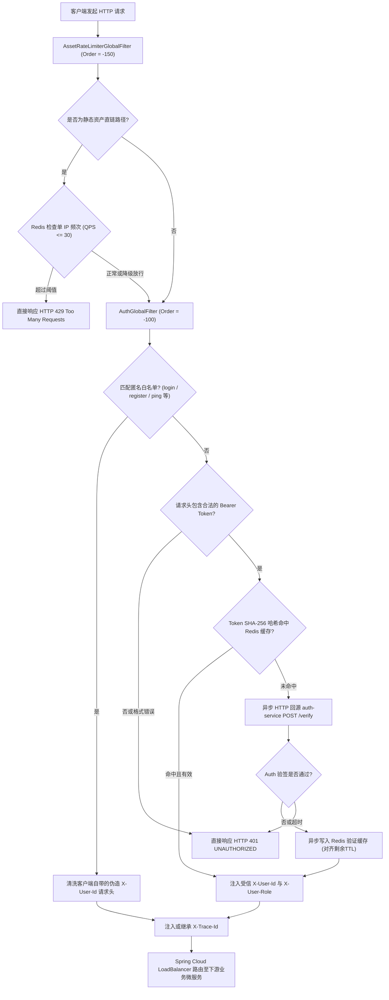

# 网关模块 · gateway-service 架构设计与实现文档

网关模块（`gateway-service`）是平台微服务集群的**统一接入、动态路由分发与安全防护中枢**（运行端口：8000）。基于 Spring Cloud Gateway 与 Reactor Netty 高性能响应式非阻塞框架构建。模块承担对外 API 统一路由断言、入口级 IP 滑动窗口防刷限流、无状态/有状态 JWT 身份鉴权与防伪清洗、Token 验签多级缓存加速、CORS 跨域预检处理以及分布式链路追踪染色（`X-Trace-Id`）透传。

---

## 1. 模块定位与架构边界

### 1.1 核心业务职责
- **统一路由与协议分发**：
  - 对外统一暴露 `/api/**` 前缀，阻断内部微服务端口直接暴露给公网；
  - 结合 Nacos 服务发现中心，使用响应式负载均衡器（`lb://<service-name>`）实现微服务实例的健康感知与流量平摊；
  - 统一处理 OPTIONS 跨域预检请求，集中配置 CORS 策略（AllowedOrigins、AllowedHeaders、AllowCredentials）。
- **非侵入式身份鉴权与 Header 清洗**：
  - 拦截所有非白名单请求，校验 `Authorization: Bearer <token>` 凭据合法性；
  - **防身份伪造铁律**：无论客户端请求是否携带 `X-User-Id` 或 `X-User-Role`，网关在转发给下游微服务前**无条件剔除客户端发来的特权 Header**，仅在 JWT 本地验签或回源成功后，由网关自主重新注入受信的身份标头；
  - 下游微服务（如 `content-service`、`user-service`）完全信任网关注入的 Header，免除重复验签开销。
- **高吞吐 Token 验签多级缓存**：
  - 网关本地支持 HMAC-SHA256 快速验签，并结合 Redis 缓存验签结果（Key 为 Token SHA-256 哈希），将验签耗时压低至 1ms 以内；
  - 缓存未命中或遇到非标准状态时，异步回源 `auth-service` 的 `/api/auth/verify` 端点。
- **入口级资产防刷与 IP 令牌桶限流**：
  - 识别针对高频静态资源与流媒体代理（`/api/files/assets/**`）的恶意刷量爬虫；
  - 提取客户端真实物理 IP，基于 Redis 维护单 IP 限流计数（默认每秒 30 次）；
  - 触发超限时直接拦截并返回标准 HTTP 429 错误报文，避免攻击流量穿透至应用层。
- **全链路追踪（Distributed Tracing）染色**：
  - 在入口处生成或继承 `X-Trace-Id`，绑定至 Reactor 上下文与 SLF4J MDC；
  - 向下游 HTTP 请求头与入站响应头双向透传，保证日志与事件全链路可溯。

### 1.2 防腐与禁止承担的工作
- **严禁编写具体业务逻辑**：网关不得查询业务数据库，不得调用非基础设施类业务服务，严禁参与具体的业务状态转移；
- **严禁代理音视频直传大流**：客户端直传必须直连 MinIO 暂存存储桶，严禁经由网关代理几百 MB 的视频二进制流；
- **严禁向公网暴露内部受信接口**：对匹配 `/api/*/internal/**` 模式的请求，网关层必须强制拦截并返回 404/403，确保内部服务间接口绝不暴露于公网。

### 1.3 参与的全局业务主线导航
- 核心贯穿 [主线 01：账号生命周期与鉴权透传](../flows/01-账号生命周期与鉴权透传.md)
- 核心贯穿 [主线 04：前台视频播放分发、短码寻址与网关防刷](../flows/04-前台视频播放分发与网关防刷.md)
- 核心贯穿 [主线 05：平台合规治理、违规封禁与全站事件广播下线](../flows/05-平台合规治理与全站广播下线.md)

---

## 2. 全局过滤器链执行决策流程图



---

## 3. 动态路由映射与访问控制策略

### 3.1 核心微服务路由矩阵

网关在 `application.yml` 中配置如下响应式路由规则：

| 路由标识 (`id`) | 匹配路径断言 (`Path`) | 目标服务 (`uri`) | 核心承载业务与安全说明 |
| :--- | :--- | :--- | :--- |
| `auth-service` | `/api/auth/**` | `lb://auth-service` | 账号注册、登录、双 Token 刷新、登出销毁 |
| `user-service` | `/api/users/**` | `lb://user-service` | 个人主页资料维护、关注/粉丝关系、公开名片 |
| `file-service` | `/api/files/**` | `lb://file-service` | 直传通行证申请、归档确认、防盗链代理流 |
| `content-service` | `/api/content/**` | `lb://content-service` | 视频创作草稿、提审流水线、前台多码率播放流 |
| `audit-service` | `/api/audit/**` | `lb://audit-service` | 机审结果接收、管理端人工复审队列 |
| `interaction-service` | `/api/interactions/**` | `lb://interaction-service` | 高并发点赞、投币、收藏写缓冲与互动快照 |
| `recommend-service` | `/api/recommend/**` | `lb://recommend-service` | 首页推荐瀑布流、播放页关联视频召回 |

### 3.2 静态匿名白名单定义

以下端点无需在网关层执行 JWT 签名拦截，直接进入安全清洗通道：
- **认证开放端点**：`/api/auth/login`、`/api/auth/register`、`/api/auth/refresh`、`/api/auth/ping`；
- **文件防盗链代理**：`/api/files/assets/**`（通过 URL 内部带时效 HMAC 签名防盗链与 IP 令牌桶协同保护）；
- **外部 Webhook 回调**：`/api/audit/callback/**`（由审核服务自身校验 SHA-256 签名）；
- **基础运维端点**：`/actuator/health`、`/actuator/info`。

### 3.3 内部私有端点阻断规则（网关防穿透）
为了杜绝内部微服务专享的高权限端点被外部网络绕过调用，网关配置了最高优先级拦截器：
- 任何匹配 `/api/*/internal/**` 模式的请求，若外部请求直接到达网关，一律响应 **HTTP 403 Forbidden**；
- 内部微服务调用（如转码服务压制完成切片调用 `POST /api/files/internal/upload`）仅通过集群内部 K8s Service / 内部网段直连，不经过外部网关。

---

## 4. 全局统一异常响应规范

网关在发生限流、未认证、越权或目标服务宕机时，必须抹除 Netty 底层堆栈，向客户端统一返回标准化 JSON 报文：

#### 1. 未授权或 Token 过期 (`HTTP 401 Unauthorized`)
```json
{
  "code": 40101,
  "message": "Full authentication is required to access this resource",
  "data": null,
  "timestamp": 1773728000000,
  "traceId": "9b12a83f98274ac09d7e345b1287e0fa"
}
```

#### 2. 静态资产 IP 防刷限流拦截 (`HTTP 429 Too Many Requests`)
```json
{
  "code": 42901,
  "message": "Too many requests. Please try again later.",
  "data": {
    "limitQps": 30,
    "retryAfterSeconds": 1
  },
  "timestamp": 1773728000000,
  "traceId": "9b12a83f98274ac09d7e345b1287e0fa"
}
```

#### 3. 下游服务熔断或不可达 (`HTTP 503 Service Unavailable`)
```json
{
  "code": 50301,
  "message": "Target service is temporarily unavailable. Please retry later.",
  "data": null,
  "timestamp": 1773728000000,
  "traceId": "9b12a83f98274ac09d7e345b1287e0fa"
}
```

---

## 5. 第二套件：MQ 消息链路

- **定位说明**：网关模块为**纯 HTTP/WebFlux 协议中继层与反向代理**，不直接连接 RabbitMQ，**既不发布也不消费 MQ 领域事件**。
- **分布式链路追踪透传契约**：
  - 网关在每个请求入口通过 `TraceIdFilter` 生成全局唯一的 `X-Trace-Id` 并注入 HTTP Header；
  - 当下游业务服务收到请求并在本地执行业务后向 RabbitMQ 投递领域事件时，从当前线程上下文提取该 `traceId` 写入事件契约载荷，从而实现跨服务、跨网络、跨消息总线的全息链路追踪。

---

## 6. 第三套件：定时任务与容灾补偿调度链路

- **定位说明**：网关模块为**轻量无状态容器**，不配置持久化数据库定时任务。
- **高可用与自愈机制**：
  1. **Token 验签缓存自动过期（TTL 对齐）**：向 Redis 写入 `auth:token:cache:<token_hash>` 时，缓存 TTL 取 `gateway.auth.cache-ttl`（默认 600 秒）与 Token 剩余有效期的较小值，完全由 Redis 原生过期机制自动驱逐回收；
  2. **登出即时清理**：当用户调用 `/api/auth/logout` 成功时，网关在转发响应的后置链路中主动异步删除对应的 Redis 验证缓存，杜绝注销后延迟；
  3. **认证中心依赖熔断保护**：网关通过 WebClient 回源调用 `auth-service` 时配置了严格的 **3000ms 超时闸门**。若认证中心遇到极端网络丢包或崩溃，网关直接短路降级返回 401，防止 Netty 工作线程被排队打满导致全站雪崩。

---

## 7. 核心源码入口索引

- **启动入口类**：[`GatewayApplication.java`](../../service/gateway-service/src/main/java/com/calles/platform/gateway/GatewayApplication.java)
- **网关路由规则配置**：[`application.yml`](../../service/gateway-service/src/main/resources/application.yml)
- **全局拦截与鉴权过滤器**：
  - 入口 IP 令牌桶限流：[`AssetRateLimiterGlobalFilter.java`](../../service/gateway-service/src/main/java/com/calles/platform/gateway/filter/AssetRateLimiterGlobalFilter.java)
  - JWT 鉴权与 Header 清洗：[`AuthGlobalFilter.java`](../../service/gateway-service/src/main/java/com/calles/platform/gateway/filter/AuthGlobalFilter.java)
  - 网关访问日志与监控：[`GatewayAccessLogFilter.java`](../../service/gateway-service/src/main/java/com/calles/platform/gateway/filter/GatewayAccessLogFilter.java)
- **鉴权缓存与回源客户端**：
  - Token 验证缓存服务：[`AuthCacheService.java`](../../service/gateway-service/src/main/java/com/calles/platform/gateway/service/AuthCacheService.java)
  - 认证中心回源客户端：[`AuthServiceClient.java`](../../service/gateway-service/src/main/java/com/calles/platform/gateway/service/AuthServiceClient.java)
- **公共追踪上下文**：
  - 分布式追踪过滤器：[`TraceIdFilter.java`](../../common/common-web/src/main/java/com/calles/platform/common/web/filter/TraceIdFilter.java)
