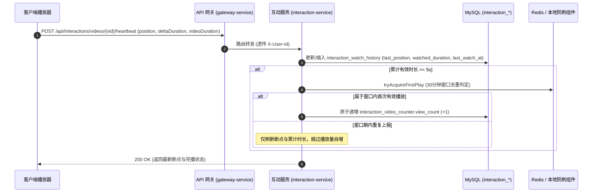
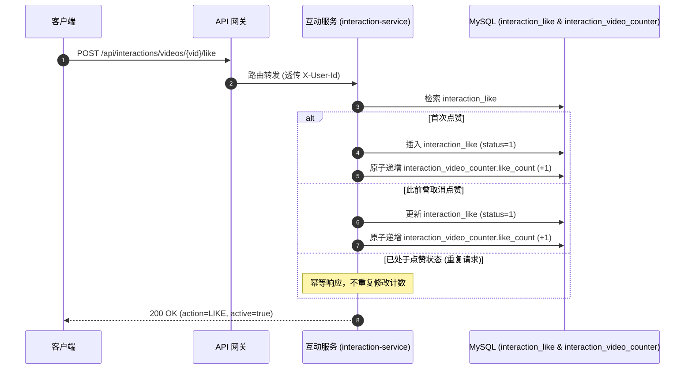

# 互动模块 · interaction-service 架构设计与实现文档

互动模块（`interaction-service`）是平台视频社交关系、高频互动行为与视频统计数据的**第一责任人与主动管理者**（运行端口：8500）。负责点赞（Like）、收藏（Star/Folder）、播放心跳（Heartbeat）、观看历史（Watch History）与视频公开统计计数（VideoCounter）的闭环支撑。

---

## 1. 模块定位与架构边界

### 1.1 核心业务职责
- **视频交互统计的主动管理者（所有权独占）**：
  - 独占维护视频的播放量（`view_count`）、点赞数（`like_count`）、收藏数（`star_count`）、分享数（`share_count`）；
  - `content-service` 的 `video_content` 主表彻底移除上述高频计数字段，高频交互行为产生时完全在 `interaction-service` 闭环，无需往内容服务发送增量计数同步事件，根除写放大与行锁竞争。
- **高并发点赞事实与状态反转**：
  - 维护用户对视频的点赞明细，支持毫秒级状态反转（点赞/取消点赞）；
  - 严格支持幂等：重复点赞或重复取消点赞不会导致计数异常递增或递减。
- **多收藏夹与视频收藏管理**：
  - 支持用户默认收藏夹（自动初始化）与自定义多收藏夹；
  - 提供视频加入收藏夹、移除收藏及收藏列表分页查询。
- **播放心跳（Heartbeat）与观看历史断点**：
  - 客户端周期上报心跳（当前播放头秒数、时段增量时长、视频总时长）；
  - 服务端记录断点续播进度（`last_position`）、累计观看时长与完播判定；
  - 结合时间窗口防刷机制（默认 30 分钟去重），驱动视频有效播放量原子累加。
- **一站式前台状态快照**：
  - 为前台播放页提供一站式聚合快照接口（`GET /api/interactions/videos/{vid}/my-state`），一次请求聚合返回点赞、收藏状态与断点续播秒数。
- **公开统计与批量计数装配**：
  - 提供单视频与批量视频统计接口，供网关或前端卡片列表组装完整视频展示数据。

### 1.2 防腐与边界铁律
- **严禁反向直接修改视频主表**：互动服务绝不跨服务调用 content-service 的 RPC 修改视频内容元数据；
- **纯粹的交互行为中枢**：推荐特征工程相关的领域事件与模型打分，待基础交互架构夯实后按需通过异步 MQ 订阅，当前阶段不耦合推荐逻辑；
- **不承接用户认证**：完全基于网关统一验签透传的 `X-User-Id` 与 `X-User-Role` 上下文。

---

## 2. 核心交互流程时序图

### 2.1 播放心跳与断点续播时序



### 2.2 点赞与计数闭环时序



---

## 3. 数据库独占表结构设计 (MySQL)

```sql
-- 1. 视频互动统计计数聚合表 (interaction-service 独占)
CREATE TABLE IF NOT EXISTS `interaction_video_counter` (
    `vid` VARCHAR(32) NOT NULL COMMENT '视频公开业务短码',
    `view_count` BIGINT NOT NULL DEFAULT 0 COMMENT '累计播放量',
    `like_count` BIGINT NOT NULL DEFAULT 0 COMMENT '累计点赞数',
    `star_count` BIGINT NOT NULL DEFAULT 0 COMMENT '累计收藏数',
    `share_count` BIGINT NOT NULL DEFAULT 0 COMMENT '累计分享数',
    `comment_count` BIGINT NOT NULL DEFAULT 0 COMMENT '累计评论数 (预留)',
    `created_at` DATETIME(3) NOT NULL DEFAULT CURRENT_TIMESTAMP(3),
    `updated_at` DATETIME(3) NOT NULL DEFAULT CURRENT_TIMESTAMP(3) ON UPDATE CURRENT_TIMESTAMP(3),
    PRIMARY KEY (`vid`),
    CONSTRAINT `ck_int_counter_view` CHECK (`view_count` >= 0),
    CONSTRAINT `ck_int_counter_like` CHECK (`like_count` >= 0),
    CONSTRAINT `ck_int_counter_star` CHECK (`star_count` >= 0),
    CONSTRAINT `ck_int_counter_share` CHECK (`share_count` >= 0),
    CONSTRAINT `ck_int_counter_comment` CHECK (`comment_count` >= 0)
) ENGINE=InnoDB DEFAULT CHARSET=utf8mb4 COMMENT='视频互动统计计数聚合表';

-- 2. 用户点赞事实与状态表
CREATE TABLE IF NOT EXISTS `interaction_like` (
    `id` CHAR(32) NOT NULL COMMENT '主键 UUID',
    `vid` VARCHAR(32) NOT NULL COMMENT '视频公开业务短码',
    `user_id` CHAR(32) NOT NULL COMMENT '用户账号ID',
    `status` TINYINT NOT NULL DEFAULT 1 COMMENT '点赞状态: 1=已赞, 0=已取消',
    `created_at` DATETIME(3) NOT NULL DEFAULT CURRENT_TIMESTAMP(3),
    `updated_at` DATETIME(3) NOT NULL DEFAULT CURRENT_TIMESTAMP(3) ON UPDATE CURRENT_TIMESTAMP(3),
    PRIMARY KEY (`id`),
    UNIQUE KEY `uk_like_user_vid` (`user_id`, `vid`),
    KEY `idx_like_vid_status` (`vid`, `status`),
    KEY `idx_like_user_list` (`user_id`, `status`, `created_at` DESC)
) ENGINE=InnoDB DEFAULT CHARSET=utf8mb4 COMMENT='视频点赞记录表';

-- 3. 用户收藏夹表
CREATE TABLE IF NOT EXISTS `interaction_star_folder` (
    `id` CHAR(32) NOT NULL COMMENT '收藏夹主键 UUID',
    `user_id` CHAR(32) NOT NULL COMMENT '用户账号ID',
    `title` VARCHAR(64) NOT NULL COMMENT '收藏夹标题',
    `is_default` TINYINT NOT NULL DEFAULT 0 COMMENT '是否默认收藏夹: 1=是, 0=否',
    `status` TINYINT NOT NULL DEFAULT 1 COMMENT '状态: 1=正常, 0=已删除',
    `created_at` DATETIME(3) NOT NULL DEFAULT CURRENT_TIMESTAMP(3),
    `updated_at` DATETIME(3) NOT NULL DEFAULT CURRENT_TIMESTAMP(3) ON UPDATE CURRENT_TIMESTAMP(3),
    PRIMARY KEY (`id`),
    KEY `idx_folder_user` (`user_id`, `status`)
) ENGINE=InnoDB DEFAULT CHARSET=utf8mb4 COMMENT='用户收藏夹表';

-- 4. 收藏视频明细表
CREATE TABLE IF NOT EXISTS `interaction_star_item` (
    `id` CHAR(32) NOT NULL COMMENT '明细主键 UUID',
    `folder_id` CHAR(32) NOT NULL COMMENT '所属收藏夹ID',
    `vid` VARCHAR(32) NOT NULL COMMENT '视频公开业务短码',
    `user_id` CHAR(32) NOT NULL COMMENT '用户账号ID (反查冗余)',
    `created_at` DATETIME(3) NOT NULL DEFAULT CURRENT_TIMESTAMP(3),
    PRIMARY KEY (`id`),
    UNIQUE KEY `uk_folder_vid` (`folder_id`, `vid`),
    KEY `idx_item_user_vid` (`user_id`, `vid`),
    KEY `idx_item_folder_time` (`folder_id`, `created_at` DESC)
) ENGINE=InnoDB DEFAULT CHARSET=utf8mb4 COMMENT='用户收藏明细表';

-- 5. 用户视频观看历史与心跳断点表
CREATE TABLE IF NOT EXISTS `interaction_watch_history` (
    `id` CHAR(32) NOT NULL COMMENT '记录主键 UUID',
    `user_id` CHAR(32) NOT NULL COMMENT '用户账号ID',
    `vid` VARCHAR(32) NOT NULL COMMENT '视频公开业务短码',
    `last_position` INT NOT NULL DEFAULT 0 COMMENT '上次播放头进度 (秒)，用于断点续播',
    `watched_duration` INT NOT NULL DEFAULT 0 COMMENT '累计有效观看总时长 (秒)',
    `video_duration` INT NOT NULL DEFAULT 0 COMMENT '视频总时长 (秒)',
    `completed` TINYINT NOT NULL DEFAULT 0 COMMENT '是否完播: 1=是, 0=否',
    `first_watch_at` DATETIME(3) NOT NULL DEFAULT CURRENT_TIMESTAMP(3) COMMENT '首次观看时间',
    `last_watch_at` DATETIME(3) NOT NULL DEFAULT CURRENT_TIMESTAMP(3) ON UPDATE CURRENT_TIMESTAMP(3) COMMENT '最近一次心跳活跃时间',
    PRIMARY KEY (`id`),
    UNIQUE KEY `uk_watch_user_vid` (`user_id`, `vid`),
    KEY `idx_watch_user_recent` (`user_id`, `last_watch_at` DESC)
) ENGINE=InnoDB DEFAULT CHARSET=utf8mb4 COMMENT='用户视频观看历史与进度表';
```

---

## 4. 外部 HTTP API 契约列表

| 业务分类 | 方法 | 路径 | 鉴权要求 | 说明 |
| :--- | :--- | :--- | :--- | :--- |
| **点赞** | `POST` | `/api/interactions/videos/{vid}/like` | 需登录 | 点赞视频，原子累加 like_count |
| | `DELETE` | `/api/interactions/videos/{vid}/like` | 需登录 | 取消点赞，原子扣减 like_count |
| **收藏** | `POST` | `/api/interactions/videos/{vid}/star` | 需登录 | 收藏视频（可选 folderId，默认为默认收藏夹） |
| | `DELETE` | `/api/interactions/videos/{vid}/star` | 需登录 | 取消收藏（可选 folderId） |
| | `GET` | `/api/interactions/star/folders` | 需登录 | 获取当前用户所有收藏夹 |
| | `POST` | `/api/interactions/star/folders` | 需登录 | 创建自定义收藏夹 |
| | `GET` | `/api/interactions/star/items` | 需登录 | 分页查询指定收藏夹内的视频 |
| **观看心跳** | `POST` | `/api/interactions/videos/{vid}/heartbeat` | 登录/匿名 | 上报心跳（position, deltaDuration, videoDuration） |
| | `GET` | `/api/interactions/videos/{vid}/watch-progress` | 登录/匿名 | 获取视频断点续播位置 |
| | `GET` | `/api/interactions/watch/history` | 需登录 | 分页查询我的观看历史列表 |
| | `DELETE` | `/api/interactions/watch/history` | 需登录 | 删除单条（带 vid 参数）或清空历史 |
| **播放页快照** | `GET` | `/api/interactions/videos/{vid}/my-state` | 登录/匿名 | 一站式返回点赞、收藏状态与断点秒数 |
| **公开统计** | `GET` | `/api/interactions/videos/{vid}/stat` | 开放 | 获取单视频的公开互动计数字段 |
| | `POST` | `/api/interactions/videos/stats` | 开放/内部 | 批量查询多个视频的公开计数（供视频列表装配） |
| | `POST` | `/api/interactions/videos/{vid}/share` | 登录/匿名 | 记录视频分享并自增 share_count |

---

## 5. 核心源码入口索引

- **服务启动类**：[`InteractionApplication.java`](../../service/interaction-service/src/main/java/com/calles/platform/interaction/InteractionApplication.java)
- **配置文件**：[`application.yml`](../../service/interaction-service/src/main/resources/application.yml)
- **计数聚合根**：[`VideoCounter.java`](../../service/interaction-service/src/main/java/com/calles/platform/interaction/domain/model/counter/VideoCounter.java)
- **心跳服务**：[`WatchHeartbeatApplicationService.java`](../../service/interaction-service/src/main/java/com/calles/platform/interaction/application/watch/WatchHeartbeatApplicationService.java)
- **点赞服务**：[`LikeApplicationService.java`](../../service/interaction-service/src/main/java/com/calles/platform/interaction/application/like/LikeApplicationService.java)
- **收藏服务**：[`StarApplicationService.java`](../../service/interaction-service/src/main/java/com/calles/platform/interaction/application/star/StarApplicationService.java)
- **聚合控制器**：[`InteractionStatController.java`](../../service/interaction-service/src/main/java/com/calles/platform/interaction/interfaces/http/InteractionStatController.java)
