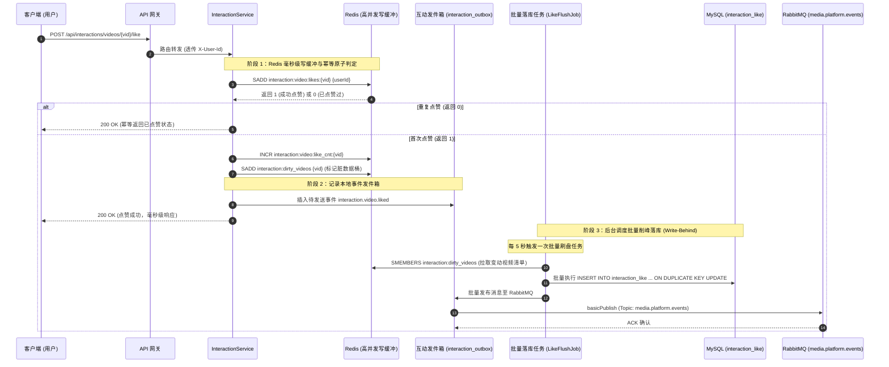
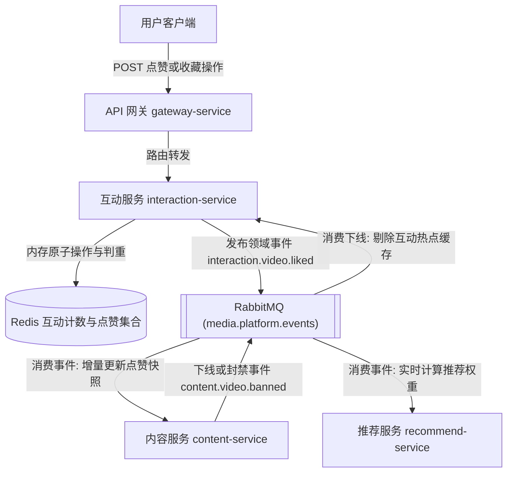

# 互动模块 · interaction-service 架构设计与实现文档

互动模块（`interaction-service`）是平台视频社交关系、高并发互动计数与用户行为中枢（运行端口：8060）。负责点赞（Like）、收藏（Star）、投币（Coin）、转发与评论互动等高并发写场景的架构支撑。核心采用 **Redis 高并发写缓冲（Write-Behind Cache）+ 批量聚合落库 + 领域事件异步广播** 架构，化解瞬间爆款视频的点赞并发冲击与数据库行锁竞争，同时为推荐系统提供实时用户兴趣特征流。

---

## 1. 模块定位与架构边界

### 1.1 核心业务职责
- **高并发轻量互动操作**：
  - 支持对指定视频进行点赞、取消点赞、收藏、取消收藏、投币等操作；
  - 严格支持请求幂等性：同一用户对同一视频重复提交点赞，保持最终状态一致且不重复递增计数；
  - 批量聚合查询：为前端播放页和列表卡片提供登录用户针对当前视频的“互动状态快照”（是否已点赞、是否已收藏、投币枚数）。
- **读写分离与高并发写缓冲（Write-Behind）**：
  - 引入 Redis 作为第一道高吞吐防线，所有点赞/收藏写操作优先在 Redis 内存数据结构（SET / ZSET / HyperLogLog）完成；
  - 计数器与用户关联双轨维护：使用 Redis SET 记录点赞用户集合实现 $O(1)$ 判定，使用原子计数器支撑前台毫秒级读响应；
  - 异步延迟批量落库：通过后台定时任务将 Redis 增量缓冲分批写入 MySQL 物理表，消除数据库行锁竞争。
- **互动事件异步驱动与协同**：
  - 将用户点赞、收藏行为通过 Transactional Outbox 异步发布至 RabbitMQ；
  - 驱动 `content-service` 异步更新视频主表中的静态点赞计数快照；
  - 驱动 `recommend-service` 实时计算协同过滤矩阵，动态调整热门推荐池权重。

### 1.2 防腐与禁止承担的工作
- **严禁跨库直接修改视频元数据**：互动服务绝不直接连库操作 `video_content` 主表，所有计数同步严格通过消息队列领域事件完成；
- **严禁代理视频播放权限鉴定**：是否可播由 `content-service` 与网关负责，互动服务仅关注互动行为本身；
- **不承接用户认证**：完全基于网关鉴权通过后透传的 `X-User-Id` 与 `X-User-Role`。

### 1.3 参与的全局业务主线导航
- 核心支撑 [主线 04：前台视频播放分发、短码寻址与网关防刷](../flows/04-video-playback-and-portal.md)（播放页互动状态展示与即时操作）
- 关键输入 [主线 05：平台合规治理、违规封禁与全站事件广播下线](../flows/05-platform-governance-flow.md)（违规视频互动数据熔断）

---

## 2. 高并发点赞写缓冲与批量落库时序图



---

## 3. 互动事件驱动协同拓扑图



---

## 4. 第一套件：HTTP 接口服务链路

所有对外接口统一挂载于 `/api/interactions/**` 下：

| HTTP 方法 | URI 路径 | 鉴权要求 | 核心处理流与调用链 | 关键响应状态 |
| :--- | :--- | :--- | :--- | :--- |
| `POST` | `/api/interactions/videos/{vid}/like` | `requireUser` | 点赞视频 ➔ Redis SET 原子判定 ➔ 计数自增 ➔ 写入脏视频桶 ➔ 登记 Outbox | `200` 成功 (status=LIKED)<br/>`404` 视频不存在 |
| `DELETE`| `/api/interactions/videos/{vid}/like` | `requireUser` | 取消点赞 ➔ Redis SREM 原子移除 ➔ 计数自减 ➔ 登记 Outbox `unliked` | `200` 成功 (status=UNLIKED) |
| `POST` | `/api/interactions/videos/{vid}/star` | `requireUser` | 收藏视频 ➔ 校验收藏夹 ➔ 写入 `interaction_star` ➔ Redis 计数递增 ➔ 派发收藏事件 | `200` 成功 (status=STARRED) |
| `DELETE`| `/api/interactions/videos/{vid}/star` | `requireUser` | 取消收藏 ➔ 标记逻辑删除 ➔ Redis 计数递减 ➔ 派发 `unstarred` 事件 | `200` 成功 (status=UNSTARRED) |
| `POST` | `/api/interactions/videos/{vid}/coin` | `requireUser` | 投币互动 ➔ 校验本人硬币余额 ➔ 限制单视频上限（最多2枚）➔ 事务扣减并记录流水 | `200` 投币成功<br/>`400` 硬币不足或超限 |
| `GET` | `/api/interactions/videos/{vid}/my-state` | `requireUser` | 查询本人互动快照 ➔ 批量读取 Redis 点赞 SET、收藏表与投币表 ➔ 汇聚聚合对象返回 | `200` 成功返回快照 |
| `GET` | `/api/interactions/videos/{vid}/summary` | 匿名开放 | 获取公开互动统计 ➔ 优先命中 Redis 聚合计数（点赞数、收藏数、投币数、分享数） | `200` 成功返回计数 |

### 4.1 接口请求与响应报文规范

#### 1. 用户点赞响应 (`POST /api/interactions/videos/{vid}/like`)
```json
{
  "code": 0,
  "message": "success",
  "data": {
    "videoId": "cv05hG9Kq2RtLw7XbPmZv4Ya",
    "liked": true,
    "totalLikes": 12850,
    "timestamp": 1773728000000
  }
}
```

#### 2. 用户互动快照 (`GET /api/interactions/videos/{vid}/my-state`)
```json
{
  "code": 0,
  "message": "success",
  "data": {
    "videoId": "cv05hG9Kq2RtLw7XbPmZv4Ya",
    "isLiked": true,
    "isStarred": false,
    "coinsGiven": 2,
    "hasShared": false
  }
}
```

---

## 5. 第二套件：MQ 消息链路

### 5.1 发布的领域事件

| 事件名称 | 路由键 RoutingKey | 触发场景 | 消费方与业务联动 |
| :--- | :--- | :--- | :--- |
| `interaction.video.liked` | `interaction.video.liked` | 用户完成点赞操作 | `content-service` 增量刷新点赞缓存<br/>`recommend-service` 增加该视频权重与用户偏好 |
| `interaction.video.unliked` | `interaction.video.unliked` | 用户取消点赞 | `content-service` 扣减计数<br/>`recommend-service` 衰减权重 |
| `interaction.video.starred` | `interaction.video.starred` | 用户收藏视频 | `recommend-service` 高权重强化用户兴趣向量 |
| `interaction.video.coined` | `interaction.video.coined` | 用户投币 | `user-service` 统计作者创作收益<br/>`recommend-service` 显著提升视频曝光推荐池 |

- **事件载荷格式规范**：
  ```json
  {
    "eventId": "evt_int_89a012345678abcdef0123456789",
    "eventType": "interaction.video.liked",
    "timestamp": 1773728000000,
    "traceId": "9b12a83f98274ac09d7e345b1287e0fa",
    "payload": {
      "videoId": "cv05hG9Kq2RtLw7XbPmZv4Ya",
      "userId": "u_9876543210abcdef9876543210abcdef",
      "authorId": "u_1001",
      "currentLikes": 12850,
      "actionTime": 1773728000000
    }
  }
  ```

### 5.2 消费的外部领域事件

- **`content.video.published`**：
  - 收到视频发布成功通知后，在 Redis 中预热该视频的初始互动计数槽位（`interaction:video:like_cnt:{vid} = 0`）；
- **`content.video.banned` / `content.video.offlined`**：
  - 收到视频下线或封禁事件后，立即封锁该视频的写操作（拒绝新的点赞投币），并从热门互动排行榜中剔除。

---

## 6. 第三套件：定时任务与异步补偿调度链路

### 6.1 Redis 脏计数异步批量回写调度器 (`InteractionFlushScheduler`)
- **执行频率**：默认每 5 秒触发一次；
- **削峰填谷机制**：
  1. 从 Redis 脏数据集合 `interaction:dirty_videos` 中弹出（`SPOP`）一批视频 ID（限制每次最多 100 个）；
  2. 批量读取其当前在 Redis 中的点赞增量计数与点赞用户关系流水；
  3. 开启 MySQL JDBC Batch 执行批量插入与计数更新：
     ```sql
     INSERT INTO interaction_like (video_id, user_id, status, created_at)
     VALUES (?, ?, 'ACTIVE', NOW())
     ON DUPLICATE KEY UPDATE status = VALUES(status), updated_at = NOW();
     ```
  4. 彻底解决高峰期每秒数万次点赞直击 MySQL 导致的锁表瘫痪。

### 6.2 热门互动榜单定时计算任务 (`InteractionTrendingJob`)
- **执行频率**：每 10 分钟执行一次；
- **计算模型**：基于过去 24 小时内的互动增量综合得分公式：
  $$\text{Score} = \text{Likes} \times 1.0 + \text{Coins} \times 2.0 + \text{Stars} \times 3.0$$
  结合牛顿冷却定律时间衰减因子，生成前台热门榜单并缓存至 Redis ZSET `interaction:trending:rank`。

---

## 7. 数据库表结构全景 (Schema)

### 7.1 视频点赞关系表 (`interaction_like`)
```sql
CREATE TABLE IF NOT EXISTS `interaction_like` (
    `id` BIGINT NOT NULL AUTO_INCREMENT COMMENT '自增主键',
    `video_id` CHAR(32) NOT NULL COMMENT '视频内部唯一ID',
    `user_id` CHAR(32) NOT NULL COMMENT '用户唯一ID',
    `status` VARCHAR(16) NOT NULL DEFAULT 'ACTIVE' COMMENT '状态: ACTIVE=已赞, CANCELLED=已取消',
    `created_at` DATETIME(3) NOT NULL DEFAULT CURRENT_TIMESTAMP(3),
    `updated_at` DATETIME(3) NOT NULL DEFAULT CURRENT_TIMESTAMP(3) ON UPDATE CURRENT_TIMESTAMP(3),
    PRIMARY KEY (`id`),
    UNIQUE KEY `uk_video_user` (`video_id`, `user_id`),
    KEY `idx_user_likes` (`user_id`, `status`, `created_at`)
) ENGINE=InnoDB DEFAULT CHARSET=utf8mb4 COMMENT='视频点赞记录表';
```

### 7.2 视频收藏关系表 (`interaction_star`)
```sql
CREATE TABLE IF NOT EXISTS `interaction_star` (
    `id` BIGINT NOT NULL AUTO_INCREMENT COMMENT '自增主键',
    `video_id` CHAR(32) NOT NULL COMMENT '视频唯一ID',
    `user_id` CHAR(32) NOT NULL COMMENT '用户唯一ID',
    `folder_id` CHAR(32) NULL COMMENT '所属收藏夹ID (NULL为默认收藏夹)',
    `status` VARCHAR(16) NOT NULL DEFAULT 'ACTIVE' COMMENT '状态: ACTIVE, DELETED',
    `created_at` DATETIME(3) NOT NULL DEFAULT CURRENT_TIMESTAMP(3),
    `updated_at` DATETIME(3) NOT NULL DEFAULT CURRENT_TIMESTAMP(3) ON UPDATE CURRENT_TIMESTAMP(3),
    PRIMARY KEY (`id`),
    UNIQUE KEY `uk_video_user_folder` (`video_id`, `user_id`, `folder_id`),
    KEY `idx_user_stars` (`user_id`, `status`, `created_at`)
) ENGINE=InnoDB DEFAULT CHARSET=utf8mb4 COMMENT='视频收藏记录表';
```

---

## 8. 核心源码入口索引

- **服务启动类**：[`InteractionApplication.java`](../../service/interaction-service/src/main/java/com/calles/platform/interaction/InteractionApplication.java)
- **本地配置文件**：[`application.yml`](../../service/interaction-service/src/main/resources/application.yml)
- **网关路由规则**：定义于 `gateway-service` 路由配置中，统一映射 `/api/interactions/**` ➔ `lb://interaction-service`。
