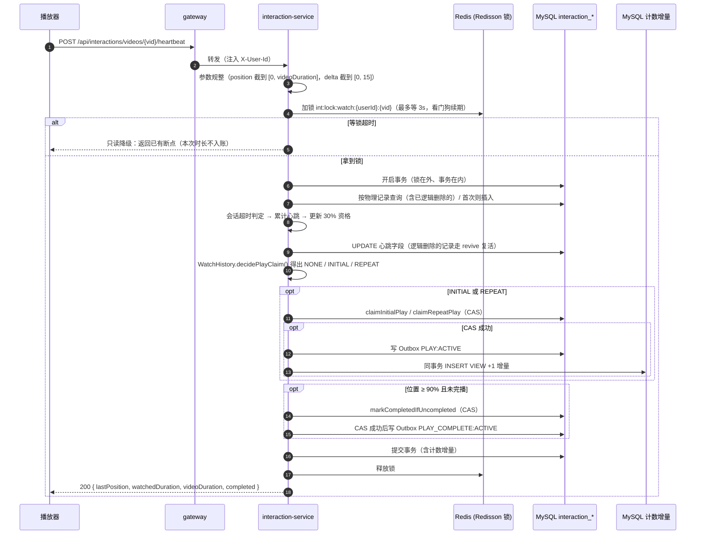
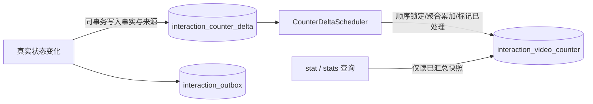

# 互动模块 · interaction-service

`interaction-service`（端口 8500）负责点赞、收藏、观看心跳、观看历史、分享，以及视频公开计数。它是这些数据**唯一的业务所有者**。

- 相关 ADR：[0001 Outbox 与视频交互事件](../adr/0001-interaction-outbox-and-video-action-events.md)、[0003 Redisson 分布式锁](../adr/0003-interaction-redisson-distributed-lock.md)、[0004 计数增量汇总](../adr/0004-interaction-counter-deltas.md)
- 相关主线：[主线 04 · 播放心跳与防重](../flows/04-前台视频播放分发与网关防刷.md#34-播放心跳上报会话隔离与可重复有效播放防重-interaction-service)
- 进度：[TODO · 互动模块](../TODO.md#互动模块--interaction-service)

---

## 1. 定位与边界

### 1.1 职责

| 能力 | 说明 |
| :--- | :--- |
| 点赞 | 维护 `user × vid` 点赞状态。重复点赞或重复取消都是幂等的，不重复计数、不重复发事件 |
| 收藏 | 默认收藏夹自动创建，支持自定义收藏夹。“首次收藏”和“从所有收藏夹彻底移除”才算状态变化 |
| 观看心跳 | 登录用户周期上报播放进度，服务端维护断点、累计时长、会话、有效播放和完播状态 |
| 观看历史 | 分页查询、删除单条、清空；删除是逻辑删除，保留防刷时间戳 |
| 分享 | 必须带 `Idempotency-Key`，持久化防重后计数 |
| 公开计数 | `view/like/star/share` 由本服务独占维护；业务事务写增量，后台汇总到 MySQL，公开查询只读已汇总值 |
| 领域事件 | 真实状态变化写入本服务 Outbox，统一事件 `interaction.video-action.v1` |

### 1.2 边界

- 只访问 `interaction_*` 表；不调用 content-service 修改视频数据，也不同步查询视频元数据。
- 不做认证：身份来自网关注入的 `X-User-Id` / `X-User-Role`，由 `InteractionAccessPolicy` 读取。
- 不做推荐：只产出事件；推荐侧消费链路**尚未实现**，所以 Outbox 投递默认关闭。
- 评论：`comment_count` 字段已预留，评论功能尚未实现。

### 1.3 分层

```text
interfaces/http        控制器 + DTO + 统一异常处理（协议层）
application/*          like / star / watch / query / event / security 用例
domain/model|repository 领域实体（WatchHistory 承载播放资格决策）与仓储接口
infrastructure/*       MyBatis/JDBC 持久化、计数增量汇总、Redis 观看锁、Outbox、定时任务
```

---

## 2. HTTP 接口链路

完整字段见 [api.md · 互动接口](../api.md#8-互动模块接口)。所有路径都以 `/api/interactions` 开头。

| 分类 | 方法 | 路径 | 服务内身份要求 | 说明 |
| :--- | :--- | :--- | :--- | :--- |
| 点赞 | POST | `/videos/{vid}/like` | 登录 | 点赞；状态变化时计数 +1，并写 `LIKE:ACTIVE` |
| | DELETE | `/videos/{vid}/like` | 登录 | 取消点赞；状态变化时计数 −1，并写 `LIKE:INACTIVE` |
| 收藏 | POST | `/videos/{vid}/star` | 登录 | 可带 body `folderId`，不带时进默认收藏夹；首次收藏计数 +1，并写 `STAR:ACTIVE` |
| | DELETE | `/videos/{vid}/star` | 登录 | 可带 query `folderId`，不带时从所有收藏夹移除；彻底移除后计数 −1，并写 `STAR:INACTIVE` |
| | GET | `/star/folders` | 登录 | 列出收藏夹；纯读不写库，若无则返回空列表 |
| | POST | `/star/folders` | 登录 | 新建自定义收藏夹（`title` 必填，防重名） |
| | PUT | `/star/folders/{folderId}` | 登录 | 修改自定义收藏夹标题（防重名，默认收藏夹不可改名） |
| | DELETE | `/star/folders/{folderId}` | 登录 | 删除自定义收藏夹（级联移出明细，彻底移出视频扣减计数并写 Outbox） |
| | GET | `/star/items` | 登录 | 分页查询收藏夹里的视频；校验属主权限，不带 `folderId` 时查默认收藏夹 |
| 观看 | POST | `/videos/{vid}/heartbeat` | 登录 | 上报 `position / deltaDuration / videoDuration`，返回最新进度 |
| | GET | `/videos/{vid}/watch-progress` | 可匿名 | 游客返回零进度 |
| | GET | `/watch/history` | 登录 | 分页（`page` 从 1 开始，`size` 最大 100） |
| | DELETE | `/watch/history` | 登录 | 带 `vid` 删单条，不带就清空；都是逻辑删除 |
| 快照 | GET | `/videos/{vid}/my-state` | 可匿名 | 一次返回 liked、starred、断点、completed；游客全部返回默认值 |
| 计数 | GET | `/videos/{vid}/stat` | 可匿名 | 单个视频的公开计数 |
| | POST | `/videos/stats` | 可匿名 | 批量查询，body `{"vids":[...]}`，缺失的补 0 |
| 分享 | POST | `/videos/{vid}/share` | 登录 | 必须带 Header `Idempotency-Key`，同一个键重复请求按幂等处理 |

> **网关现状**：`/api/interactions/**` 不在网关白名单里，经网关访问时游客请求一律 `401`。“可匿名”只是服务内部的行为。是否对游客开放还没定。

错误语义：没登录返回 `401`（`InteractionException`）；参数非法或缺少幂等键返回 `400`；未知异常返回 `500`，不暴露内部信息。

---

## 3. 观看心跳与播放资格

### 3.1 已确认的后续设计基线

> 本节记录已确认的目标语义，作为后续重构的依据。当前代码仍按 3.2、3.3 描述的迁移前模型运行，不能将本节字段和事件名视为已落地契约。

#### 3.1.1 业务规则

| 规则 | 目标定义 |
| :--- | :--- |
| 播放量重复计入 | 同一用户对同一视频允许按 `repeat-window` 时间窗口重复计入播放量 |
| 观看会话 | 连续心跳属于同一会话；超过 `session-timeout`（默认 30m）未上报心跳时开启新会话 |
| 30% 防刷门槛 | 当前会话累计有效观看达到 `ceil(videoDuration × 30%)` 后，才具备本次会话的播放量资格；它不再表示“下一会话资格” |
| 短视频最低门槛 | 播放量资格门槛建议为 `max(5 秒, ceil(videoDuration × 30%))`，避免短视频观看极短时间即计数 |
| 会话内播放量 | 每个观看会话最多成功计入一次播放量 |
| 播放量冷却 | 当前会话达到资格但仍在冷却窗口时不计数；冷却窗口结束后，若本会话尚未计数，允许计入一次 |
| 完播 | 每个会话最多产生一次完播事件；建议同时满足播放位置达到 90% 和服务端认可的累计观看时长达到 90% |
| 视频总时长 | 以后端保存的视频元数据快照为准，客户端上传的 `videoDuration` 不参与资格或完播判定 |
| 观看时长 | 客户端提供播放增量，服务端校验后计入；服务端无法直接证明用户是否实际观看，因此客户端数据只能作为测量输入 |
| 删除历史 | 删除只影响用户的历史展示；播放量冷却和事件防重状态不通过“复活历史记录”维护 |
| 缺少时长快照 | 允许保存断点，但暂停播放量和完播事件，直到互动服务获得后端时长快照 |

#### 3.1.2 目标数据模型

后续重构按职责拆分观看数据，避免一个 `WatchHistory` 同时承担进度、历史、会话、防刷和事件防重：

```text
video_snapshot
  vid
  duration
  version

watch_progress
  user_id
  vid
  last_position
  watched_duration
  last_watch_at
  deleted

watch_session
  session_id
  user_id
  vid
  started_at
  last_heartbeat_at
  credited_duration
  qualified
  view_claimed
  completed_claimed

watch_event_claim（按需要保留，用于事件审计与唯一防重）
  user_id
  vid
  session_id
  event_type
  claimed_at
  UNIQUE(user_id, vid, session_id, event_type)
```

`watch_progress` 负责断点和历史展示，`watch_session` 负责当前会话累计与会话内状态，`watch_event_claim` 负责事件幂等。用户删除历史时只隐藏 `watch_progress`，不再通过删除和复活同一条记录维护风控状态。

#### 3.1.3 心跳可信度校验

客户端心跳应携带服务端会话标识和递增序号，建议字段为 `sessionId`、`sequence`、`position`、`deltaDuration`。服务端处理时遵循以下约束：

- 已处理过的 `sequence` 直接按幂等请求处理，不重复累计时长；
- 旧序号不得覆盖新进度；
- `deltaDuration` 不得超过服务端两次有效心跳之间的合理时间，并继续限制单次最大增量；
- 播放位置大幅向前跳跃时只更新断点，不将跳跃距离全部计入有效观看时长；
- `videoDuration` 仅为兼容字段，服务端忽略其业务含义；
- 播放量和完播事件只使用服务端校验后的 `credited_duration`。

视频时长不通过每次心跳同步调用 content-service 获取。content-service 发布视频发布或元数据变更事件后，interaction-service 消费事件并保存本地 `video_snapshot`，心跳只读取本地快照。

#### 3.1.4 目标事件语义

播放量和完播应使用含义明确的事件名称：

- `WATCH_VIEW_QUALIFIED`：当前会话达到防刷门槛，并成功抢占本次播放量资格；只有该事件成功后才增加公开 `view` 计数；
- `WATCH_COMPLETED`：当前会话达到完播条件；不直接增加播放量。

迁移完成前继续兼容当前 `PLAY`、`PLAY_COMPLETE` 事件。事件名称和载荷属于版本化契约，真正切换时需要新增版本并记录兼容期，不能静默替换现有事件。

### 3.2 当前实现流程（迁移前）



### 3.3 当前实现规则（迁移前）

| 规则 | 实现 |
| :--- | :--- |
| 会话划分 | 距 `last_watch_at` 超过 `session-timeout`（默认 30m）就算新会话，重置 `session_watched_duration` 和 `session_play_emitted`；`watched_duration` 一直累加 |
| 首次有效播放 | 当前会话累计 ≥ `valid-play-threshold`（默认 5s），且 `last_valid_play_at IS NULL` → `claimInitialPlay` |
| 30% 资格 | 当前会话累计 ≥ `ceil(videoDuration × 30%)` 时置位 `eligible_for_next_play = 1`，本身不发事件；视频时长未知（0）时不置位 |
| 再次有效播放 | `eligible_for_next_play = 1`，本会话还没发过 PLAY，会话累计 ≥ 5s，且 `last_valid_play_at ≤ now − repeat-window`（默认 6h）→ `claimRepeatPlay` |
| 单会话上限 | 每个会话最多一次 PLAY，由 `session_play_emitted` 和 CAS 条件共同保证 |
| 完播 | `last_position ≥ ceil(videoDuration × 90%)` 且 `completed = 0` 时执行 CAS 置位，并发 `PLAY_COMPLETE`。和 PLAY 互相独立，同一次心跳可以两个都发 |
| 删除后重看 | 逻辑删除时保留 `last_valid_play_at`，重看时复活。冷却期内的 CAS 会失败，所以“删了重看”刷不了 PLAY |
| 计数一致性 | 播放资格 CAS、Outbox 与 VIEW 增量同事务提交；公开播放量由后台批量汇总后展示 |

决策逻辑放在 `WatchHistory.decidePlayClaim()` / `shouldClaimCompletion()`，最终防线是数据库 CAS。

> 已知限制：客户端的时长和进度目前没有做可信校验；删历史再看会重置 `completed`；等锁降级时丢弃本次时长。改进方向已在本地问题清单中登记，确定后再更新本节。

---

## 4. 公开计数（事务内增量与后台汇总）



- 只在有效播放资格 CAS 成功、点赞状态变化、用户首次收藏或彻底取消、首次分享幂等记录成功时写增量；重复请求不计数。完播不增加播放量。
- **事实追溯与版本化防重（P2）**：
  - `interaction_like` 与 `interaction_star_item` 表引入单调递增 `version` 列（初始为 1，每次状态反转或复活递增）；
  - 增量记录强制携带业务事实来源引用（`source_type` 与 `source_id`），包含点赞状态版本（`like:{likeId}:v{version}`）、收藏明细版本（`star_item:{itemId}:v{version}`）与级联取消来源（`star_folder_del:{folderId}:{vid}`）、播放 CAS 时间戳（`play:{vid}:{ts}`）、分享幂等键（`share:{key}`）；
  - 增量流水表建立唯一约束 `uk_counter_delta_source (source_type, source_id)`，构筑数据库层物理防重屏障，既保障合法状态往返可正常生成递增增量，又阻断重试导致的重复记账。
- **非负防穿透与清理健壮性（P1）**：
  - 领域模型与数据库 CHECK 约束限制 `VIEW` 与 `SHARE` 必须大于 0；MyBatis-Plus 快照更新 SQL 使用 `GREATEST(0, column + delta)`，严防历史快照在异常或并发逆序下发生负数下溢；
  - 历史增量清理 Mapper 注解采用原生字面量 `<`（杜绝无 `<script>` 下的转义字符错误），确保批量清理语句执行正常。
- 多实例汇总使用行锁串行领取待处理增量，按 `vid + counter_type` 合并；计数更新与已处理标记在同一事务中提交，失败可重试。
- `flush-rate-ms` 默认 5 秒，`batch-size` 默认 500；已处理增量保留 7 天，清理失败不会重复计数。公开接口只读 MySQL，允许短暂延迟。
- Redis 仍用于观看锁，不再充当公开计数写缓冲；旧绝对值刷盘调度已停用。

---

## 5. 领域事件与 Outbox

### 5.1 契约

- Exchange：`media.platform.events`（Topic）；Routing Key：`interaction.video-action.v1`；`eventType = interaction.video-action`，`eventVersion = 1`。
- 载荷：`{ userId, vid, action, state }`。

| action | state | 触发条件 |
| :--- | :--- | :--- |
| `LIKE` | `ACTIVE` / `INACTIVE` | 点赞状态真的变化了 |
| `STAR` | `ACTIVE` / `INACTIVE` | 用户维度首次收藏 / 从所有收藏夹彻底移除 |
| `PLAY` | `ACTIVE` | 首次或再次有效播放的 CAS 成功 |
| `PLAY_COMPLETE` | `ACTIVE` | 完播 CAS 成功 |
| `SHARE` | `ACTIVE` | 幂等键第一次出现 |

`PLAY_START` 常量是保留值，**目前不会发送**。消费方必须容忍未知的 `action`。

### 5.2 投递链路

1. 业务事务里通过 `InteractionEventPublisher` 写 `interaction_outbox`，状态为 `PENDING`，和业务数据同一个事务。
2. `InteractionOutboxScanJob` 每 `poll-interval` 扫一次；`InteractionOutboxDispatcher` 用租约抢占记录（状态 `PROCESSING`），`InteractionOutboxPublisher` 等 Broker Confirm。
3. 成功记为 `PUBLISHED`；失败按指数退避重试，超过 `max-attempts` 记为 `FAILED`（需要告警出口）。重试沿用同一个 `eventId`。
4. 可以开启事务提交后立即唤醒派发（`fast-dispatch-enabled`，默认关闭）。

**现状**：`dispatch-enabled` 默认是 `false`，事件只落库不投递，等推荐侧消费者上线后再打开。目前没有清理 `PUBLISHED` 记录的任务。

---

## 6. 定时任务

| 任务 | 触发 | 作用 | 开关 |
| :--- | :--- | :--- | :--- |
| `CounterDeltaScheduler.aggregate` | `interaction.counter.flush-rate-ms`（5000ms） | 增量批量汇总到公开快照表 | 常开 |
| `CounterDeltaScheduler.cleanup` | `interaction.counter.cleanup-rate-ms`（3600000ms） | 清理超期已汇总历史增量记录 | 常开 |
| `InteractionOutboxScanJob.scanAndDispatch` | `interaction.outbox.poll-interval`（5s） | Outbox 扫描投递 | 受 `enabled && dispatch-enabled` 控制，否则直接返回 |

---

## 7. 数据表

DDL 以 [`db/init/schema.sql`](../../db/init/schema.sql) 为准，增量迁移脚本在 [`service/interaction-service/db/schema/`](../../service/interaction-service/db/schema/)。

| 表 | 主键 / 唯一键 | 关键字段 | 说明 |
| :--- | :--- | :--- | :--- |
| `interaction_video_counter` | `vid` | `view/like/star/share/comment_count` | 公开计数快照，非负 CHECK，更新使用 GREATEST(0, ...) 防穿透 |
| `interaction_counter_delta` | `id` / `uk_counter_delta_source` | `vid`、`counter_type`、`delta`、`source_type`、`source_id`、`created_at`、`processed_at` | 计数增量流水，含业务事实来源唯一键与非负 CHECK 约束 |
| `interaction_like` | `uk_like_user_vid` | `status` 1/0，`version`，`deleted` | 点赞状态与状态反转版本 |
| `interaction_star_folder` | `id` | `is_default`，`status`，`deleted` | 收藏夹 |
| `interaction_star_item` | `uk_folder_vid` | `user_id`（冗余，用于反查），`version`，`deleted` | 收藏明细；自愈复活时递增版本，避免撞唯一键 |
| `interaction_watch_history` | `uk_watch_user_vid` | `last_position`、`watched_duration`、`session_watched_duration`、`session_play_emitted`、`eligible_for_next_play`、`video_duration`、`completed`、`last_watch_at`、`last_valid_play_at`、`deleted` | 断点、会话与防刷依据 |
| `interaction_share_record` | `uk_share_idempotency` | `idempotency_key`、`user_id`、`vid` | 分享幂等（全局唯一键） |
| `interaction_outbox` | `event_id` | `status`、`attempts`、`next_attempt_at`、租约字段 | 发件箱 |

所有实体表都使用 `deleted` 逻辑删除（`@TableLogic`）。

| 迁移脚本 | 内容 |
| :--- | :--- |
| `interaction-outbox.sql` | Outbox 表 |
| `interaction-share-record.sql` | 分享幂等表 |
| `interaction-counter-delta.sql` | 计数增量流水表（含业务事实来源唯一键与约束） |
| `interaction-like-star-version-patch.sql` | 补点赞与收藏状态版本号 `version` 及增量表来源唯一约束 |
| `interaction-soft-delete-patch.sql` | 各实体补 `deleted` |
| `interaction-star-folder-unique-patch.sql` | 补收藏夹有效标题唯一键（幂等可重复执行） |
| `interaction-watch-history-patch.sql` | 补 `last_valid_play_at` |
| `interaction-watch-history-session-patch.sql` | 补会话字段 |

---

## 8. 配置

| 配置键 | 环境变量 | 默认值 | 说明 |
| :--- | :--- | :--- | :--- |
| `interaction.counter.flush-rate-ms` | `INTERACTION_COUNTER_FLUSH_RATE_MS` | 5000 | 刷盘间隔 |
| `interaction.counter.cache-ttl` | `INTERACTION_COUNTER_CACHE_TTL` | 10m | 计数缓存 TTL |
| `interaction.watch.session-timeout` | `INTERACTION_WATCH_SESSION_TIMEOUT` | 30m | 会话超时 |
| `interaction.watch.repeat-window` | `INTERACTION_WATCH_REPEAT_WINDOW` | 6h | 再次播放冷却期 |
| `interaction.watch.valid-play-threshold` | `INTERACTION_WATCH_VALID_PLAY_THRESHOLD` | 5s | 单会话有效播放门槛 |
| `interaction.outbox.enabled` | `INTERACTION_OUTBOX_ENABLED` | true | 是否写 Outbox |
| `interaction.outbox.dispatch-enabled` | `INTERACTION_OUTBOX_DISPATCH_ENABLED` | false | 是否投递到 MQ |
| `interaction.outbox.fast-dispatch-enabled` | `INTERACTION_OUTBOX_FAST_DISPATCH_ENABLED` | false | 事务提交后立即唤醒派发 |
| `interaction.outbox.batch-size` / `max-attempts` / `confirm-timeout` / `lease` / `poll-interval` / `shutdown-await` | 同名大写 | 100 / 20 / 5s / 30s / 5s / 10s | 派发参数 |

代码里写死的常量：心跳单次增量上限 15s、等锁最多 3s、完播 90%、再次播放资格 30%。

---

## 9. 源码索引

| 位置 | 类 |
| :--- | :--- |
| 启动 / 配置 | `InteractionApplication`、`config/InteractionOutbox*`、`config/InteractionMessagingConfiguration`、`application.yml` |
| 控制器 | `InteractionLikeController`、`InteractionStarController`、`InteractionWatchController`、`InteractionStatController`、`InteractionExceptionHandler` |
| 用例 | `LikeApplicationService`、`StarApplicationService`、`WatchHeartbeatApplicationService`、`InteractionQueryApplicationService`、`InteractionEventPublisher` |
| 领域 | `WatchHistory`（播放资格决策）、`VideoCounter`、`VideoLike`、`StarFolder`、`StarItem`、`InteractionShareRecord`、`VideoActionPayload` |
| 基础设施 | `WatchHistoryMapper`（CAS SQL）、`VideoCounterMapper`、`InteractionCounterDeltaMapper`、`CounterDeltaRepositoryImpl`、`VideoCounterRepositoryImpl`、`RedisLockService`、`CounterDeltaScheduler`、`outbox/**`、`InteractionOutboxScanJob` |
| 测试 | `WatchHeartbeatApplicationServiceTest`、`WatchHeartbeatLocalInfrastructureIntegrationTest`（本地 MySQL/Redis）、`RedisLockServiceTest`、Outbox 相关测试 |

源码根目录：`service/interaction-service/src/main/java/com/calles/platform/interaction/`。
