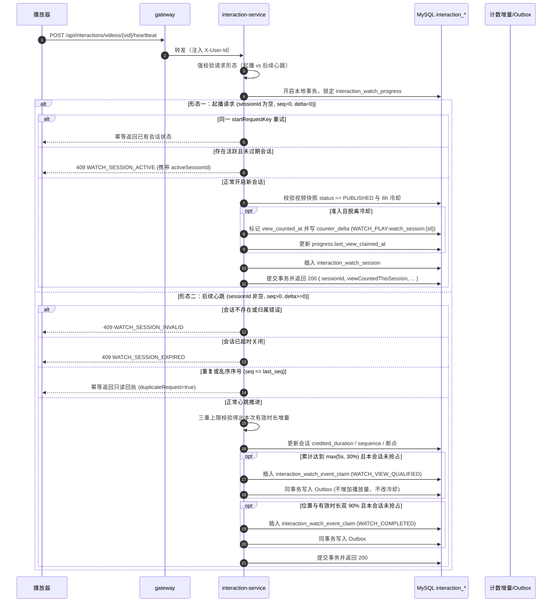
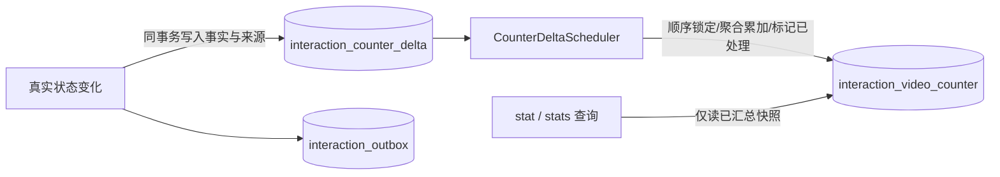
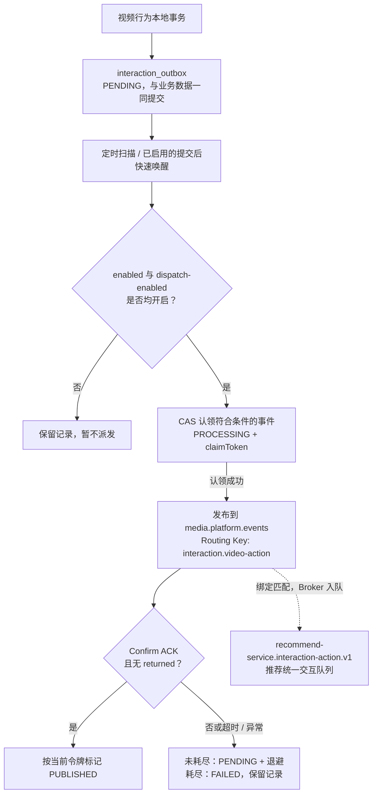

# 互动模块 · interaction-service

`interaction-service`（端口 8500）负责点赞、收藏、观看心跳、观看历史、分享，以及视频公开计数。它是这些数据**唯一的业务所有者**。

- 相关 ADR：[0001 Outbox 与视频交互事件](../adr/0001-interaction-outbox-and-video-action-events.md)、[0003 Redisson 分布式锁](../adr/0003-interaction-redisson-distributed-lock.md)、[0004 计数增量汇总](../adr/0004-interaction-counter-deltas.md)、[0005 观看能力拆分与视频时长本地快照](../adr/0005-观看能力拆分与视频时长本地快照.md)
- 相关主线：[主线 04 · 播放心跳与防重](../flows/04-前台视频播放分发与网关防刷.md#34-播放心跳上报会话隔离与可重复有效播放防重-interaction-service)
- 进度：[TODO · 互动模块](../TODO.md#互动模块--interaction-service)

---

## 1. 定位与边界

### 1.1 职责

| 能力 | 说明 |
| :--- | :--- |
| 点赞 | 维护 `user × vid` 点赞状态。重复点赞或重复取消都是幂等的，不重复计数、不重复发事件 |
| 收藏 | 默认收藏夹自动创建，支持自定义收藏夹。“首次收藏”和“从所有收藏夹彻底移除”才算状态变化 |
| 观看心跳 | 区分起播与后续心跳：起播校验内容发布准入与 6 小时冷却立即计入播放量；心跳维护有效观看时长，达标独立发出合格观看与完播领域事件 |
| 观看历史 | 分页查询、删除单条、清空；删除只隐藏展示，保留播放量冷却与事件凭据 |
| 视频时长快照 | 消费 content-service 的 `content.video.metadata`，维护本地时长口径；心跳不做跨服务同步调用 |
| 分享 | 必须带 `Idempotency-Key`，持久化防重后计数 |
| 公开计数 | `view/like/star/share` 由本服务独占维护；业务事务写增量，后台汇总到 MySQL，公开查询只读已汇总值 |
| 领域事件 | 真实状态变化写入本服务 Outbox，统一事件 `interaction.video-action`（点赞 / 收藏 / 分享 / 观看量资格 / 完播共用一条路由） |

### 1.2 边界

- 只访问 `interaction_*` 表；不调用 content-service 修改视频数据，也不同步查询视频元数据，视频时长只从 `content.video.metadata` 事件建立本地快照。
- 不做认证：身份来自网关注入的 `X-User-Id` / `X-User-Role`，由 `InteractionAccessPolicy` 读取。
- 不做推荐：只产出事件；推荐侧消费链路**尚未实现**，所以 Outbox 投递默认关闭。
- 评论：`comment_count` 字段已预留，评论功能尚未实现。

### 1.3 分层

```text
interfaces/http        控制器 + DTO + 统一异常处理（协议层）
interfaces/messaging    RabbitMQ 入站适配（视频元数据消费者）与应用层消息契约
application/*          like / star / watch / video / query / event / security 用例
                       watch 下拆为心跳写入（WatchHeartbeatApplicationService）与进度历史读写（WatchProgressApplicationService）
domain/model|repository 领域实体（WatchProgress / WatchSession / WatchEventClaim / VideoSnapshot）
                       与纯领域策略（WatchCreditValidator、WatchQualificationPolicy）
infrastructure/*       MyBatis/JDBC 持久化、计数增量汇总、Outbox、定时任务
```

---

## 2. HTTP 接口链路

完整字段见 [api.md · 互动接口](../api.md#8-互动模块接口)。所有路径都以 `/api/interactions` 开头。

| 分类 | 方法 | 路径 | 服务内身份要求 | 说明 |
| :--- | :--- | :--- | :--- | :--- |
| 点赞 | POST | `/videos/{vid}/like` | 登录 | 点赞；状态变化时计数 +1，并写 `LIKE:ACTIVE` |
| | DELETE | `/videos/{vid}/like` | 登录 | 取消点赞；状态变化时计数 −1，并写 `LIKE:INACTIVE` |
| | GET | `/likes` | 登录 | 分页查询本人有效点赞的视频明细（按点赞时间倒序） |
| 收藏 | POST | `/videos/{vid}/star` | 登录 | 可带 body `folderId`，不带时进默认收藏夹；首次收藏计数 +1，并写 `STAR:ACTIVE` |
| | DELETE | `/videos/{vid}/star` | 登录 | 可带 query `folderId`，不带时从所有收藏夹移除；彻底移除后计数 −1，并写 `STAR:INACTIVE` |
| | GET | `/star/folders` | 登录 | 列出收藏夹；纯读不写库，若无则返回空列表 |
| | POST | `/star/folders` | 登录 | 新建自定义收藏夹（`title` 必填，防重名） |
| | PUT | `/star/folders/{folderId}` | 登录 | 修改自定义收藏夹标题（防重名，默认收藏夹不可改名） |
| | DELETE | `/star/folders/{folderId}` | 登录 | 删除自定义收藏夹（级联移出明细，彻底移出视频扣减计数并写 Outbox） |
| | GET | `/star/items` | 登录 | 分页查询收藏夹里的视频；校验属主权限，不带 `folderId` 时查默认收藏夹 |
| 观看 | POST | `/videos/{vid}/heartbeat` | 登录 | 起播（带 Header `Idempotency-Key`，`sessionId` 为空，`sequence=0`，`delta=0`）开启会话并计播放量；后续心跳回传 `sessionId` 与递增 `sequence>0` 累计有效观看时长与完播 |
| | GET | `/videos/{vid}/watch-progress` | 可匿名 | 游客返回零进度 |
| | GET | `/watch/history` | 登录 | 分页（`page` 从 1 开始，`size` 最大 100） |
| | DELETE | `/watch/history` | 登录 | 带 `vid` 删单条，不带就清空；只隐藏展示，不释放防重状态 |
| 快照 | GET | `/videos/{vid}/my-state` | 可匿名 | 一次返回 liked、starred、断点、completed；游客全部返回默认值 |
| 计数 | GET | `/videos/{vid}/stat` | 可匿名 | 单个视频的公开计数 |
| | POST | `/videos/stats` | 可匿名 | 批量查询，body `{"vids":[...]}`，缺失的补 0 |
| 分享 | POST | `/videos/{vid}/share` | 登录 | 必须带 Header `Idempotency-Key`，同一个键重复请求按幂等处理 |

> **网关与游客访问策略（游客只读模式）**：
> - **公开计数开放**：`/api/interactions/videos/*/stat` 与 `/api/interactions/videos/stats` 已加入网关白名单，未登录游客可直接查询公开计数；
> - **心跳与写操作严格拦截**：观看心跳 `/videos/{vid}/heartbeat`、点赞/收藏/分享及个人历史记录**严格不在白名单**，经网关时未携带 Token 直接返回 `401`；
> - **播放量防刷原则**：游客观看视频采用前端暂存断点（localStorage）的只读模式，不调用心跳接口、不计入播放量、不产生服务端观看历史，从根本上杜绝代理池与脚本刷量。

错误语义：没登录返回 `401`（`InteractionException`）；参数非法或缺少幂等键返回 `400`；会话状态冲突返回 `409`（`WATCH_SESSION_ACTIVE` / `WATCH_SESSION_INVALID` / `WATCH_SESSION_EXPIRED`）；未知异常返回 `500`，不暴露内部信息。

---

## 3. 观看心跳与播放资格

### 3.1 业务规则

> 本节是本模块的目标语义，已在代码中落地。实现细节、字段与事件名固定在 3.2 节。

#### 3.1.1 业务规则

| 规则 | 目标定义 |
| :--- | :--- |
| 播放量起播计入 | 新建观看会话（起播）时立即校验视频内容准入（`status == PUBLISHED`）与冷却窗口（距上次计入已满 `repeat-window`，默认 6h）；达标立即记录播放量，**彻底解耦 5 秒/30% 时长门槛** |
| 播放量冷却与生命周期 | 冷却窗口内的起播会话不计数；且遵循**会话生命周期一次性决策**——会话中途冷却窗口结束绝不补计播放量 |
| 观看会话 | 由起播请求显式开启（携 Header `Idempotency-Key`，`sequence=0`，`deltaDuration=0`）；超过 `session-timeout`（默认 30m）未上报心跳时关闭 |
| 合格观看事件 | 累计服务端认可的有效观看时长达到 `max(valid-play-threshold, ceil(duration_snapshot × qualification-ratio))` 时，由凭据防重并写入 Outbox `WATCH_VIEW_QUALIFIED`；**完全解耦播放量与冷却时间**，不增加播放量、不读改冷却时间 |
| 完播事件 | 每个会话最多产生一次完播事件；必须同时满足播放位置与有效观看时长达到 `completion-ratio`（默认双 90%）；不增加播放量 |
| 视频总时长 | 以后端保存的视频元数据快照为准，客户端上传的 `videoDuration` 不参与资格或完播判定 |
| 观看时长 | 客户端提供播放增量，服务端校验后计入；服务端无法直接证明用户是否实际观看，因此客户端数据只能作为测量输入 |
| 删除历史 | 删除只影响用户的历史展示；播放量冷却和事件防重状态不通过“复活历史记录”维护 |
| 缺少时长快照 | 内容未发布时起播不计播放量；快照缺失时不产生合格观看与完播事件，仅保存播放进度断点 |

#### 3.1.2 数据模型

观看数据按职责拆分，避免单一实体同时承担进度、历史、会话、防刷和事件防重：

```text
interaction_video_snapshot          视频时长本地快照（唯一时长口径）
  vid (PK)
  duration          <=0 视为不可用
  metadata_version
  source_event_id   来源事件 ID，唯一键，消费幂等
  status            PUBLISHED 等发布准入状态
  updated_at

interaction_watch_progress          断点、历史展示与最近一次播放量时间
  id (PK)
  user_id + vid     唯一键
  active_session_id
  last_position
  watched_duration
  first_watch_at
  last_watch_at
  last_view_claimed_at      最近一次播放量成功计入时间戳（驱动 6h 冷却）
  deleted           仅隐藏展示，不释放防重状态

interaction_watch_session           本会话有效观看时长与会话内状态
  session_id (PK)
  user_id / vid
  start_request_key         起播幂等键（唯一索引 uk_watch_session_start_key）
  view_counted_at           本会话播放量计入时间戳（起播即判）
  duration_snapshot         会话创建时固定的视频时长
  qualification_threshold   会话创建时固定的合格观看门槛
  credited_duration         服务端校验后的累计有效观看时长
  last_sequence / last_position
  qualified                 是否已达有效观看门槛
  started_at / last_heartbeat_at / closed_at

interaction_watch_event_claim       合格观看与完播事件的最终防重依据
  id (PK)
  user_id + vid + session_id + event_type   唯一键
  outbox_event_id
  claimed_at
```

`watch_progress` 负责断点和历史展示，`watch_session` 负责当前会话累计与起播播放量状态，
`watch_event_claim` 负责事件幂等。用户删除历史时只隐藏 `watch_progress`，不再通过删除和复活同一条记录维护风控状态。

#### 3.1.3 心跳协议与可信度校验

HTTP 接口统一为 `POST /api/interactions/videos/{vid}/heartbeat`，通过入参约束区分两种请求形态：

1. **起播请求（Start Play）**：
   - 必须携带 Header `Idempotency-Key`（≤64 字符）；
   - 请求体 `sessionId` 必须为空/null，`sequence` 必须为 0，`deltaDuration` 必须为 0；
   - 校验视频发布状态与 6 小时冷却，达标在开启会话事务中写入 `WATCH_PLAY:watch_session:{sessionId}` 计数增量并更新 `view_counted_at` 与 `last_view_claimed_at`；
   - 同一幂等键重试幂等返回已有会话；若已存在活跃未过期会话且幂等键不同，返回 409 `WATCH_SESSION_ACTIVE`。
2. **后续心跳（Subsequent Heartbeat）**：
   - 必须携带有效 `sessionId`；
   - `sequence` 必须大于 0 且单调递增，`deltaDuration` 必须 ≥ 0；
   - 重复或乱序序号（`sequence ≤ last_sequence`）返回只读回执，不累计时长、不产生副作用；
   - 会话不存在或错位返回 409 `WATCH_SESSION_INVALID`，会话已超时关闭返回 409 `WATCH_SESSION_EXPIRED`；
   - `deltaDuration` 必须通过三重上限校验，达到门槛后抢占凭据并写入 Outbox。

#### 3.1.4 事件语义

播放量与观看行为事件彻底解耦：

- **播放量计数**：起播时直接向 `interaction_counter_delta` 写入增量（`source_type = WATCH_PLAY, source_id = watch_session:{sessionId}`），由定时汇总任务合并至 `interaction_video_counter.view_count`；
- `WATCH_VIEW_QUALIFIED`：当前会话有效观看时长达到 `max(5s, 30%)` 门槛时发出，下游（推荐侧等）作为用户高信度偏好特征，**不再据此增加公开播放量**；
- `WATCH_COMPLETED`：当前会话达到完播条件时发出；不增加播放量。

### 3.2 实现（已落地）

#### 3.2.1 心跳处理流程


```mermaid
sequenceDiagram
    autonumber
    participant App as 播放器
    participant GW as gateway
    participant IS as interaction-service
    participant DB as MySQL interaction_*
    participant Cnt as 计数增量/Outbox

    App->>GW: POST /api/interactions/videos/{vid}/heartbeat
    GW->>IS: 转发（注入 X-User-Id）
    IS->>IS: 强校验请求形态（起播 vs 后续心跳）
    IS->>DB: 开启本地事务，锁定 interaction_watch_progress
    alt 形态一：起播请求 (sessionId 为空, seq=0, delta=0)
        alt 同一 startRequestKey 重试
            IS-->>App: 幂等返回已有会话状态
        else 存在活跃且未过期会话
            IS-->>App: 409 WATCH_SESSION_ACTIVE (携带 activeSessionId)
        else 正常开启新会话
            IS->>DB: 校验视频快照 status == PUBLISHED 与 6h 冷却
            opt 准入且脱离冷却
                IS->>DB: 标记 view_counted_at 并写 counter_delta (WATCH_PLAY:watch_session:{id})
                IS->>DB: 更新 progress.last_view_claimed_at
            end
            IS->>DB: 插入 interaction_watch_session
            IS->>DB: 提交事务并返回 200 { sessionId, viewCountedThisSession, ... }
        end
    else 形态二：后续心跳 (sessionId 非空, seq>0, delta>=0)
        alt 会话不存在或归属错误
            IS-->>App: 409 WATCH_SESSION_INVALID
        else 会话已超时关闭
            IS-->>App: 409 WATCH_SESSION_EXPIRED
        else 重复或乱序序号 (seq <= last_seq)
            IS-->>App: 幂等返回只读回执 (duplicateRequest=true)
        else 正常心跳推进
            IS->>IS: 三重上限校验得出本次有效时长增量
            IS->>DB: 更新会话 credited_duration / sequence / 断点
            opt 累计达到 max(5s, 30%) 且本会话未抢占
                IS->>DB: 插入 interaction_watch_event_claim (WATCH_VIEW_QUALIFIED)
                IS->>DB: 同事务写入 Outbox (不增加播放量、不改冷却)
            end
            opt 位置与有效时长双 90% 且本会话未抢占
                IS->>DB: 插入 interaction_watch_event_claim (WATCH_COMPLETED)
                IS->>DB: 同事务写入 Outbox
            end
            IS->>DB: 提交事务并返回 200
        end
    end
```

#### 3.2.2 判定规则

| 规则 | 实现 |
| :--- | :--- |
| 起播计数准入 | 视频快照 `status == PUBLISHED` 且满足 6 小时冷却（`now >= last_view_claimed_at + 6h`）立即计数 |
| 播放量防重 | `uk_watch_session_start_key (user_id, vid, start_request_key)` 防止起播重试重复开会话；会话内播放量一次性决策 |
| 会话状态约束 | 存在活跃会话时拒绝开启新会话（409 `WATCH_SESSION_ACTIVE`）；心跳回传失效/过期会话拒绝推进（409 `WATCH_SESSION_INVALID/EXPIRED`） |
| 时长口径 | 只使用服务端校验后的 `credited_duration`；客户端上报的 `videoDuration` 完全不参与判定 |
| 增量上限 | 同时受 `max-heartbeat-delta`、`参考时间 + heartbeat-credit-tolerance`、会话时长剩余量三重约束 |
| 合格观看门槛 | `max(valid-play-threshold, ceil(duration_snapshot × qualification-ratio))`，凭据防重，纯事件派发 |
| 完播 | 播放位置与 `credited_duration` 同时达到 `completion-ratio`（默认双 90%），每会话最多一次，不增加播放量 |
| 重复与乱序序号 | `sequence ≤ last_sequence` 的请求幂等返回当前状态，不累计、不回退 |
| 删除历史 | 只把 `watch_progress.deleted` 置 1，不重置 `last_view_claimed_at`，也不删除事件凭据 |

#### 3.2.3 并发与事务

- 并发串行化入口是 `interaction_watch_progress` 的行锁；首次心跳的并发插入靠 `uk_watch_progress_user_vid` 唯一键兜底，冲突后转为读取同一行加锁。
- 观看状态、事件凭据、计数增量与 Outbox 在同一本地事务内提交，任一步失败整体回滚。
- 心跳链路**不依赖 Redis 与分布式锁**。
- 计数按 ADR 0004 在后台汇总，增量来源为 `source_type = WATCH_PLAY`、`source_id = watch_session:{sessionId}`，会话唯一性保证不会重复计分。

#### 3.2.4 视频时长快照

- 订阅队列 `interaction-service.video-metadata`，路由键 `content.video.metadata`，绑定到 `media.platform.events`。
- 队列配置死信交换机 `media.platform.events.dlx` 与死信队列 `interaction-service.video-metadata.dlq`；消费重试默认 3 次，重试耗尽后进死信队列并告警，而不是静默丢弃。
- 消费幂等与原子版本防护：按载荷 `eventId` 去重（`uk_video_snapshot_source_event`）；更新快照采用行锁原子 CAS 约束（`WHERE vid = ? AND metadata_version <= ?`），在并发处理不同版本事件时彻底阻断 Check-Then-Act 并发降级，杜绝视频时长或发布状态回退；`duration ≤ 0` 的载荷拒绝写入，避免把有效快照污染成 0 秒时长而放宽防刷门槛。
- 本服务不做回填任务：快照只由 content-service 在该视频发布事务内发出的元数据事件建立。
- **发布顺序约束**：content 侧 outbox 已开启投递，必须先部署本服务（声明队列与绑定）再上线发布侧，否则事件因无绑定丢失，需重放。

---

## 4. 公开计数（事务内增量与后台汇总）


```mermaid
flowchart LR
    W[真实状态变化] -->|同事务写入事实与来源| D[(interaction_counter_delta)]
    W --> O[(interaction_outbox)]
    S[CounterDeltaScheduler] -->|顺序锁定/聚合累加/标记已处理| DB[(interaction_video_counter)]
    D --> S
    Q[stat / stats 查询] -->|仅读已汇总快照| DB
```

- 只在播放量凭据抢占成功、点赞状态变化、用户首次收藏或彻底取消、首次分享幂等记录成功时写增量；重复请求不计数。完播不增加播放量。
- **事实追溯与版本化防重（P2）**：
  - `interaction_like` 与 `interaction_star_item` 表引入单调递增 `version` 列（初始为 1，每次状态反转或复活递增）；
  - 增量记录强制携带业务事实来源引用（`source_type` 与 `source_id`），包含点赞状态版本（`like:{likeId}:v{version}`）、收藏明细版本（`star_item:{itemId}:v{version}`）与级联取消来源（`star_folder_del:{folderId}:{vid}`）、观看凭据 ID（`source_type = WATCH_PLAY`，`source_id = interaction_watch_event_claim.id`）、分享幂等键（`share:{key}`）；
  - 增量流水表建立唯一约束 `uk_counter_delta_source (source_type, source_id)`，构筑数据库层物理防重屏障，既保障合法状态往返可正常生成递增增量，又阻断重试导致的重复记账。
- **非负防穿透与清理健壮性（P1）**：
  - 领域模型与数据库 CHECK 约束限制 `VIEW` 与 `SHARE` 必须大于 0；MyBatis-Plus 快照更新 SQL 使用 `GREATEST(0, column + delta)`，严防历史快照在异常或并发逆序下发生负数下溢；
  - 历史增量清理 Mapper 注解采用原生字面量 `<`（杜绝无 `<script>` 下的转义字符错误），确保批量清理语句执行正常。
- 多实例汇总使用行锁串行领取待处理增量，按 `vid + counter_type` 合并；计数更新与已处理标记在同一事务中提交，失败可重试。
- `flush-rate-ms` 默认 5 秒，`batch-size` 默认 500；已处理增量保留 7 天，清理失败不会重复计数。公开接口只读 MySQL，允许短暂延迟。
- 本模块**不依赖 Redis**：读路径就是 MySQL 直读，没有读缓存；也不需要写缓冲。旧方案的 Redis 绝对值刷盘已停用（见 [ADR 0004](../adr/0004-interaction-counter-deltas.md)）。

---

## 5. 领域事件与 Outbox

### 5.1 契约

- Exchange：`media.platform.events`（Topic）；Routing Key 与 `eventType` 同为 `interaction.video-action`（不带版本后缀），`eventVersion = 1`。
- 载荷按行为族扩展字段，空字段不序列化：
  - 点赞 / 收藏 / 分享：`{ userId, vid, action, state }`；
  - 观看量资格 / 完播：`{ userId, vid, action, sessionId, creditedDuration, videoDuration }`。

| action | 附加字段 | 触发条件 |
| :--- | :--- | :--- |
| `LIKE` | `state` = `ACTIVE` / `INACTIVE` | 点赞状态真的变化了 |
| `STAR` | `state` = `ACTIVE` / `INACTIVE` | 用户维度首次收藏 / 从所有收藏夹彻底移除 |
| `SHARE` | `state` = `ACTIVE` | 幂等键第一次出现 |
| `WATCH_VIEW_QUALIFIED` | `sessionId`、`creditedDuration`、`videoDuration` | 本会话达到门槛、冷却已结束且成功抢占播放量凭据；下游据此增加公开播放量 |
| `WATCH_COMPLETED` | 同上 | 本会话达成双 90% 完播条件；不增加播放量 |

消费方必须先读 `action` 再取对应字段，并容忍未知的 `action`。点赞收藏分享与观看量共用一条路由，不存在多版本路由共存的问题。

### 5.2 投递链路

1. 业务事务里通过 `InteractionEventPublisher` 写 `interaction_outbox`，状态为 `PENDING`，和业务数据同一个事务。
2. `InteractionOutboxScanJob` 每 `poll-interval` 扫一次；`InteractionOutboxDispatcher` 用租约抢占记录（状态 `PROCESSING`），`InteractionOutboxPublisher` 等 Broker Confirm。
3. 成功记为 `PUBLISHED`；失败按指数退避重试，超过 `max-attempts` 记为 `FAILED`（需要告警出口）。重试沿用同一个 `eventId`。
4. 可以开启事务提交后立即唤醒派发（`fast-dispatch-enabled`，默认关闭）。

**现状**：`dispatch-enabled` 默认是 `false`，事件只落库不投递；推荐统一交互消费者已实现，是否启用投递由环境配置决定。目前没有清理 `PUBLISHED` 记录的任务。


```mermaid
flowchart TD
    Business["视频行为本地事务"]
    Outbox["interaction_outbox<br/>PENDING，与业务数据一同提交"]
    Trigger["定时扫描 / 已启用的提交后快速唤醒"]
    Gate{"enabled 与 dispatch-enabled<br/>是否均开启？"}
    Wait["保留记录，暂不派发"]
    Claim["CAS 认领符合条件的事件<br/>PROCESSING + claimToken"]
    Publish["发布到 media.platform.events<br/>Routing Key: interaction.video-action"]
    Confirm{"Confirm ACK<br/>且无 returned？"}
    Published["按当前令牌标记 PUBLISHED"]
    Failure["未耗尽：PENDING + 退避<br/>耗尽：FAILED，保留记录"]
    Queue["recommend-service.interaction-action.v1<br/>推荐统一交互队列"]

    Business --> Outbox
    Outbox --> Trigger
    Trigger --> Gate
    Gate -->|"否"| Wait
    Gate -->|"是"| Claim
    Claim -->|"认领成功"| Publish
    Publish --> Confirm
    Confirm -->|"是"| Published
    Confirm -->|"否或超时 / 异常"| Failure
    Publish -.->|"绑定匹配，Broker 入队"| Queue
```

图中 `PUBLISHED` 与推荐队列是两个观察点：前者是生产端发布状态，后者进入独立消费流程；消费失败不会把生产端状态改回 `PENDING`。两端的确认关系见[推荐模块 MQ 时序](recommend.md#53-mq-发布确认与消费确认)。本模块下面的视频元数据死信配置仅用于入站元数据队列，不会自动应用到推荐交互队列。

### 5.3 入站事件（视频元数据）

订阅 content-service 发布的 `content.video.metadata`，用于建立本地视频时长快照。

| 项 | 值 |
| :--- | :--- |
| 队列 | `interaction-service.video-metadata`（持久化，带死信配置） |
| 路由键 | `content.video.metadata` |
| 死信交换机 / 队列 | `media.platform.events.dlx` / `interaction-service.video-metadata.dlq` |
| 消费类 | `VideoMetadataConsumer` → `VideoMetadataApplicationService` |
| 幂等键 | 载荷 `eventId`（数据库唯一键 `uk_video_snapshot_source_event`） |
| 重试 | 容器重试 3 次（初始 1s、倍增、最长 10s），重试耗尽后拒绝并进死信队列 |
| 降级 | 快照缺失或非法时心跳仍保存断点，但不产生播放量与完播事件 |

---

## 6. 定时任务

| 任务 | 触发 | 作用 | 开关 |
| :--- | :--- | :--- | :--- |
| `CounterDeltaScheduler.aggregate` | `interaction.counter.flush-rate-ms`（5000ms） | 增量批量汇总到公开快照表 | 常开 |
| `CounterDeltaScheduler.cleanup` | `interaction.counter.cleanup-rate-ms`（3600000ms） | 清理超期已汇总历史增量记录 | 常开 |
| `InteractionOutboxScanJob.scanAndDispatch` | `interaction.outbox.poll-interval`（5s） | Outbox 扫描投递 | 受 `enabled && dispatch-enabled` 控制，否则直接返回 |
| `WatchRetentionScheduler.cleanup` | `interaction.watch.cleanup-rate-ms`（3600000ms） | 按保留期清理观看会话、事件凭据、已隐藏进度 | 常开 |

观看保留期清理的执行顺序固定为：解除长期无心跳的活跃会话引用（按 `last_watch_at ASC` 排序） → 删除超期会话（带 `NOT EXISTS` 引用防护，防止超期会话量大于批大小时两步批次错位造成悬空活跃引用） → 删除超期凭据 → 删除超期隐藏进度。
前两步顺序不可颠倒，且会话删除 SQL 强制复核未被 `interaction_watch_progress.active_session_id` 引用，杜绝批次跨度下的悬空外键风险。每次调用最多处理 `cleanup-batch-size` 行，避免长事务锁表。

---

## 7. 数据表

DDL 以 [`db/init/schema.sql`](../../db/init/schema.sql) 为准，增量迁移脚本在 [`service/interaction-service/db/schema/`](../../service/interaction-service/db/schema/)。

| 表 | 主键 / 唯一键 | 关键字段 | 说明 |
| :--- | :--- | :--- | :--- |
| `interaction_video_counter` | `vid` | `view/like/star/share/comment_count` | 公开计数快照，非负 CHECK，更新使用 GREATEST(0, ...) 防穿透 |
| `interaction_counter_delta` | `id` / `uk_counter_delta_source` | `vid`、`counter_type`、`delta`、`source_type`、`source_id`、`created_at`、`processed_at` | 计数增量流水，含业务事实来源唯一键与非负 CHECK 约束 |
| `interaction_like` | `uk_like_user_vid` | `status` 1/0，`version`，`deleted` | 点赞状态与状态反转版本 |
| `interaction_star_folder` | `id` | `is_default`，`status`，`deleted` | 收藏夹 |
| `interaction_star_item` | `uk_folder_vid` | `user_id`（冗余，用于反查），`version`，`deleted` | 收藏明细；自愈复活时递增版本，避免撞唯一键 |
| `interaction_video_snapshot` | `vid` / `uk_video_snapshot_source_event` | `duration`、`metadata_version`、`source_event_id`、`status`、`updated_at` | 视频时长本地快照，`duration <= 0` 视为不可用；唯一键承担元数据事件消费幂等 |
| `interaction_watch_progress` | `id` / `uk_watch_progress_user_vid` | `active_session_id`、`last_position`、`watched_duration`、`first_watch_at`、`last_watch_at`、`last_view_claimed_at`、`deleted` | 断点、历史展示与播放量冷却依据；删除仅隐藏展示 |
| `interaction_watch_session` | `session_id` / `uk_watch_session_start_key` | `start_request_key`、`view_counted_at`、`duration_snapshot`、`qualification_threshold`、`credited_duration`、`last_sequence`、`last_position`、`qualified`、`started_at`、`last_heartbeat_at`、`closed_at` | 会话级有效观看时长、起播播放量标记与门槛，创建时固定不可漂移 |
| `interaction_watch_event_claim` | `id` / `uk_watch_event_claim` | `user_id`、`vid`、`session_id`、`event_type`、`outbox_event_id`、`claimed_at` | 合格观看与完播事件的最终防重凭据 |
| `interaction_share_record` | `uk_share_user_idempotency` | `user_id`、`idempotency_key`、`vid` | 分享幂等（用户联合唯一键：`user_id + idempotency_key`） |
| `interaction_outbox` | `event_id` | `status`、`attempts`、`next_attempt_at`、租约字段 | 发件箱 |

所有实体表都使用 `deleted` 逻辑删除（`@TableLogic`）。

例外：`interaction_watch_progress` 的 `deleted` **不是** MyBatis-Plus 逻辑删除字段。心跳链路必须读取物理行，
否则删除历史会连同播放量冷却状态一起被过滤掉，出现“删掉历史再重新观看即可重复计数”的漏洞。

| 迁移脚本 | 内容 |
| :--- | :--- |
| `interaction-outbox.sql` | Outbox 表 |
| `interaction-share-record.sql` | 分享幂等表 |
| `interaction-counter-delta.sql` | 计数增量流水表（含业务事实来源唯一键与约束） |
| `interaction-like-star-version-patch.sql` | 补点赞与收藏状态版本号 `version` 及增量表来源唯一约束 |
| `interaction-soft-delete-patch.sql` | 点赞、收藏加与分享表补 `deleted` |
| `interaction-star-folder-unique-patch.sql` | 补收藏夹有效标题唯一键（幂等可重复执行） |
| `interaction-video-snapshot.sql` | 视频元数据本地快照表 |
| `interaction-watch-progress.sql` | 观看进度表 |
| `interaction-watch-session.sql` | 观看会话表 |
| `interaction-watch-session-view-decouple-patch.sql` | 观看会话补 `view_counted_at` 与 `start_request_key` 唯一键 |
| `interaction-watch-event-claim.sql` | 观看事件凭据表 |

---

## 8. 配置

| 配置键 | 环境变量 | 默认值 | 说明 |
| :--- | :--- | :--- | :--- |
| `interaction.counter.flush-rate-ms` | `INTERACTION_COUNTER_FLUSH_RATE_MS` | 5000 | 汇总批处理间隔 |
| `interaction.counter.batch-size` | — | 500 | 单次汇总与清理最大行数 |
| `interaction.counter.cleanup-rate-ms` / `retention-days` | — | 3600000 / 7 | 清理间隔与已汇总增量保留天数 |
| `interaction.watch.session-timeout` | `INTERACTION_WATCH_SESSION_TIMEOUT` | 30m | 会话超时 |
| `interaction.watch.repeat-window` | `INTERACTION_WATCH_REPEAT_WINDOW` | 6h | 重复计入播放量的冷却期 |
| `interaction.watch.valid-play-threshold` | `INTERACTION_WATCH_VALID_PLAY_THRESHOLD` | 5s | 会话播放量最低时长门槛 |
| `interaction.watch.max-heartbeat-delta` | `INTERACTION_WATCH_MAX_HEARTBEAT_DELTA` | 15s | 单次心跳最大有效增量 |
| `interaction.watch.heartbeat-credit-tolerance` | `INTERACTION_WATCH_HEARTBEAT_CREDIT_TOLERANCE` | 2s | 增量时间校验容差；调大会直接放大可刷量空间 |
| `interaction.watch.qualification-ratio` | `INTERACTION_WATCH_QUALIFICATION_RATIO` | 0.30 | 播放量资格的时长比例门槛 |
| `interaction.watch.completion-ratio` | `INTERACTION_WATCH_COMPLETION_RATIO` | 0.90 | 完播的位置与时长比例门槛 |
| `interaction.watch.retention` | `INTERACTION_WATCH_RETENTION` | 30d | 观看会话与事件凭据保留期 |
| `interaction.watch.cleanup-batch-size` | `INTERACTION_WATCH_CLEANUP_BATCH_SIZE` | 500 | 单次清理最大行数 |
| `interaction.watch.cleanup-rate-ms` | `INTERACTION_WATCH_CLEANUP_RATE_MS` | 3600000 | 保留期清理间隔 |
| `spring.rabbitmq.listener.simple.prefetch` | `RABBITMQ_LISTENER_PREFETCH` | 20 | 元数据消费预取上限 |
| `spring.rabbitmq.listener.simple.retry.max-attempts` | `RABBITMQ_LISTENER_MAX_ATTEMPTS` | 3 | 元数据消费重试次数，耗尽后进死信队列 |
| `interaction.outbox.enabled` | `INTERACTION_OUTBOX_ENABLED` | true | 是否写 Outbox |
| `interaction.outbox.dispatch-enabled` | `INTERACTION_OUTBOX_DISPATCH_ENABLED` | false | 是否投递到 MQ |
| `interaction.outbox.fast-dispatch-enabled` | `INTERACTION_OUTBOX_FAST_DISPATCH_ENABLED` | false | 事务提交后立即唤醒派发 |
| `interaction.outbox.batch-size` / `max-attempts` / `confirm-timeout` / `lease` / `poll-interval` / `shutdown-await` | 同名大写 | 100 / 20 / 5s / 30s / 5s / 10s | 派发参数 |

代码里全部阈值都通过 `interaction.watch.*` 与 `interaction.outbox.*` 配置，不再硬编码。

---

## 9. 源码索引

| 位置 | 类 |
| :--- | :--- |
| 启动 / 配置 | `InteractionApplication`、`config/InteractionOutbox*`、`config/InteractionMessagingConfiguration`、`application.yml` |
| 控制器 | `InteractionLikeController`、`InteractionStarController`、`InteractionWatchController`、`InteractionStatController`、`InteractionExceptionHandler` |
| 用例 | `LikeApplicationService`、`StarApplicationService`、`WatchHeartbeatApplicationService`（观看心跳唯一实现）、`WatchProgressApplicationService`（进度与历史读写）、`WatchRetentionApplicationService`、`VideoMetadataApplicationService`、`InteractionQueryApplicationService`、`InteractionEventPublisher` |
| 消息入站 | `VideoMetadataConsumer`、`VideoMetadataMessage` |
| 领域 | `WatchProgress`、`WatchSession`、`WatchEventClaim`、`WatchEventType`、`WatchHistoryEntry`、`VideoSnapshot`、`WatchCreditValidator`、`WatchQualificationPolicy`、`VideoCounter`、`VideoLike`、`StarFolder`、`StarItem`、`InteractionShareRecord`、`VideoActionPayload` |
| 基础设施 | `WatchProgressMapper`、`WatchSessionMapper`、`WatchEventClaimMapper`、`VideoSnapshotMapper`、`VideoCounterMapper`、`InteractionCounterDeltaMapper`、`CounterDeltaRepositoryImpl`、`VideoCounterRepositoryImpl`、`CounterDeltaScheduler`、`WatchRetentionScheduler`、`outbox/**`、`InteractionOutboxScanJob` |
| 测试 | `WatchHeartbeatApplicationServiceTest`（业务规则 13 例）、`WatchDomainPolicyTest`（时长校验与门槛 9 例）、`WatchRetentionApplicationServiceTest`、`VideoMetadataApplicationServiceTest`、`InteractionMessagingConfigurationTest`、`InteractionWatchControllerTest`、`WatchHeartbeatLocalInfrastructureIntegrationTest`（本地 MySQL，需 `WATCH_HEARTBEAT_IT_ENABLED=true`） |

源码根目录：`service/interaction-service/src/main/java/com/calles/platform/interaction/`。
