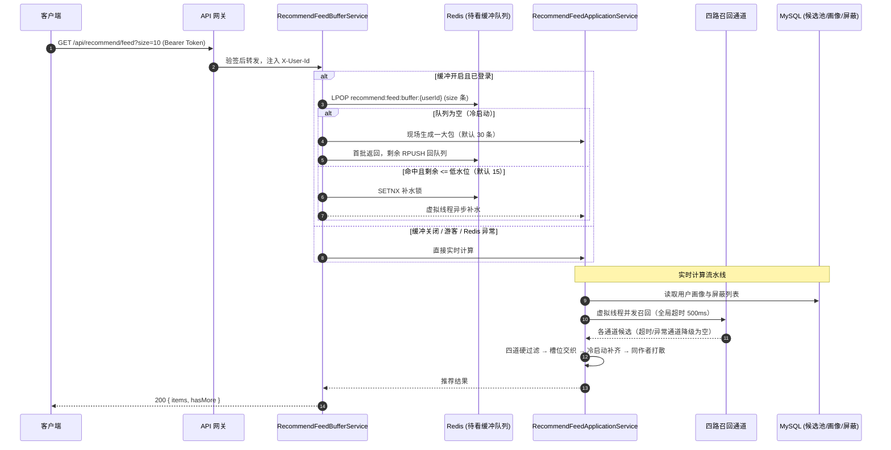
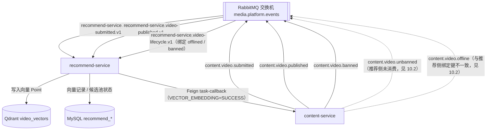

# 推荐模块 · recommend-service 架构设计与实现文档

推荐模块（`recommend-service`，端口 8600）负责视频向量化、推荐候选池维护、用户画像演进和首页推荐流下发。

本文按**当前代码实际实现**描述；尚未实现的能力统一放在 [第 10 节 规划与已知缺口](#10-规划与已知缺口)，不与现状混写。

---

## 1. 模块定位与架构边界

### 1.1 核心业务职责

- **视频向量化与发布门禁**：消费 `content.video.submitted`，计算视频特征向量写入 Qdrant 与自属表，再回调 `content-service` 汇报 `VECTOR_EMBEDDING` 完成。
- **候选池生命周期**：消费 `content.video.published` 入池（`ACTIVE`），消费 `content.video.offlined` / `content.video.banned` 出池（`OFFLINE` / `BANNED`）。
- **首页推荐流**：四路召回（个性化、探索、热度、关注）→ 四道硬过滤 → 槽位交织 → 冷启动补齐 → 同作者打散。
- **行为反馈与画像**：接收客户端上报的曝光、播放、跳过、负反馈，记入流水并驱动用户画像演进。
- **用户屏蔽**：维护视频、作者、主题三个维度的黑名单，作为推荐硬过滤条件。

### 1.2 防腐与禁止承担的工作

- **只输出推荐决策**：接口只返回视频短码 `vid` 列表，详情与播放流由客户端向 `content-service` 获取。
- **不管理视频元数据与审核状态**：候选池出入完全由上游领域事件驱动，不跨服务读取草稿或未审核视频。
- **不持有互动计数**：点赞、收藏、播放等计数归 `interaction-service` 所有，推荐侧只接收事件（当前尚未接入，见第 10 节）。

### 1.3 参与的全局业务主线

- [主线 03：视频创作提审与分级门禁](../flows/03-视频创作提审与分级门禁.md)：向量化任务回调门禁。
- [主线 04：前台视频播放分发与网关防刷](../flows/04-前台视频播放分发与网关防刷.md)：首页推荐流。
- [主线 05：平台合规治理与全站广播下线](../flows/05-平台合规治理与全站广播下线.md)：封禁/下架出池。

---

## 2. 首页推荐流时序图



---

## 3. 事件驱动拓扑



---

## 4. 第一套件：HTTP 接口

所有端点挂载于 `/api/recommend/**`，由网关转发至 `lb://recommend-service`。

> **鉴权现状**：`/api/recommend/**` 不在网关白名单，**经网关访问的所有推荐接口都需要令牌**。代码中的“游客态”分支只在绕过网关直连服务时生效。

| HTTP 方法 | URI 路径 | 服务内鉴权 | 处理流程 | 关键响应 |
| :--- | :--- | :--- | :--- | :--- |
| `GET` | `/api/recommend/feed` | 可选用户态 | 缓冲队列弹出或实时计算 → 返回推荐短码列表 | `200` |
| `POST` | `/api/recommend/feedback` | 可选用户态 | 记入 `recommend_feedback_log` → 按行为类型更新画像（游客只记流水） | `200` |
| `POST` | `/api/recommend/blocks` | 必须登录 | 新增视频/作者/主题屏蔽，写 `recommend_user_block` | `200` 返回屏蔽记录 |
| `DELETE` | `/api/recommend/blocks?blockType=&targetId=` | 必须登录 | 撤销指定屏蔽 | `200` |
| `GET` | `/api/recommend/blocks` | 必须登录 | 查询当前用户全部屏蔽 | `200` 返回列表 |

**错误处理现状**：未登录调用屏蔽接口、未知 `actionType` / `blockType` 时抛出 `IllegalArgumentException`。服务未配置全局异常映射，**推断实际返回 `500`**（未实测）。请求体校验失败按 Spring 默认返回 `400`。

### 4.1 首页推荐流：`GET /api/recommend/feed`

| 参数 | 类型 | 默认 | 规则 |
| :--- | :--- | :--- | :--- |
| `size` | int | 10 | `<= 0` 取默认值；上限 50 |

```json
{
  "code": 0,
  "message": "success",
  "data": {
    "items": [
      { "vid": "cv05hG9Kq2RtLw7XbPmZv4Ya", "recallChannel": "PERSONALIZED", "score": 0.9421, "reason": "偏好标签推荐" },
      { "vid": "cv78jK2Lm3NqP4RtU5Vw8XyZ", "recallChannel": "EXPLORE_SIMILAR", "score": 0.6120, "reason": "相似领域探索" },
      { "vid": "cv12aB3Cd4Ef5Gh6Ij7Kl8Mn", "recallChannel": "COLD_START", "score": 0.7500, "reason": "新鲜发布" }
    ],
    "hasMore": true
  }
}
```

- `recallChannel` 取值：`PERSONALIZED`、`EXPLORE_SIMILAR`、`EXPLORE_RANDOM`、`TRENDING`、`FOLLOWING`（当前恒为空）、`COLD_START`。
- `score` 保留 4 位小数，只用于排序参考，不同通道之间不可直接比较。
- **没有游标**：翻页靠服务端缓冲队列逐批弹出，客户端重复调用即可取下一批。

### 4.2 行为反馈：`POST /api/recommend/feedback`

| 字段 | 类型 | 必填 | 说明 |
| :--- | :--- | :--- | :--- |
| `vid` | string | 是 | 视频短码 |
| `actionType` | string | 是 | `IMPRESSION` / `PLAY` / `SKIP` / `DISLIKE`，大小写不敏感 |
| `playDuration` | int | 否 | 实际播放秒数，缺省 0 |
| `videoDuration` | int | 否 | 视频总秒数，缺省 0 |
| `reason` | string | 否 | 负反馈原因；`DISLIKE_AUTHOR` 表示屏蔽作者，其余按屏蔽视频处理 |
| `occurredAt` | datetime | 否 | 客户端行为时间，缺省取服务端当前时间 |

画像更新规则（仅登录用户）：

| 行为 | 触发条件 | 画像变化 |
| :--- | :--- | :--- |
| `PLAY` | 播放比例 >= 30% 或播放 >= 10 秒 | 用视频向量按 EMA（指数移动平均，新数据按固定权重逐步融入）更新用户向量，累加主题偏好，记入近期已看 |
| `SKIP` | 播放比例 < 10% 且播放 < 3 秒 | 记一次粗领域“曝光未消费”，后续对该领域打折 |
| `DISLIKE` | 无 | 自动写入屏蔽（作者或视频），并记一次粗领域曝光未消费 |
| `IMPRESSION` | 无 | 只记流水 |

> 注意：播放时长、视频时长都来自客户端，服务端不做校验。

### 4.3 用户屏蔽：`/api/recommend/blocks`

`POST` 请求体：`blockType`（`VIDEO` / `AUTHOR` / `TOPIC`）、`targetId`、`reason`（可选）。

响应字段：`id`、`userId`、`blockType`、`targetId`、`reason`、`createdAt`。

---

## 5. 第二套件：MQ 消息链路

所有队列绑定统一 Topic 交换机 `media.platform.events`。

| 消费队列 | 绑定路由键 | 消费者 | 处理 |
| :--- | :--- | :--- | :--- |
| `recommend-service.video-submitted.v1` | `content.video.submitted` | `VideoSubmittedConsumer` | 虚拟线程异步计算向量 → 写 Qdrant 与 `recommend_video_vector` → Feign 回调 `task-callback` |
| `recommend-service.video-published.v1` | `content.video.published` | `VideoPublishedConsumer` | 幂等写入 `recommend_candidate_video`，状态 `ACTIVE` |
| `recommend-service.video-lifecycle.v1` | `content.video.offlined`、`content.video.banned` | `VideoLifecycleConsumer` | `banned` 置 `BANNED`，其他类型按下架置 `OFFLINE` |

- 反序列化失败或缺少 `videoId` 的消息直接丢弃并记日志，**当前没有死信队列**。
- 本服务**不发布**任何领域事件。
- 未消费 `interaction.video-action.v1`，见第 10 节。

---

## 6. 第三套件：定时任务与补偿

**当前没有任何 `@Scheduled` 定时任务。**

- 推荐缓冲队列补水由请求触发（低水位异步补水），不是定时任务。
- `application.yml` 中的 `recommend.callback.max-retries: 5` **当前没有代码读取**，不代表已实现回调重试。

---

## 7. 召回、过滤与编排细节

### 7.1 四路召回通道

| 通道 | 配比 | `supports` 条件 | 召回策略 | 不足时 |
| :--- | :---: | :--- | :--- | :--- |
| `PERSONALIZED` 核心个性化 | 50% | 已登录且有非空用户向量 | Qdrant ANN（近似最近邻检索）取 `max(count×4, 30)` 条；得分 = 余弦分 × 粗领域抑制系数 + 主题加分（上限 0.5） | 返回空，由其他通道吸收 |
| `EXPLORE` 探索 | 30% | 始终执行 | 约 2/3 近似探索：检索前 35 条后倒序取弱相关，并要求主领域在用户已有领域内；约 1/3 跨领域：从最新候选中挑用户未接触过的主领域 | 用最新 `ACTIVE` 候选补齐 |
| `TRENDING` 热度 | 10% | 始终执行 | 统计 `recommend_feedback_log` 近 24 小时播放最多的视频 | 用最新 `ACTIVE` 候选补齐 |
| `FOLLOWING` 关注 | 10% | 已登录 | **当前直接返回空列表**，尚未调用 `user-service` | 配额由其他通道吸收 |

- 每个通道请求量 = `max(期望条数×2, 4)`，用于抵消后续过滤损耗。
- 所有通道共用 **500ms 全局超时**，超时或异常的通道降级为空，不影响其他通道。

### 7.2 四道硬过滤

在槽位混合前统一执行，冷启动补齐时同样执行：

1. 候选状态必须是 `ACTIVE`；
2. 不推荐用户本人的作品；
3. 命中视频、作者、主题屏蔽则剔除；
4. 画像中近期已看的视频剔除。

### 7.3 槽位交织与打散

- 10 槽模板：`PERSONALIZED, FOLLOWING, PERSONALIZED, EXPLORE, TRENDING, PERSONALIZED, EXPLORE, PERSONALIZED, EXPLORE, PERSONALIZED`。
- 混合时取 `max(size×2, 20)` 条，给打散留余量；某槽的通道没有物料时，按配比从高到低依次向其他通道借。
- 所有通道都耗尽仍不足 `size` 时，从最新 `ACTIVE` 候选补齐，通道标记 `COLD_START`，得分按发布时间衰减。
- 打散规则：同一作者在结果中至少间隔 2 张卡片；实在凑不满时放宽限制。

### 7.4 待看缓冲队列

| 配置键（前缀 `recommend.feed.buffer`） | 默认 | 说明 |
| :--- | :--- | :--- |
| `enabled` | `true` | 关闭后所有请求走实时计算 |
| `batch-generate-size` | 30 | 每次预生成条数 |
| `default-pop-size` | 10 | `size <= 0` 时的弹出条数 |
| `low-watermark` | 15 | 剩余条数 <= 该值时异步补水 |
| `max-buffer-capacity` | 60 | 剩余条数达到该值时不再补水 |
| `buffer-ttl-seconds` | 3600 | 队列过期时间 |
| `refill-lock-timeout-seconds` | 30 | 补水锁超时 |

- 游客不使用缓冲队列。
- 队列中的物料不会在弹出时重新过滤：**用户新增屏蔽或视频被下架后，已进入队列的物料在过期前仍可能被下发**。

### 7.5 Redis Key

| Key | 类型 | 用途 |
| :--- | :--- | :--- |
| `recommend:feed:buffer:{userId}` | List | 用户待看缓冲队列，元素为推荐项 JSON |
| `recommend:feed:refill:lock:{userId}` | String | 异步补水防重入锁 |

---

## 8. 数据库与存储

- **自属数据库表**：
  - [`recommend_video_vector`](../../service/recommend-service/db/schema/recommend-video-vector.sql)：视频向量、模型标识、维度、Qdrant 同步状态与处理状态，唯一键 `video_id`，索引 `vid`；
  - [`recommend_candidate_video`](../../service/recommend-service/db/schema/recommend-candidate-video.sql)：候选池元数据，含 `author_id`、`domain_tag_ids` / `topic_tag_ids` 与状态 `ACTIVE/OFFLINE/BANNED`；
  - [`recommend_user_profile`](../../service/recommend-service/db/schema/recommend-user-model.sql)：用户向量、主题偏好、粗领域状态、近期已看序列与乐观锁版本；
  - [`recommend_user_block`](../../service/recommend-service/db/schema/recommend-user-model.sql)：视频、作者、主题屏蔽；
  - [`recommend_feedback_log`](../../service/recommend-service/db/schema/recommend-user-model.sql)：行为反馈流水，只追加。
- **Qdrant**：集合 `video_vectors`（Cosine 距离），Point ID 为视频 ID，Payload 含 `vid`、`authorId`、`title`、`modelName`。
- **向量引擎**：`recommend.embedding.type` 可选 `remote`（OpenAI 兼容接口，默认）/ `local`（本地特征哈希）/ `mock`；远程异常或未配 Key 时按 `fallback-to-local` 回退本地算法。

---

## 9. 核心源码入口

- **启动类**：[`RecommendApplication.java`](../../service/recommend-service/src/main/java/com/calles/platform/recommend/RecommendApplication.java)
- **本地配置**：[`application.yml`](../../service/recommend-service/src/main/resources/application.yml)
- **MQ 消费**：[`VideoSubmittedConsumer.java`](../../service/recommend-service/src/main/java/com/calles/platform/recommend/interfaces/messaging/consumer/VideoSubmittedConsumer.java)、[`VideoPublishedConsumer.java`](../../service/recommend-service/src/main/java/com/calles/platform/recommend/interfaces/messaging/consumer/VideoPublishedConsumer.java)、[`VideoLifecycleConsumer.java`](../../service/recommend-service/src/main/java/com/calles/platform/recommend/interfaces/messaging/consumer/VideoLifecycleConsumer.java)
- **消息拓扑**：[`RecommendMessagingConfiguration.java`](../../service/recommend-service/src/main/java/com/calles/platform/recommend/config/RecommendMessagingConfiguration.java)
- **Web 控制器**：[`RecommendFeedController.java`](../../service/recommend-service/src/main/java/com/calles/platform/recommend/interfaces/web/RecommendFeedController.java)
- **缓冲队列门面**：[`RecommendFeedBufferService.java`](../../service/recommend-service/src/main/java/com/calles/platform/recommend/application/service/RecommendFeedBufferService.java)
- **推荐编排**：[`RecommendFeedApplicationService.java`](../../service/recommend-service/src/main/java/com/calles/platform/recommend/application/service/RecommendFeedApplicationService.java)
- **召回通道**：[`channel/impl/`](../../service/recommend-service/src/main/java/com/calles/platform/recommend/application/channel/impl/)（`PersonalizedRecallChannel`、`ExploreRecallChannel`、`TrendingRecallChannel`、`FollowingRecallChannel`）
- **行为反馈**：[`FeedbackApplicationService.java`](../../service/recommend-service/src/main/java/com/calles/platform/recommend/application/service/FeedbackApplicationService.java)
- **用户屏蔽**：[`UserBlockApplicationService.java`](../../service/recommend-service/src/main/java/com/calles/platform/recommend/application/service/UserBlockApplicationService.java)
- **向量编排**：[`VideoVectorApplicationService.java`](../../service/recommend-service/src/main/java/com/calles/platform/recommend/application/service/VideoVectorApplicationService.java)
- **候选池编排**：[`CandidateVideoApplicationService.java`](../../service/recommend-service/src/main/java/com/calles/platform/recommend/application/service/CandidateVideoApplicationService.java)
- **用户模型**：[`UserProfile.java`](../../service/recommend-service/src/main/java/com/calles/platform/recommend/domain/model/profile/UserProfile.java)、[`UserVector.java`](../../service/recommend-service/src/main/java/com/calles/platform/recommend/domain/model/profile/UserVector.java)、[`UserBlock.java`](../../service/recommend-service/src/main/java/com/calles/platform/recommend/domain/model/block/UserBlock.java)、[`FeedbackLog.java`](../../service/recommend-service/src/main/java/com/calles/platform/recommend/domain/model/feedback/FeedbackLog.java)
- **向量引擎与 Qdrant**：[`VectorEmbeddingEngineRouter.java`](../../service/recommend-service/src/main/java/com/calles/platform/recommend/infrastructure/engine/VectorEmbeddingEngineRouter.java)、[`QdrantClient.java`](../../service/recommend-service/src/main/java/com/calles/platform/recommend/infrastructure/qdrant/QdrantClient.java)
- **内容门禁回调**：[`ContentServiceClient.java`](../../service/recommend-service/src/main/java/com/calles/platform/recommend/application/client/ContentServiceClient.java)

---

## 10. 规划与已知缺口

### 10.1 未实现能力

| 能力 | 现状 | 依赖 / 下一步 |
| :--- | :--- | :--- |
| 关注召回 | `FollowingRecallChannel` 恒返回空 | `user-service` 已提供 `GET /api/users/internal/{accountId}/following-ids`，需补 Feign 调用并声明超时与降级 |
| 互动事件消费 | 未消费 `interaction.video-action.v1` | 幂等消费后，互动 Outbox 才能打开 `dispatch-enabled` |
| 热度榜接入互动计数 | 热度只基于本服务反馈流水 | 依赖互动事件消费 |
| 相关推荐 `GET /api/recommend/videos/{vid}/related` | 无接口 | 可复用 Qdrant 按锚点视频检索 |
| 游客推荐 | 网关拦截，游客拿不到推荐 | 需确认是否把 `/api/recommend/feed` 加入网关白名单 |
| 协同过滤、热度衰减等离线任务 | 无 | 待互动数据接入后再评估 |
| 消费失败死信 | 非法消息直接丢弃 | 补死信队列与告警 |

### 10.2 已知问题

| 编号 | 问题 | 影响 | 状态 |
| :--- | :--- | :--- | :--- |
| REC-01 | `content-service` 下架时以 `content.video.offline` 为路由键发送；推荐侧只绑定 `content.video.offlined` | **创作者主动下架的视频不会移出推荐候选池**（封禁不受影响） | 待修复，需确定以哪边命名为准 |
| REC-02 | 缓冲队列中的物料弹出时不再过滤 | 新屏蔽或刚下线的视频最多在 1 小时内仍可能被下发 | 待评估 |
| REC-03 | 参数非法、未登录抛 `IllegalArgumentException`，无统一异常映射 | 推断返回 `500` 而非 `400/401` | 待处理 |
| REC-04 | 反馈的播放时长和视频时长完全信任客户端 | 画像可被伪造上报影响 | 待决策 |
| REC-05 | 未消费 `content.video.unbanned` | 解封后的视频在候选池中仍为 `BANNED`，不会重新被推荐（内容服务解封时只发 `unbanned`，不重发 `published`） | 待处理 |
