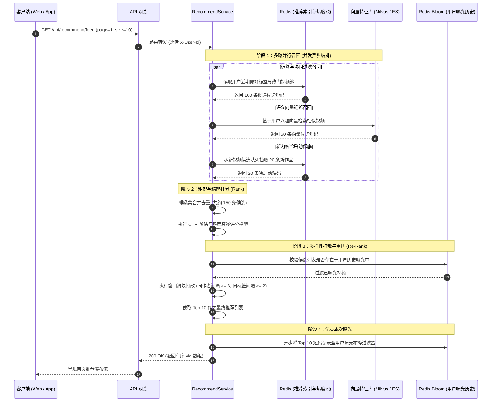
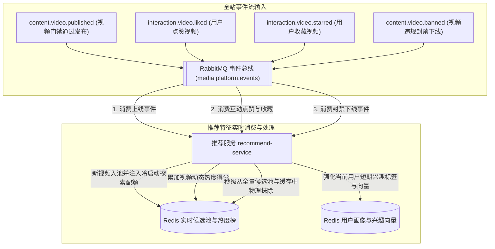

# 推荐模块 · recommend-service 架构设计与实现文档

推荐模块（`recommend-service`）是平台智能流量分发、首页个性化瀑布流与内容分发的核心中枢（运行端口：8600）。负责支撑亿级视频的智能索引、多路并发召回、实时特征计算、冷启动流量扶持以及多样性重排打散。架构采用 **“多路召回（Recall）➔ 综合粗排与精排（Rank）➔ 业务规则与多样性重排（Re-Rank）”** 的经典推荐流水线，完全通过事件驱动机制实时感知全站内容发布与用户互动行为。

---

## 1. 模块定位与架构边界

### 1.1 核心业务职责
- **个性化首页瀑布流（Personalized Feed）**：
  - 基于用户画像与实时短期兴趣，为已登录用户提供千人千面的动态信息流；
  - 为匿名或未登录用户提供基于热度衰减与优质标签的全局热门瀑布流。
- **播放详情页相关推荐（Related Videos）**：
  - 结合当前播放视频的标签矩阵、作者维度与向量嵌入（Vector Embedding），提供高契合度的“猜你喜欢”延伸播放列表。
- **多路并发召回流水线（Multi-Channel Recall）**：
  - **标签召回（Tag-based Recall）**：根据用户偏好标签倒排索引召回候选视频；
  - **协同过滤召回（Collaborative Filtering）**：根据用户共同点赞/收藏矩阵召回相似受众喜好的视频；
  - **语义向量召回（Vector Recall）**：基于 `content-service` 异步生成的文本/封面向量进行近邻搜索（KNN）；
  - **新视频冷启动探索（Cold Start Exploration）**：强制给予新发布视频一定比例的曝光保底配额。
- **多样性打散与频控重排（Re-Rank）**：
  - **曝光去重**：借助 Redis Bloom Filter 或短期缓存集合，过滤用户 48 小时内已浏览过的历史视频；
  - **多样性打散**：限制连续卡片出现同一作者或同一分类标签，避免信息茧房与审美疲劳。

### 1.2 防腐与禁止承担的工作
- **严禁直接返回完整视频实体与媒体流**：推荐服务只负责“推荐决策”，输出精简的视频业务短码 `vid` 列表；前端通过短码向前台 `content-service` 拉取图文详情与播放流；
- **严禁管理创作者元数据与审核状态**：推荐池的入池与出池完全受上游领域事件驱动，绝不跨服务直接读取未审核或草稿状态的视频。

### 1.3 参与的全局业务主线导航
- 核心支撑 [主线 04：前台视频播放分发、短码寻址与网关防刷](../flows/04-前台视频播放分发与网关防刷.md)（首页瀑布流与猜你喜欢接口）
- 关键消费 [主线 03：视频创作、提审探活、异步机审与分级门禁流水线](../flows/03-视频创作提审与分级门禁.md)（消费上线事件入池）
- 关键消费 [主线 05：平台合规治理、违规封禁与全站事件广播下线](../flows/05-平台合规治理与全站广播下线.md)（秒级清退封禁视频）

---

## 2. 推荐流水线多路召回与重排时序图



---

## 3. 实时特征驱动拓扑架构图



---

## 4. 第一套件：HTTP 接口服务链路

所有端点统一挂载于 `/api/recommend/**` 下：

| HTTP 方法 | URI 路径 | 鉴权要求 | 核心处理流与调用链 | 关键响应状态 |
| :--- | :--- | :--- | :--- | :--- |
| `GET` | `/api/recommend/feed` | 可选用户态 | 首页瀑布流 ➔ 判断游客/登录态 ➔ 多路召回 ➔ 排序与打散 ➔ 记录曝光 ➔ 返回推荐短码列表 | `200` 成功返回列表 |
| `GET` | `/api/recommend/videos/{vid}/related` | 可选用户态 | 相关推荐 ➔ 提取当前视频标签与嵌入 ➔ 近邻召回 ➔ 过滤当前视频本身 ➔ 返回相关列表 | `200` 成功返回列表<br/>`404` 视频不存在 |
| `POST` | `/api/recommend/feedback` | `requireUser` | 用户行为负反馈（如“不感兴趣/减少此类推荐”） ➔ 降低对应标签权重 ➔ 写入屏蔽集合 | `200` 反馈已接收 |

### 4.1 接口响应报文契约

#### 1. 首页瀑布流响应 (`GET /api/recommend/feed?size=10`)
```json
{
  "code": 0,
  "message": "success",
  "data": {
    "items": [
      {
        "vid": "cv05hG9Kq2RtLw7XbPmZv4Ya",
        "recallChannel": "COLLABORATIVE_FILTERING",
        "score": 0.942
      },
      {
        "vid": "cv78jK2Lm3NqP4RtU5Vw8XyZ",
        "recallChannel": "TAG_PREFERENCE",
        "score": 0.885
      },
      {
        "vid": "cv12aB3Cd4Ef5Gh6Ij7Kl8Mn",
        "recallChannel": "COLD_START_EXPLORE",
        "score": 0.750
      }
    ],
    "hasMore": true,
    "nextCursor": "cur_1773728000_50"
  }
}
```

---

## 5. 第二套件：MQ 消息链路（事件驱动特征流）

### 5.1 消费的领域事件

| 事件名称 | 路由键 RoutingKey | 触发业务与推荐特征联动 |
| :--- | :--- | :--- |
| `content.video.published` | `content.video.published` | 视频上线 ➔ 提取视频标签、时长、发布时间 ➔ 注入 Redis 候选池，配置初始冷启动曝光量 |
| `interaction.video.liked` | `interaction.video.liked` | 用户点赞 ➔ 用户兴趣模型加权该视频关联标签（权重 +1.0），提升该视频在全站热度榜中的排名 |
| `interaction.video.starred` | `interaction.video.starred` | 用户收藏 ➔ 强正反馈信号（权重 +3.0），触发关联视频的协同召回候选计算 |
| `content.video.banned` | `content.video.banned` | 视频封禁 ➔ **硬性熔断**：立即从 Redis 候选池、热度榜和向量库中删除该短码，防止任何端继续推荐 |
| `content.video.offlined` | `content.video.offlined` | 创作者主动下架 ➔ 软下线：移出公开推荐池，保留统计特征 |

---

## 6. 第三套件：定时任务与异步补偿调度链路

### 6.1 全局热度基准衰减调度器 (`TrendingDecayJob`)
- **执行频率**：每小时执行一次；
- **算法模型**：牛顿冷却定律时间衰减：
  $$\text{CurrentScore} = \text{InitialScore} \times e^{-\lambda \cdot \Delta t}$$
  其中 $\lambda$ 为衰减常数，$\Delta t$ 为发布距今小时数。确保平台始终有新鲜优质视频浮出，避免远期高赞老视频长期垄断首页推荐。

### 6.2 离线协同过滤矩阵增量计算任务 (`CollaborativeFilteringSyncJob`)
- **执行频率**：每日凌晨 3:00 执行；
- **任务目标**：批处理过去 7 天的全站互动日志，计算 Item-to-Item 相似度矩阵，同步至 Redis 缓存供近邻推荐快速查询。

---

## 7. 核心缓存数据结构规范

- **实时热门池（ZSET）**：`recommend:pool:trending`，Score 为综合热度分，Member 为业务短码 `vid`；
- **标签倒排候选池（SET）**：`recommend:tag:{tagId}`，存储属于该标签的高分视频短码集合；
- **用户短期兴趣画像（HASH）**：`recommend:user:profile:{userId}`，字段为 `tag:{id}`，值为动态浮点数权重；
- **用户曝光去重布隆过滤器**：`recommend:bloom:{userId}`，采用可重置时效布隆过滤器，防止近期连续刷到相同内容。

---

## 8. 核心数据库与存储规范

- **自属数据库表**：[`recommend_video_vector`](../../service/recommend-service/db/schema/recommend-video-vector.sql)（记录视频向量、模型标识、维度、Qdrant 同步状态与处理状态，唯一键 `video_id`，索引 `vid`）；
- **Qdrant 向量数据库**：集合 `video_vectors`（Cosine 距离 HNSW 索引），Point ID 为视频 UUID，Payload 携带 `vid`、`authorId`、`title`、`modelName`；负责视频近邻向量索引与后续基于锚点视频的相似召回（Recommend API）。


---

## 9. 核心源码入口索引

- **启动类**：[`RecommendApplication.java`](../../service/recommend-service/src/main/java/com/calles/platform/recommend/RecommendApplication.java)
- **本地配置文件**：[`application.yml`](../../service/recommend-service/src/main/resources/application.yml)
- **MQ 提审消费**：[`VideoSubmittedConsumer.java`](../../service/recommend-service/src/main/java/com/calles/platform/recommend/interfaces/messaging/consumer/VideoSubmittedConsumer.java)
- **向量应用编排**：[`VideoVectorApplicationService.java`](../../service/recommend-service/src/main/java/com/calles/platform/recommend/application/service/VideoVectorApplicationService.java)
- **向量引擎路由**：[`VectorEmbeddingEngineRouter.java`](../../service/recommend-service/src/main/java/com/calles/platform/recommend/infrastructure/engine/VectorEmbeddingEngineRouter.java)
- **Qdrant 客户端**：[`QdrantClient.java`](../../service/recommend-service/src/main/java/com/calles/platform/recommend/infrastructure/qdrant/QdrantClient.java)
- **内容门禁回调**：[`ContentServiceClient.java`](../../service/recommend-service/src/main/java/com/calles/platform/recommend/application/client/ContentServiceClient.java)
- **网关路由**：统一由网关转发 `/api/recommend/**` ➔ `lb://recommend-service`。

