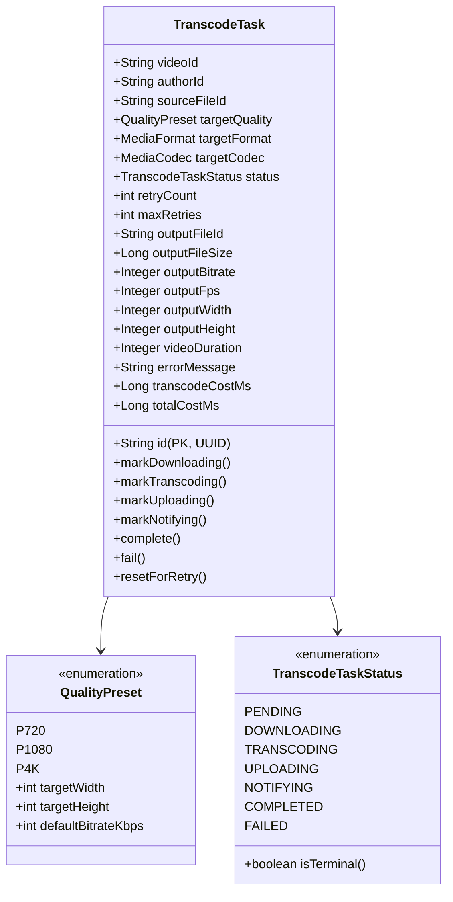
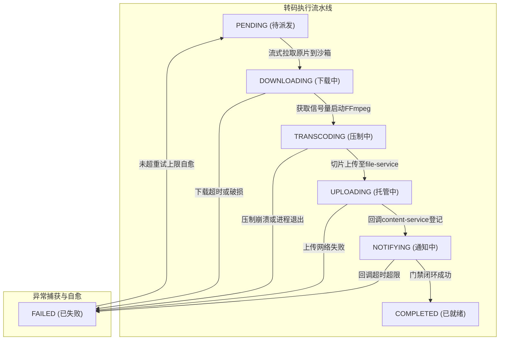
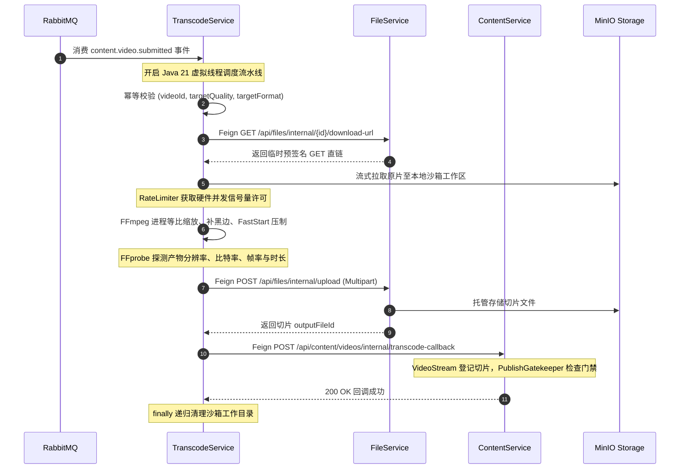

# 视频转码模块 · transcode-service 架构设计与实现文档

视频转码模块（`transcode-service`）是平台流媒体处理、多规格画质切片压制与分级发布门禁的核心计算密集型微服务（默认端口 8800）。负责监听来自内容服务（`content-service`）的提审事件，在宿主机硬件安全保护下调度执行器（系统级 FFmpeg 或可插拔 Mock 桩）对创作者上传的原始音视频原片进行多清晰度（720P、1080P 等）等比保真切片压制，将切片产物通过免 Session 内部通道上传至文件服务（`file-service`）完成统一托管，最后向内容服务登记流媒体切片元数据与视频真实时长，支撑视频分级发布门禁（`PublishGatekeeper`）的流转与自动化放行。

---

## 1. 模块定位与架构边界

### 1.1 业务职责边界
- **提审事件异步驱动**：监听 RabbitMQ 领域交换机 `media.platform.events` 中的 `content.video.submitted` 路由键，通过专属队列 `transcode-service.video-submitted.v1` 接收视频 ID、创作者 ID 与源文件资产 ID；
- **沙箱隔离流式拉取**：为每个转码工单创建独立隔离的任务沙箱目录，通过 Feign 申请 `file-service` 临时直链流式拉取原片，并在执行结束后 `finally` 彻底清除临时大文件，防止磁盘泄漏；
- **宿主机硬件并发保护**：视频转码是极度消耗 CPU 与内存的重度任务，服务内置公平信号量并发限流器（`TranscodeRateLimiter`），严格控制本地最大并发转码进程数（默认 1），配合 Java 21 虚拟线程执行外部进程异步等待，杜绝突发提审流量压垮服务器；
- **等比保真与 Web 秒开压制**：采用系统级 `ffmpeg`，使用 `scale` 与 `pad` 动态滤镜保持原始宽高比等比缩放并填充黑边，限制压制线程数，开启 `-movflags +faststart` 将 moov atom 移动至文件头部，保证客户端与 Web 浏览器边下边播秒开；
- **产物文件托管闭环**：转码生成的流媒体切片通过受信任内部 Feign 端点 `POST /api/files/internal/upload` 统一注册到 `file-service`，由对象存储（MinIO）持久化并签发全新 `fileId`；
- **分级门禁流媒体登记**：切片注册完成后，通过 OpenFeign 调用内容服务受信任内部端点 `POST /api/content/videos/internal/transcode-callback` 登记流媒体画质、码率、帧率与精准时长，驱动 `PublishGatekeeper` 门禁与分级发布放行。

### 1.2 防腐与不应承担的工作
- **不直接访问业务数据库**：严禁跨服务直接读写 `video_content`、`video_stream` 或 `file_asset` 表，所有跨服务交互严格经由内部 Feign 契约或 RabbitMQ 领域事件；
- **不长期留存媒体文件**：转码服务本地磁盘仅作为计算临时缓存，切片完成后必须上传至 `file-service` 并立刻清理本地沙箱目录；
- **不处理客户端用户身份**：转码服务为纯内部计算节点，不对外部网关开放修改接口，不解析用户端 JWT 会话。

### 1.3 参与的全局业务主线导航
- 核心参与 [主线 03：视频创作、提审探活、异步机审与分级门禁流水线](../flows/03-video-publish-and-pipeline-flow.md)

---

## 2. 领域模型与核心状态机

### 2.1 聚合根与工单拓扑


### 2.2 转码全生命周期状态流转图


---

## 3. 第一套件：HTTP / RPC 接口服务链路

本微服务主要作为计算 Worker 节点运行，其对外接口与跨微服务 RPC 调用如下：

### 3.1 跨服务上游依赖调用
- **拉取源文件直链**：
  - 调用 `file-service`：`GET /api/files/internal/{id}/download-url`，获取带有短有效期的预签名 GET 直链，免密流式拉取原片至沙箱。
- **切片文件托管上传**：
  - 调用 `file-service`：`POST /api/files/internal/upload`（Multipart 表单），传入生成的切片文件二进制流及所属 `authorId`，换取全新的正式资产 `outputFileId`。
- **内容门禁与流规格登记回调**：
  - 调用 `content-service`：`POST /api/content/videos/internal/transcode-callback`，回传转码切片元数据（清晰度、码率、帧率、时长），触发内容服务的 `PublishGatekeeper` 门禁重新评估。

---

## 4. 第二套件：MQ 消息链路（事件发布与消费）

### 4.1 消费的领域事件：`content.video.submitted`



- **监听队列与绑定**：
  - Queue: `transcode-service.video-submitted.v1`
  - Exchange: `media.platform.events`
  - RoutingKey: `content.video.submitted`
- **消费与防重机制**：
  - 基于 `(video_id, target_quality, target_format)` 唯一复合键防并发重复创建工单；
  - 启动 Java 21 虚拟线程异步执行转码任务，避免阻塞 MQ 消费监听线程。

---

## 5. 第三套件：定时任务与资源自愈清理链路

### 5.1 沙箱临时工作目录强力清理机制
- **执行时机**：每个转码任务执行块的 `finally` 阶段；
- **清理逻辑**：
  - 任务沙箱位于 `/tmp/calles-transcode/{taskId}/`；
  - 无论任务成功、失败还是超时抛出异常，均执行强力递归文件删除；
  - 杜绝因大文件切片堆积造成宿主机磁盘空间耗尽（Disk Full）。

### 5.2 硬件并发控制与超时保护
- **硬件信号量限流 (`TranscodeRateLimiter`)**：
  - 基于公平信号量实现，由 `transcode.max-concurrent-tasks`（默认 1）控制本地并发转码数；
  - 超出并发数的任务在虚拟线程中排队等待许可，防止服务器 CPU 100% 导致微服务崩溃。
- **单任务最大超时时限 (`task-timeout-seconds`)**：
  - 默认 600 秒（10分钟）。超过该阈值 FFmpeg 子进程被物理强制 Kill 并释放信号量，工单状态置为 `FAILED`。

---

## 6. 数据库设计 (`transcode_task`)

```sql
CREATE TABLE IF NOT EXISTS transcode_task (
    id VARCHAR(32) NOT NULL COMMENT '任务全局唯一主键 ID',
    video_id VARCHAR(32) NOT NULL COMMENT '关联主视频业务 ID (video_content.id)',
    author_id VARCHAR(32) NOT NULL COMMENT '创作者账号 ID',
    source_file_id VARCHAR(32) NOT NULL COMMENT '原始待转码文件资产 ID',
    target_quality VARCHAR(16) NOT NULL COMMENT '目标清晰度规格 (P720, P1080, P4K)',
    target_format VARCHAR(16) NOT NULL DEFAULT 'MP4' COMMENT '目标流媒体封装格式 (MP4, HLS)',
    target_codec VARCHAR(16) NOT NULL DEFAULT 'H264' COMMENT '目标视频编码标准 (H264, H265)',
    status VARCHAR(16) NOT NULL DEFAULT 'PENDING' COMMENT '任务状态',
    retry_count INT NOT NULL DEFAULT 0 COMMENT '已重试次数',
    max_retries INT NOT NULL DEFAULT 3 COMMENT '最大重试上限',
    output_file_id VARCHAR(32) DEFAULT NULL COMMENT '产物在 file-service 注册的文件资产 ID',
    output_file_size BIGINT DEFAULT NULL COMMENT '产物文件字节大小',
    output_bitrate INT DEFAULT NULL COMMENT '实际码率 (kbps)',
    output_fps INT DEFAULT NULL COMMENT '实际帧率 (fps)',
    output_width INT DEFAULT NULL COMMENT '实际像素宽',
    output_height INT DEFAULT NULL COMMENT '实际像素高',
    video_duration INT DEFAULT NULL COMMENT '视频时长 (秒)',
    error_message VARCHAR(1024) DEFAULT NULL COMMENT '失败错误信息摘要',
    transcode_cost_ms BIGINT DEFAULT NULL COMMENT '纯转码计算耗时 (ms)',
    total_cost_ms BIGINT DEFAULT NULL COMMENT '端到端总耗时 (ms)',
    created_at DATETIME NOT NULL DEFAULT CURRENT_TIMESTAMP COMMENT '创建时间',
    updated_at DATETIME NOT NULL DEFAULT CURRENT_TIMESTAMP ON UPDATE CURRENT_TIMESTAMP COMMENT '更新时间',
    PRIMARY KEY (id),
    UNIQUE KEY uk_video_quality_format (video_id, target_quality, target_format),
    KEY idx_status_updated (status, updated_at),
    KEY idx_video_id (video_id)
) ENGINE=InnoDB DEFAULT CHARSET=utf8mb4 COLLATE=utf8mb4_unicode_ci COMMENT='视频转码调度工单表';
```

---

## 7. 核心源码入口索引与包结构

- **启动类**：`com.calles.platform.transcode.TranscodeApplication.java`
- **入站消息消费**：`interfaces.messaging.consumer.VideoSubmittedConsumer.java`
- **消息拓扑声明**：`config.TranscodeMessagingConfiguration.java`
- **出站应用客户端**：`application.client.FileServiceClient.java`、`ContentServiceClient.java`
- **业务核心编排**：`application.service.TranscodeApplicationService.java`
- **执行引擎实现**：`infrastructure.engine.FfmpegTranscodeEngine.java`、`MockTranscodeEngine.java`
- **并发保护限流**：`infrastructure.concurrency.TranscodeRateLimiter.java`
- **Web 控制器与切面**：`interfaces.http.TranscodeTaskController.java`、`advice.TranscodeExceptionHandler.java`
- **工单领域仓储**：`infrastructure.persistence.repository.TranscodeTaskRepositoryImpl.java`
