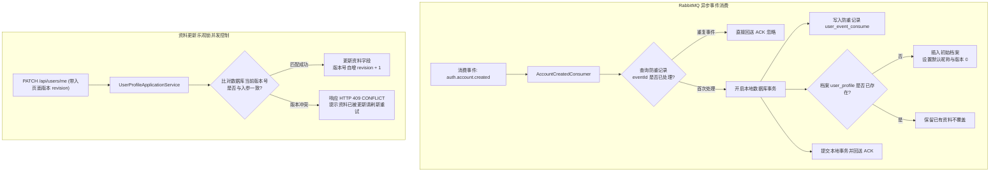
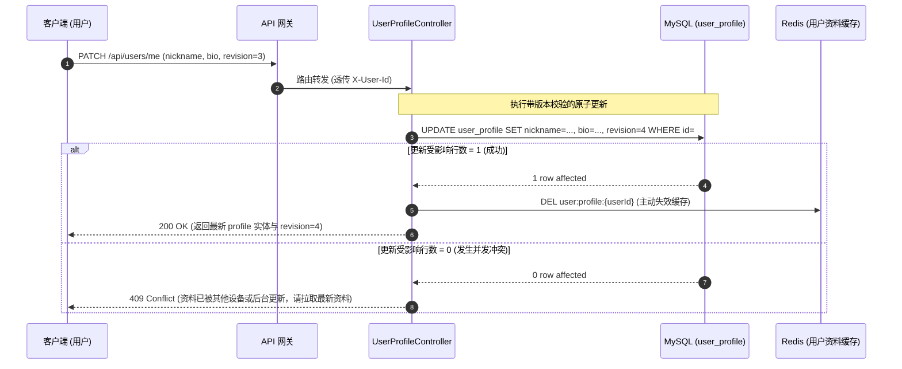

# 用户模块 · user-service 架构设计与实现文档

用户模块（`user-service`）是平台用户个人中心、公开资料名片、创作者粉丝社交与行为属性的核心微服务（运行端口：8020）。负责异步消费来自 `auth-service` 的账号创建消息完成用户档案强幂等建档、维护用户个人资料（昵称、头像、简介、城市、生日）、提供严格的并发乐观锁控制（`revision`）、维护关注与粉丝社交双向关系，以及支撑前台高并发公开资料展示与管理端治理。

---

## 1. 模块定位与架构边界

### 1.1 核心业务职责
- **档案异步建档与强幂等消费**：
  - 监听 RabbitMQ 中的 `auth.account.created` 领域事件；
  - 基于专有防重表 `user_event_consume` 与 `user_profile` 主键双重约束，确保网络重复投递时资料初始化严格幂等。
- **个人资料维护与乐观锁版本控制**：
  - 用户本人编辑资料（昵称、简介、城市、生日、头像）；
  - 采用 `revision` 乐观锁机制，更新时校验版本号并自增，拒绝多端并发提交导致的陈旧数据相互覆盖；
  - 拦截头像 URL，执行白名单防盗链安全校验（`AvatarDisplayPolicy`），杜绝不可信外链注入。
- **前台公开名片与高性能批量读取**：
  - 为播放页、评论区、作者主页提供脱敏公开资料（昵称、头像、简介）；
  - 提供 `POST /api/users/batch` 批量查询接口，内部集成 Redis Cache-Aside 缓存加速，支持一次批量读取数百位创作者名片；
  - 自动识别并过滤冻结（`DISABLED`）用户，打上不可用标记。
- **关注与粉丝社交关系中枢**：
  - 支撑关注/取关操作，维护双向关系表（`user_follow`）；
  - 维护用户粉丝数、关注数、获赞数等统计快照。

### 1.2 防腐与禁止承担的工作
- **严禁管理账号密码与凭据**：用户的注册登录、BCrypt 密码哈希、JWT 签发及刷新会话完全由 `auth-service` 负责，本服务绝不触碰密码；
- **严禁直接上传头像二进制流**：头像文件必须由客户端经由 `file-service` 直传或普通上传获取合法 `fileId` 与 URL，本服务仅持久化其有效访问地址；
- **不承接业务请求鉴权**：除内部服务互通外，完全依托网关透传的 `X-User-Id` 与 `X-User-Role` 获取用户上下文。

### 1.3 参与的全局业务主线导航
- 核心协同 [主线 01：账号生命周期与鉴权透传](../flows/01-账号生命周期与鉴权透传.md)
- 核心支撑 [主线 04：前台视频播放分发、短码寻址与网关防刷](../flows/04-前台视频播放分发与网关防刷.md)（作者信息与公开名片展示）
- 支撑协同 [主线 05：平台合规治理、违规封禁与全站事件广播下线](../flows/05-平台合规治理与全站广播下线.md)（用户封禁与名片冻结）

---

## 2. 资料初始化与并发控制架构图



---

## 3. 个人资料更新与乐观锁时序图



---

## 4. 第一套件：HTTP 接口服务链路

所有端点均挂载于统一前缀 `/api/users/**` 下：

| HTTP 方法 | URI 路径 | 鉴权门禁 | 核心处理流与调用链 | 关键响应码 |
| :--- | :--- | :--- | :--- | :--- |
| `GET` | `/api/users/me` | `requireUser` | 查询本人完整资料 ➔ 优先命中本地/Redis 缓存 ➔ 返回全量私有与公有字段 | `200` 成功<br/>`404` 资料尚未就绪 |
| `PATCH` | `/api/users/me` | `requireUser` | 修改本人资料 ➔ 字段长度与敏感词校验 ➔ 头像外链防盗链校验 ➔ 乐观锁原子更新 ➔ 清除缓存 | `200` 成功<br/>`409` 版本冲突<br/>`400` 格式非法 |
| `GET` | `/api/users/{accountId}` | 匿名/开放 | 获取创作者公开名片 ➔ 校验用户状态为 `ACTIVE` ➔ 过滤手机邮箱等私有字段 ➔ 返回公开摘要 | `200` 成功<br/>`404` 用户不存在或已冻结 |
| `POST` | `/api/users/batch` | 内部或已登录 | 批量查询创作者资料 ➔ 保持入参顺序 ➔ 批量组装名片列表（缺失或封禁用户标记 `unavailable=true`） | `200` 成功 |
| `POST` | `/api/users/admin/list` | `requireAdmin` | 管理员动态多条件分页检索资料（支持状态、时间、昵称模糊匹配） | `200` 成功 |
| `PATCH` | `/api/users/admin/{accountId}`| `requireAdmin` | 管理员强制纠偏违规昵称或违规头像（同样遵循版本号自增控制） | `200` 成功<br/>`409` 版本冲突 |

### 4.1 接口响应报文契约

#### 1. 批量创作者资料响应 (`POST /api/users/batch`)
```json
{
  "code": 0,
  "message": "success",
  "data": [
    {
      "id": "u_1001",
      "nickname": "科技前沿测评",
      "avatar": "https://storage.calles.com/media-bucket/permanent/u_1001/avatar.jpg",
      "bio": "专注于硬核数码与科技深度解析",
      "unavailable": false
    },
    {
      "id": "u_9999",
      "nickname": null,
      "avatar": null,
      "bio": null,
      "unavailable": true // 账号不存在或已被平台封禁
    }
  ]
}
```

---

## 5. 第二套件：MQ 消息链路（事件发布与消费）

### 5.1 消费的领域事件：`auth.account.created`

- **队列绑定配置**：
  - Queue：`user.account-created.v1`
  - Exchange：`media.platform.events`
  - RoutingKey：`auth.account.created`
- **消费类入口**：[`AccountCreatedConsumer.java`](../../service/user-service/src/main/java/com/calles/platform/user/interfaces/messaging/AccountCreatedConsumer.java)
- **强幂等消费与本地事务保障**：
  1. 解析事件载荷，提取 `accountId`、`email` 等信息；
  2. 开启本地数据库事务：
     - 尝试插入防重表 `user_event_consume`（若 `event_id` 已存在则唯一键冲突拦截并直接 ACK）；
     - 插入初始用户档案 `user_profile`（以 `account_id` 作为主键 `id`，初始昵称默认为 `User_` + 后 6 位截断，初始状态为 `ACTIVE`，初始版本号 `revision = 0`）；
  3. 即使极端异常下外部发送了相同 `accountId` 但不同 `eventId` 的脏消息，`user_profile` 主键约束亦可完成终极兜底，绝不重置用户已有资料。

### 5.2 死信分流与重试机制
- 消费出现数据库瞬时抖动异常时，利用 RabbitMQ 指数退避重试（最大重试 3 次）；
- 重试耗尽或捕获不可恢复的契约反序列化异常时，路由转移至死信交换机进入 `user.account-created.dlq`，不阻断主队列正常消费。

---

## 6. 第三套件：定时任务与容灾补偿调度链路

- **定位说明**：`user-service` 不设本地周期性定时调度任务（`@Scheduled`）。
- **容灾与并发补偿机制**：
  1. **乐观锁冲突处理**：当前端提交更新遇到 `409 CONFLICT` 时，提示用户当前资料已被修改，前端重新拉取最新资料与新 `revision` 供用户确认覆盖；
  2. **外部头像防盗链策略 (`AvatarDisplayPolicy`)**：仅放行配置白名单域名内的图片 URL。针对外部不可信图床，系统自动替换为默认静态占位图，防范 XSS 注入与外链失效风险。

---

## 7. 数据库表结构全景 (Schema)

### 7.1 用户资料核心表 (`user_profile`)
```sql
CREATE TABLE IF NOT EXISTS `user_profile` (
    `id` CHAR(32) NOT NULL COMMENT '用户ID (与 auth_account.id 一致)',
    `nickname` VARCHAR(32) NOT NULL COMMENT '公开展示昵称',
    `avatar` VARCHAR(512) NULL COMMENT '头像文件正式访问 URL',
    `bio` VARCHAR(255) NULL COMMENT '个性签名与个人简介',
    `gender` VARCHAR(8) NOT NULL DEFAULT 'UNKNOWN' COMMENT '性别: UNKNOWN, MALE, FEMALE',
    `birthday` DATE NULL COMMENT '出生日期',
    `city` VARCHAR(64) NULL COMMENT '所在城市',
    `status` VARCHAR(16) NOT NULL DEFAULT 'ACTIVE' COMMENT '状态: ACTIVE=正常, DISABLED=封禁',
    `revision` BIGINT NOT NULL DEFAULT 0 COMMENT '并发乐观锁版本号',
    `created_at` DATETIME(3) NOT NULL DEFAULT CURRENT_TIMESTAMP(3),
    `updated_at` DATETIME(3) NOT NULL DEFAULT CURRENT_TIMESTAMP(3) ON UPDATE CURRENT_TIMESTAMP(3),
    PRIMARY KEY (`id`),
    KEY `idx_user_status` (`status`, `created_at`)
) ENGINE=InnoDB DEFAULT CHARSET=utf8mb4 COMMENT='用户资料表';
```

### 7.2 消费防重记录表 (`user_event_consume`)
```sql
CREATE TABLE IF NOT EXISTS `user_event_consume` (
    `event_id` CHAR(32) NOT NULL COMMENT '消息事件唯一标识 (UUID)',
    `event_type` VARCHAR(64) NOT NULL COMMENT '事件类型 (如 auth.account.created)',
    `consumer_name` VARCHAR(64) NOT NULL COMMENT '消费者名称',
    `created_at` DATETIME(3) NOT NULL DEFAULT CURRENT_TIMESTAMP(3),
    PRIMARY KEY (`event_id`, `consumer_name`)
) ENGINE=InnoDB DEFAULT CHARSET=utf8mb4 COMMENT='MQ消息消费防重记录表';
```

---

## 8. 核心源码入口索引

- **启动入口类**：[`UserApplication.java`](../../service/user-service/src/main/java/com/calles/platform/user/UserApplication.java)
- **控制器与用例**：
  - 用户资料控制器：[`UserProfileController.java`](../../service/user-service/src/main/java/com/calles/platform/user/interfaces/http/UserProfileController.java)
  - 资料用例编排服务：[`UserProfileApplicationService.java`](../../service/user-service/src/main/java/com/calles/platform/user/application/profile/UserProfileApplicationService.java)
- **事件驱动与消费者**：
  - 账号建档消费者：[`AccountCreatedConsumer.java`](../../service/user-service/src/main/java/com/calles/platform/user/interfaces/messaging/AccountCreatedConsumer.java)
- **安全与防盗链策略**：
  - 头像域名合规校验：[`AvatarDisplayPolicy.java`](../../service/user-service/src/main/java/com/calles/platform/user/application/profile/AvatarDisplayPolicy.java)
- **自动化测试规范**：
  - 乐观锁并发测试：`UserProfileRevisionTest.java`
  - 消费幂等建档测试：`AccountCreatedConsumerTest.java`
