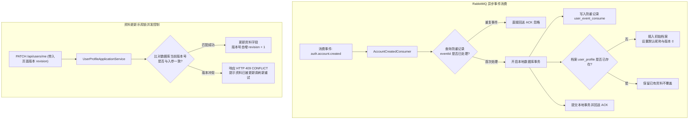
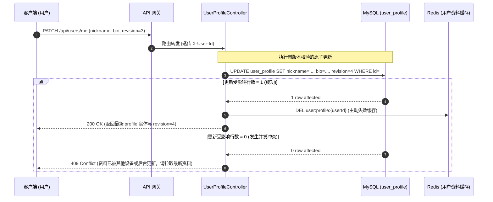
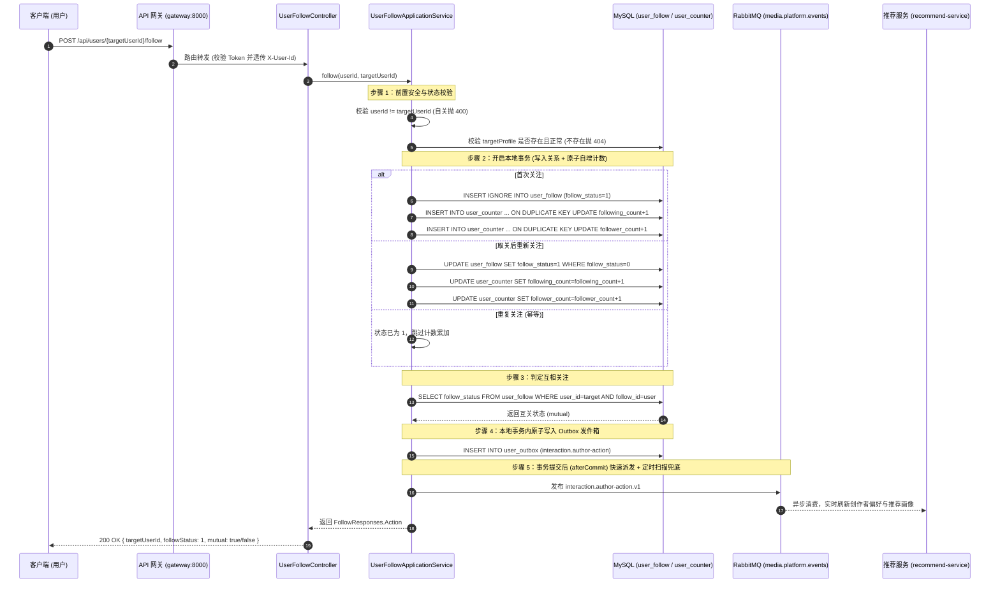
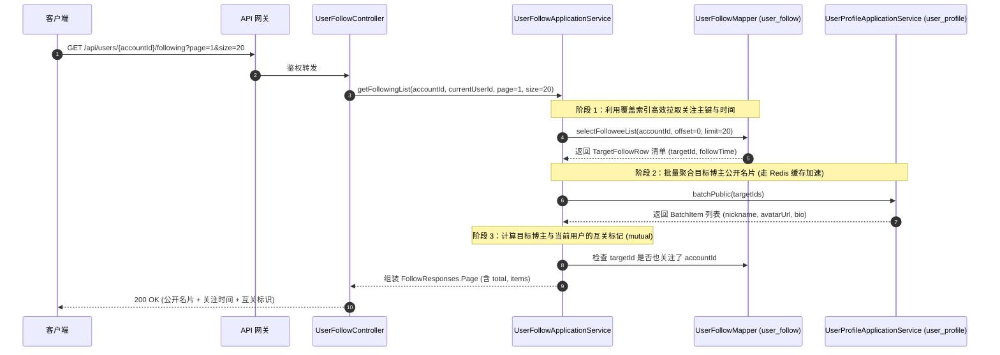

# 用户模块 · user-service 架构设计与实现文档

用户模块（`user-service`）是平台用户个人中心、公开资料名片、创作者粉丝社交与行为属性的核心微服务（运行端口：8020）。负责异步消费来自 `auth-service` 的账号创建消息完成用户档案强幂等建档、维护用户个人资料（昵称、头像、简介、城市、生日）、提供严格的并发乐观锁控制（`revision`）、维护关注与粉丝社交双向关系，以及支撑前台高并发公开资料展示与管理端治理。

---

## 1. 模块定位与架构边界

### 1.1 核心业务职责
- **档案异步建档与强幂等消费**：
  - 监听 RabbitMQ 中的 `auth.account.created` 领域事件；
  - 基于专有防重表 `user_event_consume` 与 `user_profile` 主键双重约束，确保网络重复投递时资料初始化严格幂等。
- **个人资料维护与乐观锁版本控制**：
  - 用户本人编辑资料（昵称、简介、城市、生日、头像）；
  - 采用 `revision` 乐观锁机制，更新时校验版本号并自增，拒绝多端并发提交导致的陈旧数据相互覆盖；
  - 拦截头像 URL，执行白名单防盗链安全校验（`AvatarDisplayPolicy`），杜绝不可信外链注入。
- **前台公开名片与高性能批量读取**：
  - 为播放页、评论区、作者主页提供脱敏公开资料（昵称、头像、简介）；
  - 提供 `POST /api/users/batch` 批量查询接口，内部集成 Redis Cache-Aside 缓存加速，支持一次批量读取数百位创作者名片；
  - 自动识别并过滤冻结（`DISABLED`）用户，打上不可用标记。
- **关注与粉丝社交关系中枢**：
  - 支撑关注/取关操作，维护双向关系表（`user_follow`）；
  - 维护用户粉丝数、关注数、获赞数等统计快照。

### 1.2 防腐与禁止承担的工作
- **严禁管理账号密码与凭据**：用户的注册登录、BCrypt 密码哈希、JWT 签发及刷新会话完全由 `auth-service` 负责，本服务绝不触碰密码；
- **严禁直接上传头像二进制流**：头像文件必须由客户端经由 `file-service` 直传或普通上传获取合法 `fileId` 与 URL，本服务仅持久化其有效访问地址；
- **不承接业务请求鉴权**：除内部服务互通外，完全依托网关透传的 `X-User-Id` 与 `X-User-Role` 获取用户上下文。

### 1.3 参与的全局业务主线导航
- 核心协同 [主线 01：账号生命周期与鉴权透传](../flows/01-账号生命周期与鉴权透传.md)
- 核心支撑 [主线 04：前台视频播放分发、短码寻址与网关防刷](../flows/04-前台视频播放分发与网关防刷.md)（作者信息与公开名片展示）
- 支撑协同 [主线 05：平台合规治理、违规封禁与全站事件广播下线](../flows/05-平台合规治理与全站广播下线.md)（用户封禁与名片冻结）

---

## 2. 资料初始化与并发控制架构图



---

## 3. 个人资料更新与乐观锁时序图



---

## 3.1 用户关注与取关原子事务时序图



---

## 3.2 关注与粉丝列表分页聚合时序图



---

## 4. 第一套件：HTTP 接口服务链路

所有端点均挂载于统一前缀 `/api/users/**` 下：

| HTTP 方法 | URI 路径 | 鉴权门禁 | 核心处理流与调用链 | 关键响应码 |
| :--- | :--- | :--- | :--- | :--- |
| `GET` | `/api/users/me` | `requireUser` | 查询本人完整资料 ➔ 优先命中本地/Redis 缓存 ➔ 返回全量私有与公有字段 | `200` 成功<br/>`404` 资料尚未就绪 |
| `PATCH` | `/api/users/me` | `requireUser` | 修改本人资料 ➔ 字段长度与敏感词校验 ➔ 头像外链防盗链校验 ➔ 乐观锁原子更新 ➔ 清除缓存 | `200` 成功<br/>`409` 版本冲突<br/>`400` 格式非法 |
| `GET` | `/api/users/{accountId}` | 匿名/开放 | 获取创作者公开名片 ➔ 校验用户状态为 `ACTIVE` ➔ 过滤手机邮箱等私有字段 ➔ 返回公开摘要 | `200` 成功<br/>`404` 用户不存在或已冻结 |
| `POST` | `/api/users/batch` | 内部或已登录 | 批量查询创作者资料 ➔ 保持入参顺序 ➔ 批量组装名片列表（缺失或封禁用户标记 `unavailable=true`） | `200` 成功 |
| `POST` | `/api/users/admin/list` | `requireAdmin` | 管理员动态多条件分页检索资料（支持状态、时间、昵称模糊匹配） | `200` 成功 |
| `PATCH` | `/api/users/admin/{accountId}`| `requireAdmin` | 管理员强制纠偏违规昵称或违规头像（同样遵循版本号自增控制） | `200` 成功<br/>`409` 版本冲突 |
| `POST` | `/api/users/{targetUserId}/follow` | `requireUser` | 关注创作者 ➔ 幂等写入/更新 ➔ 原子维护 `user_counter` 双方计数 ➔ 异步广播领域事件 | `200` 成功<br/>`400` 自关拦截<br/>`404` 目标不存在 |
| `DELETE`| `/api/users/{targetUserId}/follow` | `requireUser` | 取消关注 ➔ 软状态置 0 ➔ 原子递减双方计数 ➔ 异步广播取关事件 | `200` 成功<br/>`400` 自关拦截 |
| `GET` | `/api/users/{targetUserId}/relation` | 开放/已登录 | 双方拓扑关系智能判定（`NONE`, `FOLLOWING`, `FOLLOWED_BY`, `MUTUAL`） | `200` 成功 |
| `GET` | `/api/users/{accountId}/following` | `requireAuthenticated` | 关注列表分页 ➔ 关联公开名片与关注时间 ➔ 标记互关状态 | `200` 成功 |
| `GET` | `/api/users/{accountId}/followers` | `requireAuthenticated` | 粉丝列表分页 ➔ 关联公开名片与粉丝时间 ➔ 标记互关状态 | `200` 成功 |
| `GET` | `/api/users/{accountId}/stats` | `requireAuthenticated` | 用户关系统计快照查询（关注数、粉丝数） | `200` 成功 |
| `GET` | `/api/users/internal/{accountId}/following-ids` | 内部微服务 | 内部提取关注博主ID列表，赋能 `recommend-service` 关注流召回 | `200` 成功 |

### 4.1 接口响应报文契约

#### 1. 批量创作者资料响应 (`POST /api/users/batch`)
```json
{
  "code": 0,
  "message": "success",
  "data": [
    {
      "id": "u_1001",
      "nickname": "科技前沿测评",
      "avatar": "https://storage.calles.com/media-bucket/permanent/u_1001/avatar.jpg",
      "bio": "专注于硬核数码与科技深度解析",
      "unavailable": false
    },
    {
      "id": "u_9999",
      "nickname": null,
      "avatar": null,
      "bio": null,
      "unavailable": true // 账号不存在或已被平台封禁
    }
  ]
}
```

---

---

## 5. 第二套件：MQ 消息链路（事件发布与消费）

### 5.1 发布的领域事件：`interaction.author-action` (关注与取关)
- **交换机与路由键**：
  - Exchange：`media.platform.events`
  - RoutingKey：`interaction.author-action.v1`
- **发布实现与模式**：
  - 发布入口：[`UserFollowEventPublisher.java`](../../service/user-service/src/main/java/com/calles/platform/user/application/follow/UserFollowEventPublisher.java)
  - 投递模式：**Transactional Outbox（事务发件箱）模式**。在业务本地事务中原子写入 `user_outbox` 表，通过 `AfterCommitUserOutboxDispatchNotifier` 在事务成功提交后由虚拟线程毫秒级唤醒派发；后台由 `UserOutboxScanJob` 轮询自愈补偿。
- **推荐统一交互模板载荷**：
  ```json
  {
    "eventId": "e9b2c3d411114a5b8c9d000000000001",
    "eventType": "interaction.author-action",
    "eventVersion": 1,
    "traceId": "trace-uuid-12345",
    "occurredAt": "2026-09-22T10:00:00Z",
    "payload": {
      "userId": "u001",
      "authorId": "u002",
      "action": "FOLLOW",
      "state": "ACTIVE"  // 关注为 ACTIVE，取消关注为 INACTIVE
    }
  }
  ```

### 5.2 消费的领域事件：`auth.account.created`

- **队列绑定配置**：
  - Queue：`user.account-created.v1`
  - Exchange：`media.platform.events`
  - RoutingKey：`auth.account.created`
- **消费类入口**：[`AccountCreatedConsumer.java`](../../service/user-service/src/main/java/com/calles/platform/user/interfaces/messaging/consumer/AccountCreatedConsumer.java)
- **强幂等消费与本地事务保障**：
  1. 解析事件载荷，提取 `accountId`、`email` 等信息；
  2. 开启本地数据库事务：
     - 尝试插入防重表 `user_event_consume`（若 `event_id` 已存在则唯一键冲突拦截并直接 ACK）；
     - 插入初始用户档案 `user_profile`（以 `account_id` 作为主键 `id`，初始昵称默认为 `User_` + 后 6 位截断，初始状态为 `ACTIVE`，初始版本号 `revision = 0`）；
  3. 即使极端异常下外部发送了相同 `accountId` 但不同 `eventId` 的脏消息，`user_profile` 主键约束亦可完成终极兜底，绝不重置用户已有资料。

### 5.3 死信分流与重试机制
- 消费出现数据库瞬时抖动异常时，利用 RabbitMQ 指数退避重试（最大重试 3 次）；
- 重试耗尽或捕获不可恢复的契约反序列化异常时，路由转移至死信交换机进入 `user.account-created.dlq`，不阻断主队列正常消费。

---

## 6. 第三套件：定时任务与容灾补偿调度链路

### 6.1 发件箱补偿与自愈扫描调度器 (`UserOutboxScanJob`)
- **执行频率**：默认每 5 秒（`${user.outbox.poll-interval:5s}`）轮询执行；
- **自愈机制**：
  - 定向扫描 `user_outbox` 表中处于 `PENDING` 状态到达允许重试时间、或 `PROCESSING` 状态租约超期的记录；
  - 基于 CAS 原子租约抢占防多实例并发重试风暴，指数退避重试上限 20 次；
  - 保证社交关注与取关领域事件 **At-least-once 绝对不丢**。

### 6.2 容灾与并发补偿机制
1. **乐观锁冲突处理**：当前端提交更新遇到 `409 CONFLICT` 时，提示用户当前资料已被修改，前端重新拉取最新资料与新 `revision` 供用户确认覆盖；
2. **外部头像防盗链策略 (`AvatarDisplayPolicy`)**：仅放行配置白名单域名内的图片 URL。针对外部不可信图床，系统自动替换为默认静态占位图，防范 XSS 注入与外链失效风险。

---

## 7. 数据库表结构全景 (Schema)

### 7.1 用户资料核心表 (`user_profile`)
```sql
CREATE TABLE IF NOT EXISTS `user_profile` (
    `id` CHAR(32) NOT NULL COMMENT '用户ID (与 auth_account.id 一致)',
    `nickname` VARCHAR(32) NOT NULL COMMENT '公开展示昵称',
    `avatar` VARCHAR(512) NULL COMMENT '头像文件正式访问 URL',
    `bio` VARCHAR(255) NULL COMMENT '个性签名与个人简介',
    `gender` VARCHAR(8) NOT NULL DEFAULT 'UNKNOWN' COMMENT '性别: UNKNOWN, MALE, FEMALE',
    `birthday` DATE NULL COMMENT '出生日期',
    `city` VARCHAR(64) NULL COMMENT '所在城市',
    `status` VARCHAR(16) NOT NULL DEFAULT 'ACTIVE' COMMENT '状态: ACTIVE=正常, DISABLED=封禁',
    `revision` BIGINT NOT NULL DEFAULT 0 COMMENT '并发乐观锁版本号',
    `created_at` DATETIME(3) NOT NULL DEFAULT CURRENT_TIMESTAMP(3),
    `updated_at` DATETIME(3) NOT NULL DEFAULT CURRENT_TIMESTAMP(3) ON UPDATE CURRENT_TIMESTAMP(3),
    PRIMARY KEY (`id`),
    KEY `idx_user_status` (`status`, `created_at`)
) ENGINE=InnoDB DEFAULT CHARSET=utf8mb4 COMMENT='用户资料表';
```

### 7.2 消费防重记录表 (`user_event_consume`)
```sql
CREATE TABLE IF NOT EXISTS `user_event_consume` (
    `event_id` CHAR(32) NOT NULL COMMENT '消息事件唯一标识 (UUID)',
    `event_type` VARCHAR(64) NOT NULL COMMENT '事件类型 (如 auth.account.created)',
    `consumer_name` VARCHAR(64) NOT NULL COMMENT '消费者名称',
    `created_at` DATETIME(3) NOT NULL DEFAULT CURRENT_TIMESTAMP(3),
    PRIMARY KEY (`event_id`, `consumer_name`)
) ENGINE=InnoDB DEFAULT CHARSET=utf8mb4 COMMENT='MQ消息消费防重记录表';
```

### 7.3 用户关注关系表 (`user_follow`)
```sql
CREATE TABLE IF NOT EXISTS `user_follow` (
    `id` BIGINT NOT NULL AUTO_INCREMENT COMMENT '自增主键',
    `user_id` CHAR(32) NOT NULL COMMENT '关注者用户ID (发起人)',
    `follow_id` CHAR(32) NOT NULL COMMENT '被关注者用户ID (目标用户)',
    `follow_status` TINYINT NOT NULL DEFAULT 1 COMMENT '关注状态: 1=已关注, 0=已取消',
    `created_at` DATETIME(3) NOT NULL DEFAULT CURRENT_TIMESTAMP(3) COMMENT '初次关注时间',
    `updated_at` DATETIME(3) NOT NULL DEFAULT CURRENT_TIMESTAMP(3) ON UPDATE CURRENT_TIMESTAMP(3) COMMENT '最后状态更新时间',
    PRIMARY KEY (`id`),
    UNIQUE KEY `uk_user_follow` (`user_id`, `follow_id`),
    KEY `idx_user_following` (`user_id`, `follow_status`, `updated_at` DESC) COMMENT '我的关注列表高效分页',
    KEY `idx_follow_fans` (`follow_id`, `follow_status`, `updated_at` DESC) COMMENT '我的粉丝列表高效分页'
) ENGINE=InnoDB DEFAULT CHARSET=utf8mb4 COMMENT='用户关注关系表';
```

### 7.4 用户互动与关系统计快照表 (`user_counter`)
```sql
CREATE TABLE IF NOT EXISTS `user_counter` (
    `account_id` CHAR(32) NOT NULL COMMENT '用户ID (与 user_profile.account_id 一致)',
    `following_count` BIGINT NOT NULL DEFAULT 0 COMMENT '关注数',
    `follower_count` BIGINT NOT NULL DEFAULT 0 COMMENT '粉丝数',
    `created_at` DATETIME(3) NOT NULL DEFAULT CURRENT_TIMESTAMP(3),
    `updated_at` DATETIME(3) NOT NULL DEFAULT CURRENT_TIMESTAMP(3) ON UPDATE CURRENT_TIMESTAMP(3),
    PRIMARY KEY (`account_id`),
    CONSTRAINT `ck_user_counter_following` CHECK (`following_count` >= 0),
    CONSTRAINT `ck_user_counter_follower` CHECK (`follower_count` >= 0)
) ENGINE=InnoDB DEFAULT CHARSET=utf8mb4 COMMENT='用户互动与关系计数表';
```

### 7.5 用户事务发件箱表 (`user_outbox`)

- **空库初始化**：执行 `db/init/schema.sql`，其中包含与下方一致的建表定义。
- **已有库补建**：确认 `user_outbox` 尚不存在后，单独执行 `service/user-service/db/schema/user-outbox.sql`。已有 MySQL 数据卷不会重新运行 `docker-compose` 的初始化脚本。
- **执行边界**：独立脚本只建表、不回填数据；若同名表已存在，`IF NOT EXISTS` 不会校验或更新其结构。

```sql
CREATE TABLE IF NOT EXISTS `user_outbox` (
    `event_id` CHAR(36) NOT NULL COMMENT '稳定事件 UUID，重试和重放必须复用',
    `aggregate_id` CHAR(32) NOT NULL COMMENT '关联发起用户 ID (userId)',
    `event_type` VARCHAR(128) NOT NULL COMMENT '事件类型标识 (如 interaction.author-action)',
    `event_version` INT NOT NULL COMMENT '契约版本号',
    `payload` JSON NOT NULL COMMENT '符合推荐交互模板的事件载荷 JSON',
    `trace_id` VARCHAR(64) NULL COMMENT '链路追踪 ID',
    `occurred_at` DATETIME(3) NOT NULL COMMENT '事件发生时间',
    `status` VARCHAR(16) NOT NULL DEFAULT 'PENDING' COMMENT 'PENDING, PROCESSING, PUBLISHED, FAILED',
    `attempts` INT NOT NULL DEFAULT 0 COMMENT '投递尝试次数',
    `next_attempt_at` DATETIME(3) NOT NULL COMMENT '下次重试时间',
    `lease_owner` VARCHAR(64) NULL COMMENT '当前租约所有者',
    `lease_until` DATETIME(3) NULL COMMENT '当前租约截止时间',
    `claim_token` CHAR(36) NULL COMMENT '认领令牌',
    `published_at` DATETIME(3) NULL COMMENT '成功发布时间',
    `last_error_code` VARCHAR(64) NULL COMMENT '最后错误分类',
    `updated_at` DATETIME(3) NOT NULL DEFAULT CURRENT_TIMESTAMP(3) ON UPDATE CURRENT_TIMESTAMP(3),
    PRIMARY KEY (`event_id`),
    KEY `idx_user_outbox_dispatch` (`status`, `next_attempt_at`, `lease_until`),
    KEY `idx_user_outbox_aggregate` (`aggregate_id`),
    CONSTRAINT `ck_user_outbox_status` CHECK (`status` IN ('PENDING', 'PROCESSING', 'PUBLISHED', 'FAILED'))
) ENGINE=InnoDB DEFAULT CHARSET=utf8mb4 COMMENT='user-service 领域事件 Outbox 发件箱表';
```

---

## 8. 核心源码入口索引

- **启动入口类**：[`UserApplication.java`](../../service/user-service/src/main/java/com/calles/platform/user/UserApplication.java)
- **控制器与用例**：
  - 用户前台资料控制器：[`UserProfileController.java`](../../service/user-service/src/main/java/com/calles/platform/user/interfaces/http/profile/UserProfileController.java)
  - 管理端资料治理控制器：[`AdminUserProfileController.java`](../../service/user-service/src/main/java/com/calles/platform/user/interfaces/http/profile/AdminUserProfileController.java)
  - 资料用例编排服务：[`UserProfileApplicationService.java`](../../service/user-service/src/main/java/com/calles/platform/user/application/profile/UserProfileApplicationService.java)
  - 关注与粉丝控制器：[`UserFollowController.java`](../../service/user-service/src/main/java/com/calles/platform/user/interfaces/http/follow/UserFollowController.java)
  - 关注内部协同端点：[`UserFollowInternalController.java`](../../service/user-service/src/main/java/com/calles/platform/user/interfaces/http/follow/UserFollowInternalController.java)
  - 关注核心编排服务：[`UserFollowApplicationService.java`](../../service/user-service/src/main/java/com/calles/platform/user/application/follow/UserFollowApplicationService.java)
- **事件驱动与事务发件箱**：
  - 关注领域事件发布器：[`UserFollowEventPublisher.java`](../../service/user-service/src/main/java/com/calles/platform/user/application/follow/UserFollowEventPublisher.java)
  - 发件箱持久化仓储：[`UserOutboxRepository.java`](../../service/user-service/src/main/java/com/calles/platform/user/infrastructure/outbox/persistence/UserOutboxRepository.java)
  - 统一任务分发调度器：[`UserOutboxDispatcher.java`](../../service/user-service/src/main/java/com/calles/platform/user/infrastructure/outbox/dispatch/UserOutboxDispatcher.java)
  - RabbitMQ 消息发布器：[`UserOutboxPublisher.java`](../../service/user-service/src/main/java/com/calles/platform/user/infrastructure/outbox/dispatch/UserOutboxPublisher.java)
  - 提交后快速派发通知器：[`AfterCommitUserOutboxDispatchNotifier.java`](../../service/user-service/src/main/java/com/calles/platform/user/infrastructure/outbox/notify/AfterCommitUserOutboxDispatchNotifier.java)
  - 发件箱定时补偿自愈任务：[`UserOutboxScanJob.java`](../../service/user-service/src/main/java/com/calles/platform/user/infrastructure/scheduling/UserOutboxScanJob.java)
  - 账号建档消费者：[`AccountCreatedConsumer.java`](../../service/user-service/src/main/java/com/calles/platform/user/interfaces/messaging/consumer/AccountCreatedConsumer.java)
- **安全与防盗链策略**：
  - 头像域名合规校验：[`AvatarDisplayPolicy.java`](../../service/user-service/src/main/java/com/calles/platform/user/application/profile/AvatarDisplayPolicy.java)
- **自动化测试规范**：
  - 关注核心用例测试：`UserFollowApplicationServiceTest.java`
  - 关注事件发布与模板序列化测试：`UserFollowEventPublisherTest.java`
  - 发件箱调度与重试测试：`UserOutboxRepositoryTest.java`, `UserOutboxDispatcherTest.java`, `UserOutboxPublisherTest.java`
  - 关注 HTTP 契约测试：`UserFollowControllerTest.java`
  - 资料生命周期与并发测试：`UserProfileApplicationServiceTest.java`
  - 消费幂等建档测试：`AccountCreatedConsumerTest.java`
